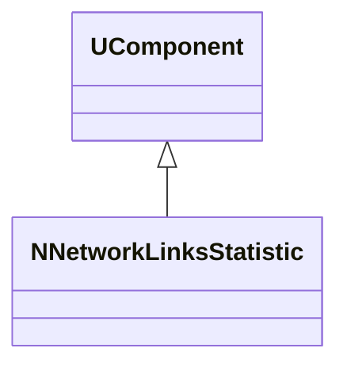
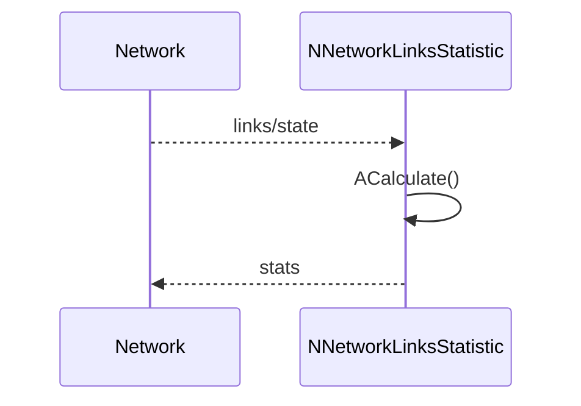
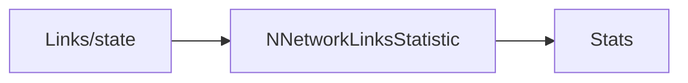
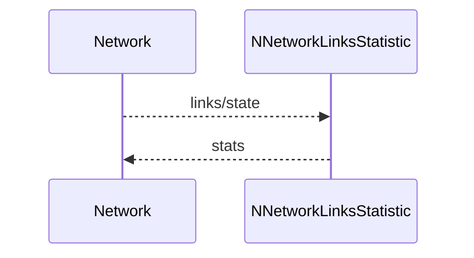

## NNetworkLinksStatistic — статистика связей сети

**Класс**: `NNetworkLinksStatistic` — вычисляет метрики/статистику по связям (например, граф/сеть управления).  
**Регистрация**: `UploadClass("NNetworkLinksStatistic", ...)` в `NMotionControlLibrary.cpp`.

### Lifecycle
- **ADefault**: настройка метрик.
- **ABuild**: подключение источников данных о связях.
- **AReset**: сброс статистики.
- **ACalculate**: обновление метрик на шаге.

### I/O
- Вход: описание связей/состояния сети.
- Выход: метрики/значения статистики.



Пояснение: диаграмма классов показывает место компонента в иерархии и ключевые связи.



Пояснение: диаграмма последовательности показывает типовой сценарий взаимодействия и порядок вызовов.



Пояснение: блок-схема показывает поток данных/сигналов (входы → компонент → выходы).

### Config snippet

```ini
[Component]
ClassName = NNetworkLinksStatistic
Name = LinkStat1
```

---

## NNetworkLinksStatistic — network links statistics (EN)

Computes statistics/metrics for network connections.


Description: this class diagram shows the component position in the type hierarchy and key relations.



Description: this sequence diagram shows a typical runtime interaction and call order.


Description: this flowchart shows the data/signal flow (inputs → component → outputs).
