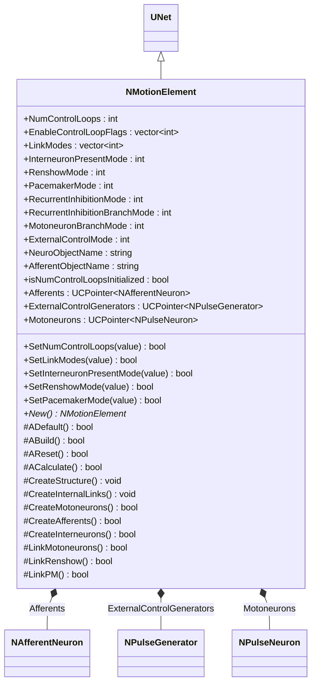
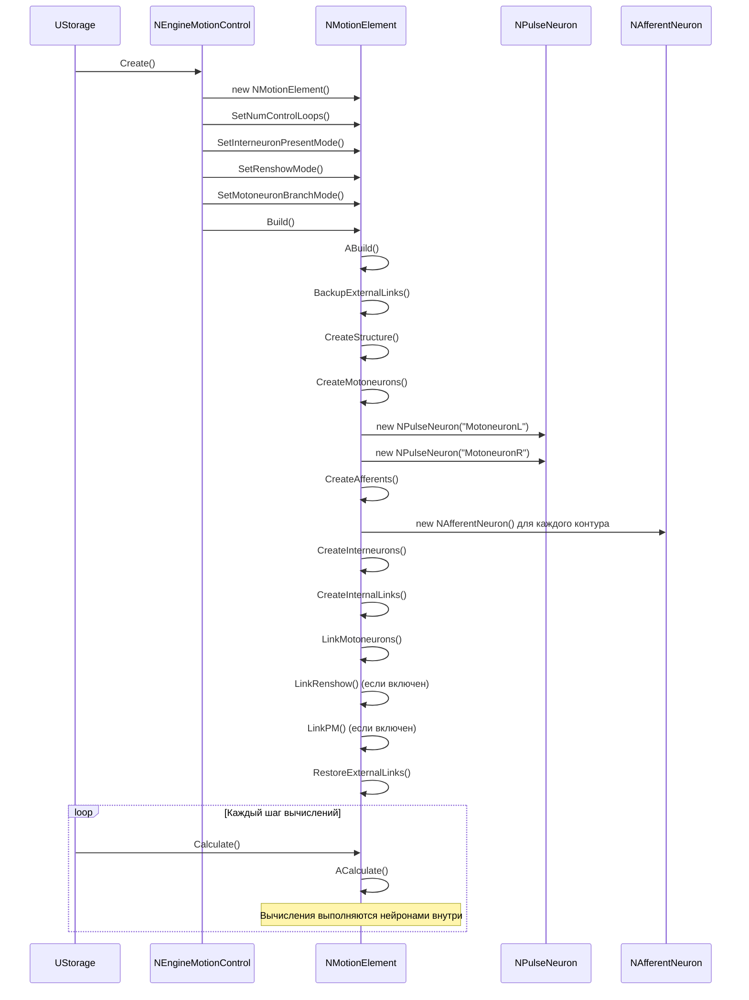
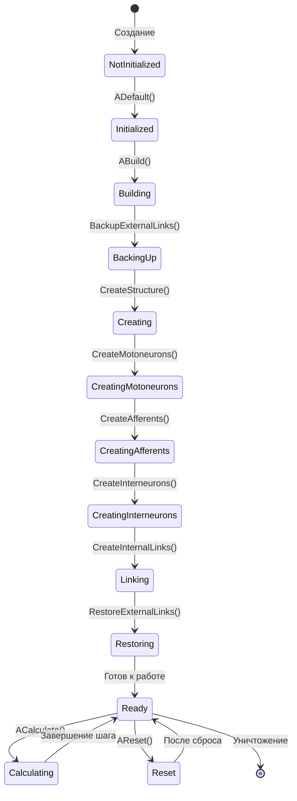
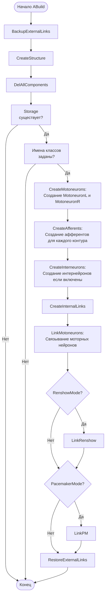
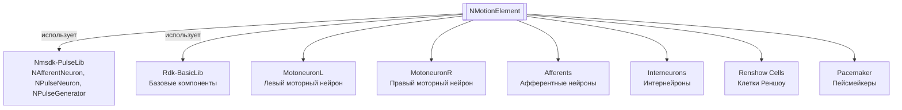

# NNewMotionElement (NMotionElement) — элемент движения

## RU

**Класс**: `NMotionElement` (регистрируется как `NNewMotionElement`) — элемент движения, создающий нейросетевую структуру для управления движением с моторными нейронами, афферентными нейронами и интернейронами.
**Регистрация**: `NMotionControlLibrary.cpp` → `UploadClass("NNewMotionElement", ...)`.
**Базовый класс**: `UNet` (из Rdk Framework).

NMotionElement является базовым элементом для систем управления движением. Он создает нейросетевую структуру, состоящую из пары моторных нейронов (MotoneuronL, MotoneuronR), афферентных нейронов для каждого контура управления, интернейронов (опционально), клеток Реншоу (опционально) и пейсмейкеров (опционально). Компонент используется внутри NEngineMotionControl для создания элементов движения.

## UML-диаграмма классов



**Иерархия наследования:**
- `UNet` (Rdk Framework) — базовый класс для сетей компонентов
- `NMotionElement` — элемент движения

**Связи с другими компонентами:**
- **Композиция**: создает и управляет моторными нейронами, афферентными нейронами, интернейронами
- **Зависимости**: использует компоненты из `Nmsdk-PulseLib` (NAfferentNeuron, NPulseNeuron, NPulseGenerator)

## UML-диаграмма последовательности



**Описание жизненного цикла:**
1. **Создание** - элемент создается внутри NEngineMotionControl
2. **Настройка параметров** - установка NumControlLoops, режимов работы
3. **Построение (ABuild)** - создание структуры нейросети
4. **Создание структуры (CreateStructure)** - создание всех нейронов
5. **Создание связей (CreateInternalLinks)** - связывание нейронов между собой
6. **Вычисление (ACalculate)** - вычисления выполняются нейронами внутри структуры

## UML-диаграмма состояний



## UML-диаграмма активности



## UML-диаграмма компонентов



**Зависимости:**
- **Nmsdk-PulseLib** - использует NAfferentNeuron, NPulseNeuron, NPulseGenerator для создания нейросетевой структуры
- **Rdk-BasicLib** - базовые компоненты и утилиты Rdk Framework

**Интерфейсы:**
- **Внутренние компоненты**: моторные нейроны, афферентные нейроны, интернейроны доступны через указатели Afferents, Motoneurons, ExternalControlGenerators
- **Внешние связи**: создаются через CreateLink() для подключения к другим компонентам системы

## Свойства

### Основные параметры

| Свойство | Тип | Флаги | Описание | Значение по умолчанию |
|----------|-----|-------|----------|----------------------|
| `NumControlLoops` | `int` | `ptPubParameter` | Количество контуров управления | `1` |
| `EnableControlLoopFlags` | `std::vector<int>` | `ptPubParameter` | Флаги включения контуров управления | Задается пользователем |
| `LinkModes` | `std::vector<int>` | `ptPubParameter` | Режимы связей для каждого контура: 0=без интернейронов, 1=с интернейронами, 2=перекрестные (L-R) + прямые (L-L), 3=прямые (L-L) + перекрестные (L-R), 4=как 1, но с ветвлением | `[1]` |
| `InterneuronPresentMode` | `int` | `ptPubParameter` | Режим наличия интернейронов: 0=нет, 1=есть | `1` |
| `RenshowMode` | `int` | `ptPubParameter` | Режим клеток Реншоу: 0=нет, 1=есть | `0` |
| `PacemakerMode` | `int` | `ptPubParameter` | Режим пейсмейкеров: 0=нет, 1=есть | `0` |
| `RecurrentInhibitionMode` | `int` | `ptPubParameter` | Режим рекуррентного торможения: 0=нет, 1=есть (торможение), 2=полное | `0` |
| `RecurrentInhibitionBranchMode` | `int` | `ptPubParameter` | Режим ветвления рекуррентного торможения: 0=нет ветвления, 1=есть ветвление | `0` |
| `MotoneuronBranchMode` | `int` | `ptPubParameter` | Режим ветвления моторных нейронов: 0=нет, 1=есть | `0` |
| `ExternalControlMode` | `int` | `ptPubParameter` | Режим внешнего управления: 0=нет внешнего управления, 1=есть внешнее управление | `0` |
| `NeuroObjectName` | `string` | `ptPubParameter` | Имя класса нейрона для моторных нейронов | `"NNewSPNeuron"` |
| `AfferentObjectName` | `string` | `ptPubParameter` | Имя класса афферентного нейрона | `"NSimpleAfferentNeuron"` |

### Внутренние указатели

| Свойство | Тип | Описание |
|----------|-----|----------|
| `Afferents` | `UCPointer<NAfferentNeuron>` | Указатель на коллекцию афферентных нейронов |
| `ExternalControlGenerators` | `UCPointer<NPulseGenerator>` | Указатель на коллекцию генераторов внешнего управления |
| `Motoneurons` | `UCPointer<NPulseNeuron>` | Указатель на коллекцию моторных нейронов |

### Внутренние флаги

| Свойство | Тип | Описание |
|----------|-----|----------|
| `isNumControlLoopsInitialized` | `bool` | Флаг инициализации NumControlLoops |

## Методы

### Конструкторы и деструкторы

#### `NMotionElement(void)`
**Назначение:** Конструктор компонента
**Параметры:** Нет
**Возвращаемое значение:** Нет
**Описание:** Инициализирует все свойства, устанавливает isNumControlLoopsInitialized=false

#### `virtual ~NMotionElement(void)`
**Назначение:** Деструктор компонента
**Параметры:** Нет
**Возвращаемое значение:** Нет
**Описание:** Освобождает ресурсы компонента

### Методы жизненного цикла

#### `virtual bool ADefault(void)`
**Назначение:** Инициализация значений по умолчанию
**Параметры:** Нет
**Возвращаемое значение:** `true` при успехе
**Описание:** Устанавливает значения по умолчанию:
- NumControlLoops = 1 (если не инициализирован)
- InterneuronPresentMode = 1
- LinkModes = [1] для каждого контура
- RenshowMode = 0
- NeuroObjectName = "NNewSPNeuron"
- AfferentObjectName = "NSimpleAfferentNeuron"

#### `virtual bool ABuild(void)`
**Назначение:** Построение внутренней структуры компонента
**Параметры:** Нет
**Возвращаемое значение:** `true` при успехе
**Описание:** Выполняет:
1. BackupExternalLinks() - сохранение внешних связей
2. CreateStructure() - создание структуры нейросети
3. CreateInternalLinks() - создание внутренних связей
4. RestoreExternalLinks() - восстановление внешних связей

#### `virtual bool AReset(void)`
**Назначение:** Сброс состояния компонента к начальному
**Параметры:** Нет
**Возвращаемое значение:** `true` при успехе
**Описание:** Для NMotionElement не требуется дополнительных действий при сбросе

#### `virtual bool ACalculate(void)`
**Назначение:** Выполнение вычислений на текущем шаге
**Параметры:** Нет
**Возвращаемое значение:** `true` при успехе
**Описание:** Для NMotionElement вычисления выполняются нейронами внутри структуры автоматически

### Методы создания структуры

#### `void CreateStructure(void)`
**Назначение:** Создание структуры нейросети
**Параметры:** Нет
**Возвращаемое значение:** Нет
**Описание:** Удаляет все существующие компоненты, проверяет наличие Storage и имен классов, затем создает:
- Моторные нейроны (CreateMotoneurons)
- Афферентные нейроны (CreateAfferents)
- Интернейроны (CreateInterneurons)

#### `void CreateInternalLinks(void)`
**Назначение:** Создание внутренних связей между нейронами
**Параметры:** Нет
**Возвращаемое значение:** Нет
**Описание:** Создает связи:
- LinkMotoneurons() - связывание моторных нейронов
- LinkRenshow() - связывание клеток Реншоу (если включен RenshowMode)
- LinkPM() - связывание пейсмейкеров (если включен PacemakerMode)

#### `bool CreateMotoneurons()`
**Назначение:** Создание пары моторных нейронов
**Параметры:** Нет
**Возвращаемое значение:** `true` при успехе
**Описание:** Создает:
- MotoneuronL - левый моторный нейрон с NumSomaMembraneParts = NumControlLoops
- MotoneuronR - правый моторный нейрон с NumSomaMembraneParts = NumControlLoops
- RenshowL, RenshowR - клетки Реншоу (если RenshowMode включен)
- PmL, PmR - пейсмейкеры (если PacemakerMode включен)

#### `bool CreateAfferents()`
**Назначение:** Создание афферентных нейронов для каждого контура управления
**Параметры:** Нет
**Возвращаемое значение:** `true` при успехе
**Описание:** Создает пары афферентных нейронов (AfferentL и AfferentR) для каждого контура управления

#### `bool CreateInterneurons()`
**Назначение:** Создание интернейронов (если включены)
**Параметры:** Нет
**Возвращаемое значение:** `true` при успехе
**Описание:** Создает интернейроны для каждого контура управления, если InterneuronPresentMode = 1

#### `bool LinkMotoneurons()`
**Назначение:** Связывание моторных нейронов в соответствии с LinkModes
**Параметры:** Нет
**Возвращаемое значение:** `true` при успехе
**Описание:** Создает связи между моторными нейронами и афферентными нейронами в зависимости от режима связи (0-4)

#### `bool LinkRenshow()`
**Назначение:** Связывание клеток Реншоу с моторными нейронами
**Параметры:** Нет
**Возвращаемое значение:** `true` при успехе
**Описание:** Создает связи между клетками Реншоу и моторными нейронами для рекуррентного торможения

#### `bool LinkPM()`
**Назначение:** Связывание пейсмейкеров с моторными нейронами
**Параметры:** Нет
**Возвращаемое значение:** `true` при успехе
**Описание:** Создает связи между пейсмейкерами и моторными нейронами для генерации ритмической активности

#### `void BackupExternalLinks(void)`
**Назначение:** Сохранение внешних связей перед перестроением
**Параметры:** Нет
**Возвращаемое значение:** Нет
**Описание:** Сохраняет информацию о внешних связях для последующего восстановления

#### `void RestoreExternalLinks(void)`
**Назначение:** Восстановление внешних связей после перестроения
**Параметры:** Нет
**Возвращаемое значение:** Нет
**Описание:** Восстанавливает внешние связи после перестроения структуры

### Сеттеры свойств

Все сеттеры свойств имеют сигнатуру `bool SetPropertyName(const Type &value)` и возвращают `true` при успехе, `false` при ошибке валидации. Многие сеттеры устанавливают флаг `Ready=false`, что требует перестроения структуры.

## Примеры использования

### C++ код

#### Создание через NEngineMotionControl

```cpp
// NMotionElement обычно создается внутри NEngineMotionControl
UEPtr<NEngineMotionControl> engine = new NEngineMotionControl;
engine->NumMotionElements = 2;  // Создаст 2 элемента движения
engine->NumControlLoops = 3;    // 3 контура управления
engine->Build();

// Получение элементов движения
std::vector<NMotionElement*> motions = engine->GetMotion();
for (size_t i = 0; i < motions.size(); i++) {
    NMotionElement* elem = motions[i];
    // Настройка параметров элемента
    elem->RenshowMode = 1;  // Включить клетки Реншоу
    elem->PacemakerMode = 1;  // Включить пейсмейкеры
    elem->InterneuronPresentMode = 1;
    elem->Build();  // Перестроение с новыми параметрами
}
```

### XML конфигурация

#### Конфигурация через NEngineMotionControl

```xml
<Object Name="MotionControlEngine" ClassName="NEngineMotionControl">
    <Property Name="NumMotionElements" Value="2" />
    <Property Name="NumControlLoops" Value="3" />
    <Property Name="MotionElementClassName" Value="NNewMotionElement" />
    <Property Name="MCNeuroObjectName" Value="NNewSPNeuron" />
    <Property Name="MCAfferentObjectName" Value="NSimpleAfferentNeuron" />
    <!-- Элементы движения создаются автоматически -->
</Object>
```

### Использование в конфигурациях

Компонент `NMotionElement` (регистрируется как `NNewMotionElement`) используется внутри `NEngineMotionControl` для создания элементов движения. Обычно не используется напрямую, а создается автоматически при построении структуры движка управления.

**Типичные сценарии использования:**
1. **Внутри NEngineMotionControl** - автоматическое создание элементов движения при построении структуры
2. **Множественные элементы движения** - создание нескольких элементов для управления несколькими степенями свободы
3. **Различные режимы связей** - настройка LinkModes для различных типов связей между нейронами

**Типичные комбинации:**
- `NMotionElement` создается внутри `NEngineMotionControl` автоматически
- Элементы движения связаны с `NControlObjectSource` для получения данных об объекте управления
- Элементы движения связаны с `NPac` компонентами для проприоцептивной обратной связи

---

## EN

NNewMotionElement (NMotionElement) — motion element

**Class**: `NMotionElement` (registered as `NNewMotionElement`) — motion element that creates a neural network structure for motion control with motoneurons, afferent neurons, and interneurons.
**Registration**: `NMotionControlLibrary.cpp` → `UploadClass("NNewMotionElement", ...)`.
**Base class**: `UNet` (from Rdk Framework).

NMotionElement is a basic element for motion control systems. It creates a neural network structure consisting of a pair of motoneurons (MotoneuronL, MotoneuronR), afferent neurons for each control loop, interneurons (optional), Renshaw cells (optional), and pacemakers (optional). The component is used inside NEngineMotionControl to create motion elements.

## Class Diagram


## Sequence Diagram


## State Diagram


## Activity Diagram


## Component Diagram


## Properties

[Same structure as RU section, translated to English]

## Methods

[Same structure as RU section, translated to English]

## Usage Examples

### C++ Code

[Same examples as RU section, with English comments]

### XML Configuration

[Same XML examples as RU section, with English comments]

### Usage in Configurations

[Same as RU section, translated to English]

## References
- [Literature-References.md](../Literature-References.md): [A], 21, 22, 23 — элементы движения, моторная память, согласованное управление.
