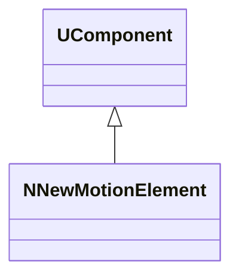
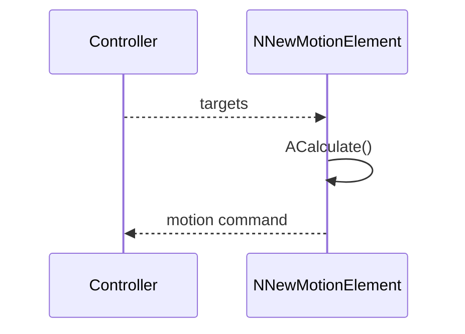
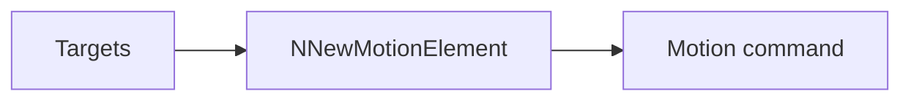
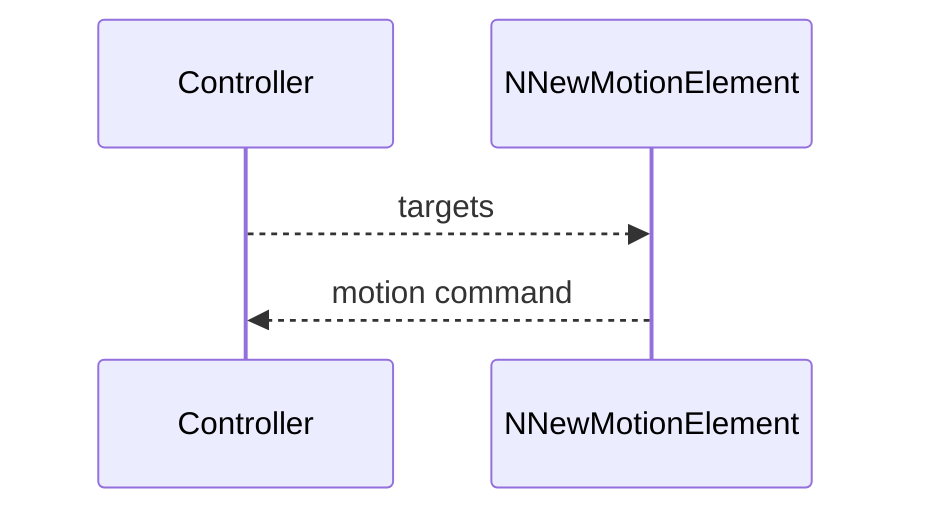

## NNewMotionElement — новый элемент движения

**Класс**: `NNewMotionElement` — элемент движения (новая реализация/вариант).  
**Регистрация**: `UploadClass("NNewMotionElement", ...)` в `NMotionControlLibrary.cpp`.

### Lifecycle
- **ADefault**: параметры элемента.
- **ABuild**: подключение к двигателям/состоянию.
- **AReset**: сброс состояния.
- **ACalculate**: расчёт шага движения.

### I/O
- Вход: цели/ошибки/сенсоры.
- Выход: команды движения.



Пояснение: диаграмма классов показывает место компонента в иерархии и ключевые связи.



Пояснение: диаграмма последовательности показывает типовой сценарий взаимодействия и порядок вызовов.



Пояснение: блок-схема показывает поток данных/сигналов (входы → компонент → выходы).

### Config snippet

```ini
[Component]
ClassName = NNewMotionElement
Name = MotionEl1
```

---

## NNewMotionElement — new motion element (EN)

Computes a motion command from targets/sensor inputs.


Description: this class diagram shows the component position in the type hierarchy and key relations.



Description: this sequence diagram shows a typical runtime interaction and call order.


Description: this flowchart shows the data/signal flow (inputs → component → outputs).
