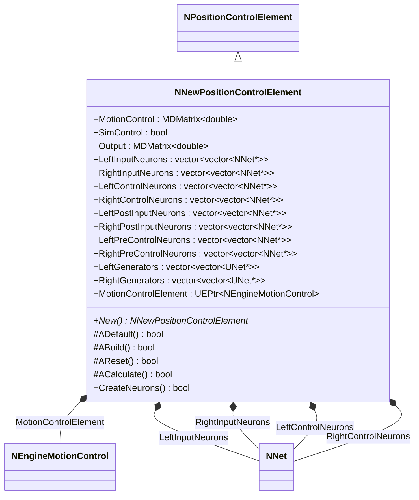
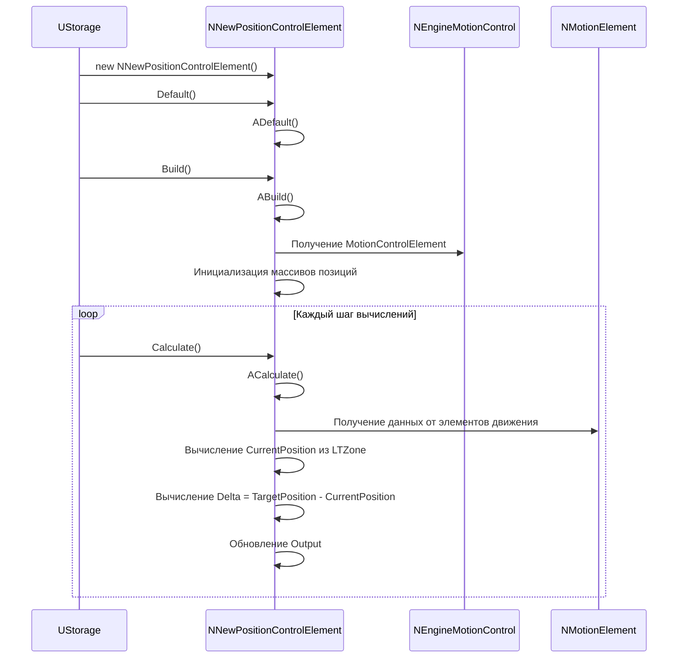
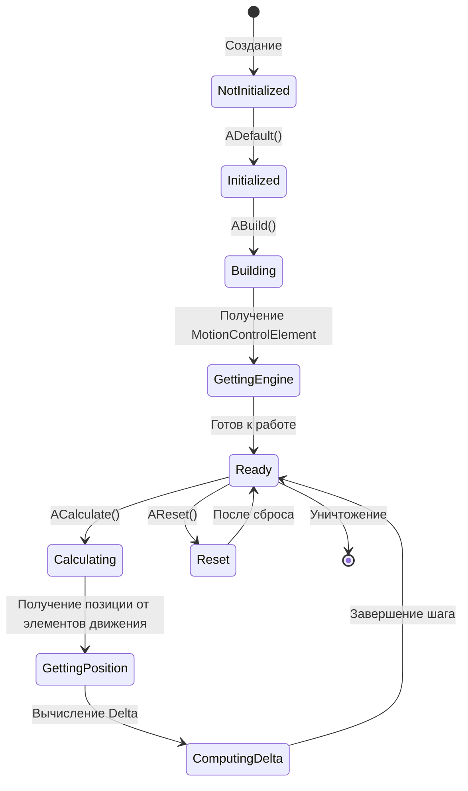
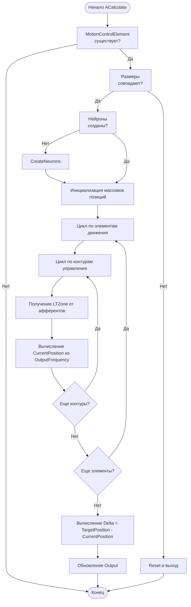
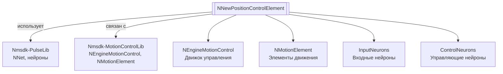

# NNewPositionControlElement — новый элемент контроля позиции

## RU

**Класс**: `NNewPositionControlElement` — расширенный элемент контроля позиции с поддержкой множественных контуров управления и элементов движения.
**Регистрация**: `NMotionControlLibrary.cpp` → `UploadClass("NNewPositionControlElement", ...)`.
**Базовый класс**: `NPositionControlElement` (из Nmsdk-MotionControlLib).

NNewPositionControlElement расширяет функциональность NPositionControlElement для работы с NEngineMotionControl. Компонент вычисляет текущую позицию на основе данных от элементов движения, вычисляет разность между целевой и текущей позицией, и создает нейросетевую структуру для управления.

## UML-диаграмма классов



**Иерархия наследования:**
- `UNet` (Rdk Framework) — базовый класс для сетей компонентов
- `NPositionControlElement` — базовый элемент контроля позиции
- `NNewPositionControlElement` — новый элемент контроля позиции

## UML-диаграмма последовательности



## UML-диаграмма состояний



## UML-диаграмма активности



## UML-диаграмма компонентов



## Свойства

### Параметры

| Свойство | Тип | Флаги | Описание | Значение по умолчанию |
|----------|-----|-------|----------|----------------------|
| `MotionControl` | `MDMatrix<double>` | `ptPubParameter` | Связь с NEngineMotionControl | Подключается к движку управления |
| `SimControl` | `bool` | `ptPubParameter` | Режим симуляции управления | `false` |

### Выходы

| Свойство | Тип | Флаги | Описание | Назначение |
|----------|-----|-------|----------|------------|
| `Output` | `MDMatrix<double>` | `ptPubOutput` | Выходной сигнал управления | Передача другим компонентам |

### Внутренние коллекции

| Свойство | Тип | Описание |
|----------|-----|----------|
| `LeftInputNeurons` | `vector<vector<NNet*>>` | Входные нейроны для левых афферентов (по контурам и элементам) |
| `RightInputNeurons` | `vector<vector<NNet*>>` | Входные нейроны для правых афферентов |
| `LeftControlNeurons` | `vector<vector<NNet*>>` | Управляющие нейроны для левых афферентов |
| `RightControlNeurons` | `vector<vector<NNet*>>` | Управляющие нейроны для правых афферентов |
| `LeftPostInputNeurons` | `vector<vector<NNet*>>` | Поствходные нейроны для левых афферентов |
| `RightPostInputNeurons` | `vector<vector<NNet*>>` | Поствходные нейроны для правых афферентов |
| `LeftPreControlNeurons` | `vector<vector<NNet*>>` | Предуправляющие нейроны для левых афферентов |
| `RightPreControlNeurons` | `vector<vector<NNet*>>` | Предуправляющие нейроны для правых афферентов |
| `LeftGenerators` | `vector<vector<UNet*>>` | Генераторы для левых афферентов |
| `RightGenerators` | `vector<vector<UNet*>>` | Генераторы для правых афферентов |
| `MotionControlElement` | `UEPtr<NEngineMotionControl>` | Указатель на движок управления движением |

## Методы

### Конструкторы и деструкторы

#### `NNewPositionControlElement(void)`
**Назначение:** Конструктор компонента
**Параметры:** Нет
**Возвращаемое значение:** Нет

#### `virtual ~NNewPositionControlElement(void)`
**Назначение:** Деструктор компонента
**Параметры:** Нет
**Возвращаемое значение:** Нет

### Методы жизненного цикла

#### `virtual bool ADefault(void)`
**Назначение:** Инициализация значений по умолчанию
**Параметры:** Нет
**Возвращаемое значение:** `true` при успехе
**Описание:** Вызывает ADefault() базового класса

#### `virtual bool ABuild(void)`
**Назначение:** Построение внутренней структуры компонента
**Параметры:** Нет
**Возвращаемое значение:** `true` при успехе
**Описание:** Получает MotionControlElement из MotionControl, инициализирует размеры массивов позиций на основе параметров движка, очищает векторы нейронов

#### `virtual bool AReset(void)`
**Назначение:** Сброс состояния компонента
**Параметры:** Нет
**Возвращаемое значение:** `true` при успехе
**Описание:** Устанавливает RememberState=false

#### `virtual bool ACalculate(void)`
**Назначение:** Выполнение вычислений на текущем шаге
**Параметры:** Нет
**Возвращаемое значение:** `true` при успехе
**Описание:**
1. Проверяет наличие MotionControlElement
2. Проверяет соответствие размеров массивов
3. Создает нейроны, если они не созданы
4. Вычисляет CurrentPosition на основе данных от элементов движения (из LTZone OutputFrequency)
5. Вычисляет Delta = TargetPosition - CurrentPosition
6. Обновляет Output

### Публичные методы

#### `virtual bool CreateNeurons(void)`
**Назначение:** Создание нейронов для всех контуров и элементов движения
**Параметры:** Нет
**Возвращаемое значение:** `true` при успехе
**Описание:** Создает входные и управляющие нейроны для левых и правых афферентов каждого контура каждого элемента движения

#### `virtual NNewPositionControlElement* New(void)`
**Назначение:** Создание нового экземпляра компонента
**Параметры:** Нет
**Возвращаемое значение:** Указатель на новый экземпляр

## Примеры использования

### C++ код

```cpp
#include "NNewPositionControlElement.h"
#include "NEngineMotionControl.h"

// Создание через NEngineMotionControl
UEPtr<NEngineMotionControl> engine = new NEngineMotionControl;
engine->NumMotionElements = 2;
engine->NumControlLoops = 3;
engine->Build();

// Создание элемента контроля позиции
UEPtr<NNewPositionControlElement> element = new NNewPositionControlElement;
element->MotionControl.Connect(engine);
element->Default();
element->Build();

// Установка целевой позиции
MDMatrix<double> target(3, 4);  // 3 контура, 2 элемента * 2 (L/R)
// Заполнение целевой позиции
element->TargetPosition = target;

// Использование в цикле
element->Reset();
for (int step = 0; step < numSteps; step++) {
    engine->Calculate();
    element->Calculate();

    // Получение текущей позиции и разности
    MDMatrix<double> current = element->CurrentPosition;
    MDMatrix<double> delta = element->Delta;
    MDMatrix<double> output = element->Output;
}
```

### XML конфигурация

```xml
<Object Name="PositionControl" ClassName="NNewPositionControlElement">
    <Property Name="MotionControl" Connect="MotionControlEngine" />
    <Property Name="SimControl" Value="false" />
    <Property Name="TargetPosition" Value="10.0,5.0,8.0,3.0,6.0,2.0" />
</Object>
```

### Использование в конфигурациях

Компонент `NNewPositionControlElement` используется для контроля позиции в системах управления движением с множественными контурами управления и элементами движения.

**Примеры конфигураций:** `Bin/Configs/SpikeSamples/MC1-PCN/` (NewPositionControl_Test, MotionControl_Test, MultiPositionControl_*).

**Типичные сценарии использования:**
1. **Контроль позиции манипулятора** - управление позицией с обратной связью от элементов движения
2. **Множественные контуры** - контроль нескольких независимых контуров управления
3. **Интеграция с NEngineMotionControl** - работа в составе системы управления движением

**Типичные комбинации:**
- `NNewPositionControlElement` + `NEngineMotionControl` - основной сценарий использования
- `NNewPositionControlElement` + `NMotionElement` - получение данных от элементов движения

---

## EN

NNewPositionControlElement — new position control element

**Class**: `NNewPositionControlElement` — extended position control element with support for multiple control loops and motion elements.
**Registration**: `NMotionControlLibrary.cpp` → `UploadClass("NNewPositionControlElement", ...)`.
**Base class**: `NPositionControlElement` (from Nmsdk-MotionControlLib).

NNewPositionControlElement extends NPositionControlElement functionality for working with NEngineMotionControl. The component calculates current position based on data from motion elements, computes the difference between target and current positions, and creates a neural network structure for control.

## Class Diagram

[Same as RU section]

## Sequence Diagram

[Same as RU section]

## State Diagram

[Same as RU section]

## Activity Diagram

[Same as RU section]

## Component Diagram

[Same as RU section]

## Properties

[Same structure as RU section, translated to English]

## Methods

[Same structure as RU section, translated to English]

## Источники

- [Literature-References.md](../Literature-References.md): [A], 22, 24 — элемент контроля позиции, пространственные конфигурации.

## Usage Examples

[Same as RU section, with English comments]
