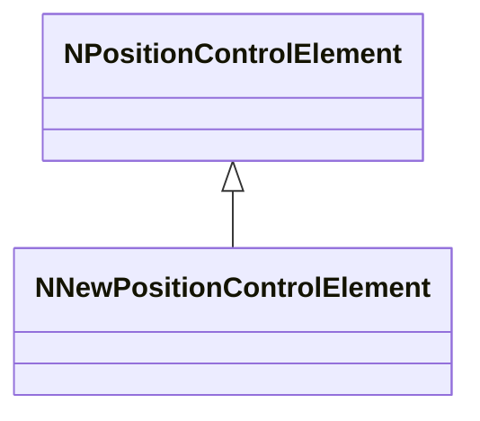
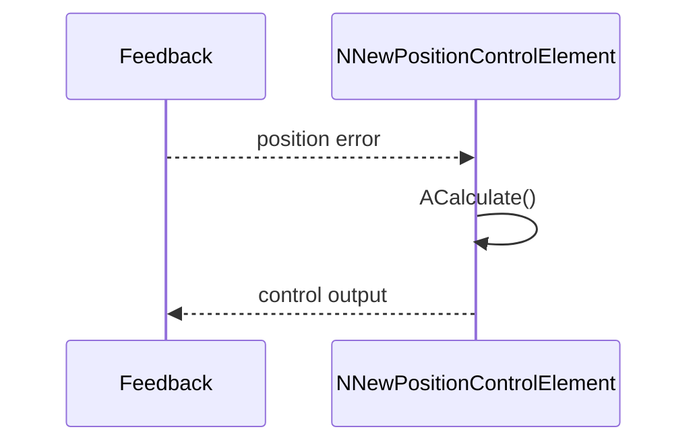
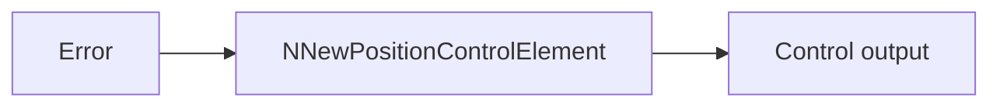
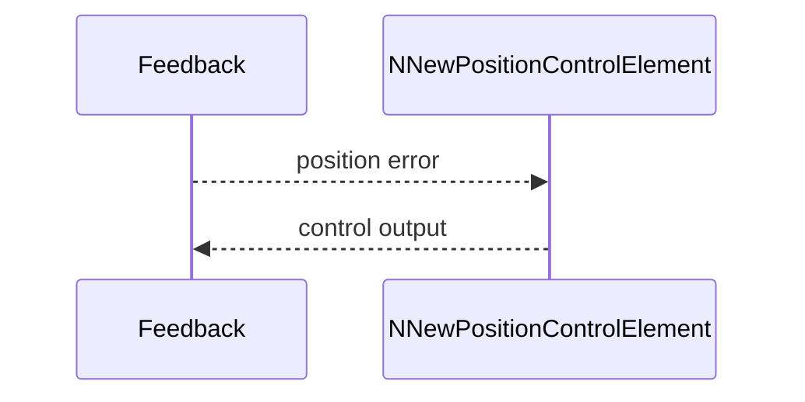

## NNewPositionControlElement — новый элемент контроля позиции

**Класс**: `NNewPositionControlElement` — обновлённая версия позиционного элемента управления.  
**Регистрация**: `UploadClass("NNewPositionControlElement", ...)` в `NMotionControlLibrary.cpp`.

### Lifecycle
- **ADefault/ABuild/AReset**: настройка регулятора.
- **ACalculate**: вычисление команды по ошибке позиции.

### I/O
- Вход: позиция/цель/ошибка.
- Выход: управляющий сигнал.



Пояснение: диаграмма классов показывает место компонента в иерархии и ключевые связи.



Пояснение: диаграмма последовательности показывает типовой сценарий взаимодействия и порядок вызовов.



Пояснение: блок-схема показывает поток данных/сигналов (входы → компонент → выходы).

### Config snippet

```ini
[Component]
ClassName = NNewPositionControlElement
Name = NewPosCtrl1
```

---

## NNewPositionControlElement — new position control element (EN)

Updated position control element producing actuation commands from position error.


Description: this class diagram shows the component position in the type hierarchy and key relations.



Description: this sequence diagram shows a typical runtime interaction and call order.


Description: this flowchart shows the data/signal flow (inputs → component → outputs).
