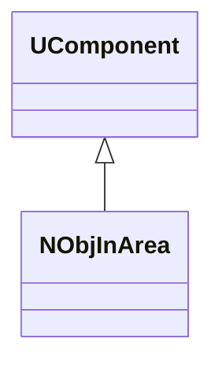
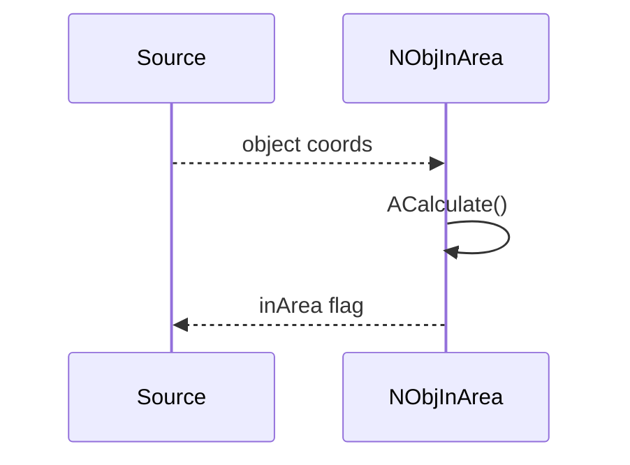
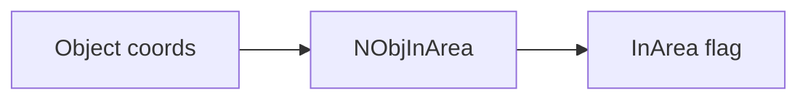
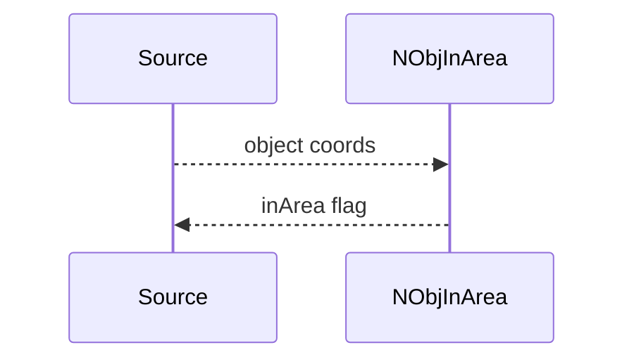

## NObjInArea — объект в области

**Класс**: `NObjInArea` — проверка/детекция объекта в заданной области (сигнал события).  
**Регистрация**: `UploadClass("NObjInArea", ...)` в `NMotionControlLibrary.cpp`.

### Lifecycle
- **ADefault**: параметры области.
- **ABuild**: подключение источников объектов/координат.
- **AReset**: сброс события.
- **ACalculate**: проверка условия «в области» и выдача результата.

### I/O
- Вход: координаты/объекты.
- Выход: флаг/событие.



Пояснение: диаграмма классов показывает место компонента в иерархии и ключевые связи.



Пояснение: диаграмма последовательности показывает типовой сценарий взаимодействия и порядок вызовов.



Пояснение: блок-схема показывает поток данных/сигналов (входы → компонент → выходы).

### Config snippet

```ini
[Component]
ClassName = NObjInArea
Name = ObjArea1
```

---

## NObjInArea — object-in-area check (EN)

Checks whether an object lies within a configured area; outputs boolean/event.


Description: this class diagram shows the component position in the type hierarchy and key relations.



Description: this sequence diagram shows a typical runtime interaction and call order.


Description: this flowchart shows the data/signal flow (inputs → component → outputs).
