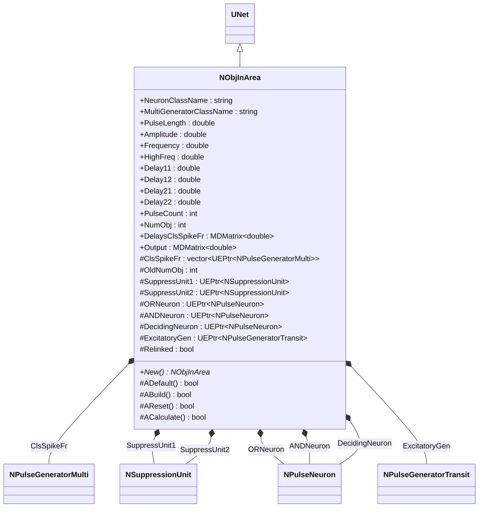
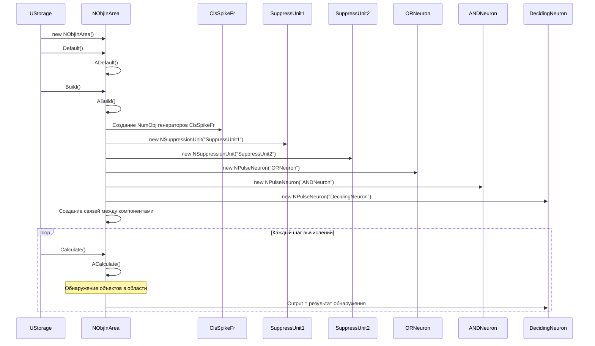
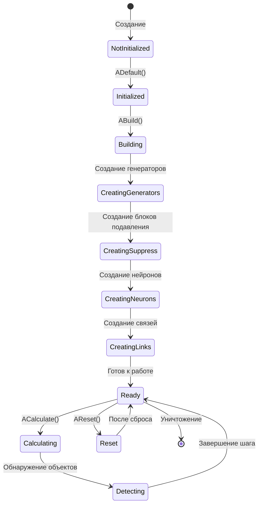
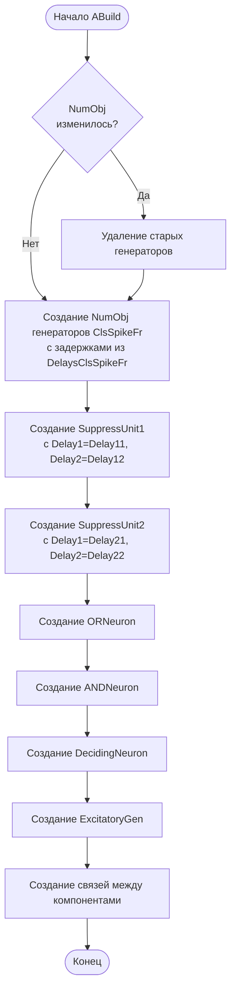
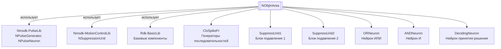

# NObjInArea — объект в области

**Класс**: `NObjInArea` — компонент для обнаружения объектов в ограниченной области изображения с использованием нейросетевой структуры и блоков подавления.
**Регистрация**: `NMotionControlLibrary.cpp` → `UploadClass("NObjInArea", ...)`.
**Базовый класс**: `UNet` (из Rdk Framework).

NObjInArea обнаруживает объекты в ограниченной области изображения, используя генераторы последовательностей импульсов, блоки подавления (NSuppressionUnit) и нейроны для принятия решений. Компонент создает сложную структуру для обработки визуальной информации.

## UML-диаграмма классов



**Иерархия наследования:**
- `UNet` (Rdk Framework) — базовый класс для сетей компонентов
- `NObjInArea` — обнаружение объектов в области

## UML-диаграмма последовательности



## UML-диаграмма состояний



## UML-диаграмма активности



## UML-диаграмма компонентов



## Свойства

### Параметры классов

| Свойство | Тип | Флаги | Описание | Значение по умолчанию |
|----------|-----|-------|----------|----------------------|
| `NeuronClassName` | `std::string` | `ptPubParameter` | Имя класса нейрона | Задается пользователем |
| `MultiGeneratorClassName` | `std::string` | `ptPubParameter` | Имя класса генератора последовательностей | Задается пользователем |

### Параметры импульсов

| Свойство | Тип | Флаги | Описание | Значение по умолчанию |
|----------|-----|-------|----------|----------------------|
| `PulseLength` | `double` | `ptPubParameter` | Длительность импульсов (с) | Задается пользователем |
| `Amplitude` | `double` | `ptPubParameter` | Амплитуда импульсов | Задается пользователем |
| `Frequency` | `double` | `ptPubParameter` | Частота генерации (Гц) | Задается пользователем |
| `HighFreq` | `double` | `ptPubParameter` | Высокая частота (Гц) | Задается пользователем |

### Параметры задержек

| Свойство | Тип | Флаги | Описание | Значение по умолчанию |
|----------|-----|-------|----------|----------------------|
| `Delay11` | `double` | `ptPubParameter` | Задержка 11 (начало подавления 1) | Задается пользователем |
| `Delay12` | `double` | `ptPubParameter` | Задержка 12 (конец подавления 1) | Задается пользователем |
| `Delay21` | `double` | `ptPubParameter` | Задержка 21 (начало подавления 2) | Задается пользователем |
| `Delay22` | `double` | `ptPubParameter` | Задержка 22 (конец подавления 2) | Задается пользователем |

### Параметры последовательностей

| Свойство | Тип | Флаги | Описание | Значение по умолчанию |
|----------|-----|-------|----------|----------------------|
| `PulseCount` | `int` | `ptPubParameter` | Количество импульсов в последовательности | Задается пользователем |
| `NumObj` | `int` | `ptPubParameter` | Количество объектов для обнаружения | Задается пользователем |
| `DelaysClsSpikeFr` | `MDMatrix<double>` | `ptPubParameter` | Задержки для генераторов последовательностей | Задается пользователем |

### Выходы

| Свойство | Тип | Флаги | Описание | Назначение |
|----------|-----|-------|----------|------------|
| `Output` | `MDMatrix<double>` | `ptOutput \| ptPubState` | Результат обнаружения объектов | Передача другим компонентам |

### Защищенные переменные

| Свойство | Тип | Описание |
|----------|-----|----------|
| `ClsSpikeFr` | `std::vector<UEPtr<NPulseGeneratorMulti>>` | Вектор генераторов последовательностей |
| `OldNumObj` | `int` | Предыдущее количество объектов |
| `SuppressUnit1` | `UEPtr<NSuppressionUnit>` | Блок подавления 1 |
| `SuppressUnit2` | `UEPtr<NSuppressionUnit>` | Блок подавления 2 |
| `ORNeuron` | `UEPtr<NPulseNeuron>` | Нейрон ИЛИ |
| `ANDNeuron` | `UEPtr<NPulseNeuron>` | Нейрон И |
| `DecidingNeuron` | `UEPtr<NPulseNeuron>` | Нейрон принятия решения |
| `ExcitatoryGen` | `UEPtr<NPulseGeneratorTransit>` | Возбуждающий генератор |
| `Relinked` | `bool` | Флаг пересвязывания |

## Методы

### Конструкторы и деструкторы

#### `NObjInArea(void)`
**Назначение:** Конструктор компонента
**Параметры:** Нет
**Возвращаемое значение:** Нет
**Описание:** Инициализирует OldNumObj=0, очищает ClsSpikeFr, устанавливает все указатели в NULL, Relinked=false

#### `virtual ~NObjInArea(void)`
**Назначение:** Деструктор компонента
**Параметры:** Нет
**Возвращаемое значение:** Нет

### Методы жизненного цикла

#### `virtual bool ADefault(void)`
**Назначение:** Инициализация значений по умолчанию
**Параметры:** Нет
**Возвращаемое значение:** `true` при успехе
**Описание:** Устанавливает значения по умолчанию для всех параметров

#### `virtual bool ABuild(void)`
**Назначение:** Построение внутренней структуры компонента
**Параметры:** Нет
**Возвращаемое значение:** `true` при успехе
**Описание:** Создает структуру:
1. Удаляет старые генераторы, если NumObj изменилось
2. Создает NumObj генераторов ClsSpikeFr с задержками из DelaysClsSpikeFr
3. Создает SuppressUnit1 и SuppressUnit2 с соответствующими задержками
4. Создает ORNeuron, ANDNeuron, DecidingNeuron
5. Создает ExcitatoryGen
6. Создает связи между компонентами

#### `virtual bool AReset(void)`
**Назначение:** Сброс состояния компонента
**Параметры:** Нет
**Возвращаемое значение:** `true` при успехе

#### `virtual bool ACalculate(void)`
**Назначение:** Выполнение вычислений на текущем шаге
**Параметры:** Нет
**Возвращаемое значение:** `true` при успехе
**Описание:** Вычисления выполняются нейронами внутри структуры автоматически

### Сеттеры свойств

Все сеттеры свойств обновляют параметры соответствующих генераторов, блоков подавления и нейронов при их существовании.

### Публичные методы

#### `virtual NObjInArea* New(void)`
**Назначение:** Создание нового экземпляра компонента
**Параметры:** Нет
**Возвращаемое значение:** Указатель на новый экземпляр

## Примеры использования

### C++ код

```cpp
#include "NObjInArea.h"

UEPtr<NObjInArea> detector = new NObjInArea;
detector->Default();
detector->NumObj = 3;
detector->PulseCount = 5;
detector->Delay11 = 0.0;
detector->Delay12 = 0.1;
detector->Delay21 = 0.2;
detector->Delay22 = 0.3;
// Настройка DelaysClsSpikeFr
detector->Build();
```

### XML конфигурация

```xml
<Object Name="ObjInArea" ClassName="NObjInArea">
    <Property Name="NumObj" Value="3" />
    <Property Name="PulseCount" Value="5" />
    <Property Name="Delay11" Value="0.0" />
    <Property Name="Delay12" Value="0.1" />
    <Property Name="Delay21" Value="0.2" />
    <Property Name="Delay22" Value="0.3" />
</Object>
```

### Использование в конфигурациях

Компонент `NObjInArea` используется для обнаружения объектов в ограниченной области изображения.

**Типичные сценарии использования:**
1. **Обнаружение объектов** - обнаружение объектов в заданной области изображения
2. **Обработка визуальной информации** - обработка визуальных данных для обнаружения объектов

**Типичные комбинации:**
- `NObjInArea` + `NEyeRetina` - обнаружение объектов на основе данных ретины
- `NObjInArea` + источники изображений - обработка визуальной информации

---

# NObjInArea — object in area

**Class**: `NObjInArea` — component for detecting objects in a restricted image area using a neural network structure and suppression units.
**Registration**: `NMotionControlLibrary.cpp` → `UploadClass("NObjInArea", ...)`.
**Base class**: `UNet` (from Rdk Framework).

NObjInArea detects objects in a restricted image area using pulse sequence generators, suppression units (NSuppressionUnit), and decision neurons. The component creates a complex structure for processing visual information.

## Class Diagram

[Same as RU section]

## Sequence Diagram

[Same as RU section]

## State Diagram

[Same as RU section]

## Activity Diagram

[Same as RU section]

## Component Diagram

[Same as RU section]

## Properties

[Same structure as RU section, translated to English]

## Methods

[Same structure as RU section, translated to English]

## Источники

- [Literature-References.md](../Literature-References.md): [A], 13, 19 — обнаружение объектов, восприятие и управление.

## Usage Examples

[Same as RU section, with English comments]
