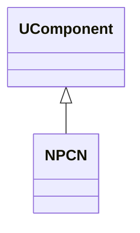
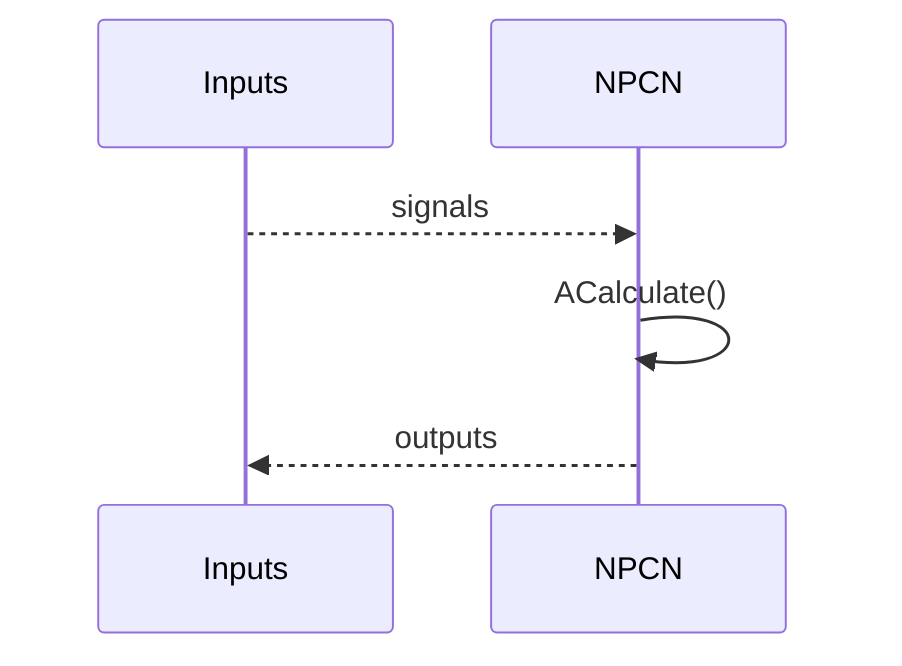
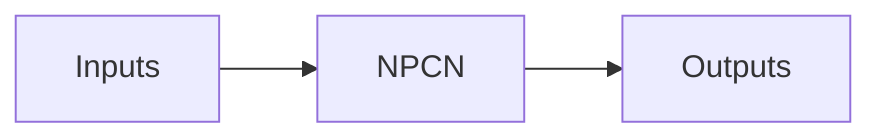
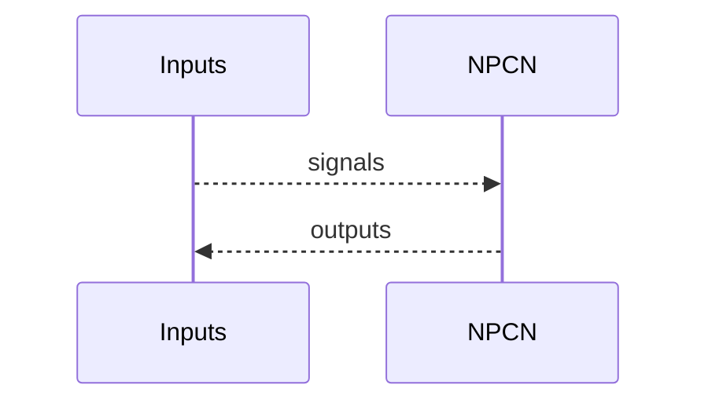

## NPCN — элемент/узел PCN (Nmsdk-MotionControlLib)

**Класс**: `NPCN` — компонент, связанный с PCN-элементами управления/сети (по регистрации библиотеки).  
**Регистрация**: `UploadClass("NPCN", ...)` в `NMotionControlLibrary.cpp`.

### Lifecycle
- **ADefault**: параметры элемента.
- **ABuild**: подключение входов/выходов.
- **AReset**: сброс состояния.
- **ACalculate**: вычисление шага/выходов.

### I/O
- Вход: сигналы/состояния (вектор).
- Выход: вычисленные значения (вектор/скаляр).



Пояснение: диаграмма классов показывает место компонента в иерархии и ключевые связи.



Пояснение: диаграмма последовательности показывает типовой сценарий взаимодействия и порядок вызовов.



Пояснение: блок-схема показывает поток данных/сигналов (входы → компонент → выходы).

### Config snippet

```ini
[Component]
ClassName = NPCN
Name = PCN1
```

---

## NPCN — PCN node/element (EN)

PCN-related component producing outputs from input signals.


Description: this class diagram shows the component position in the type hierarchy and key relations.



Description: this sequence diagram shows a typical runtime interaction and call order.


Description: this flowchart shows the data/signal flow (inputs → component → outputs).
