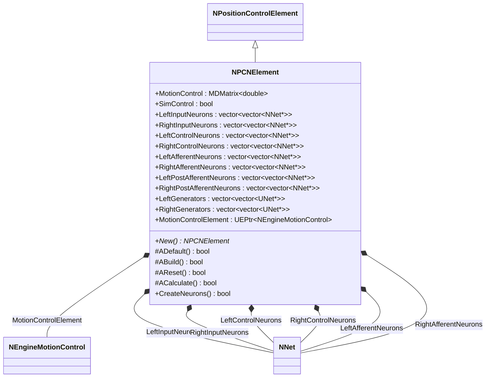
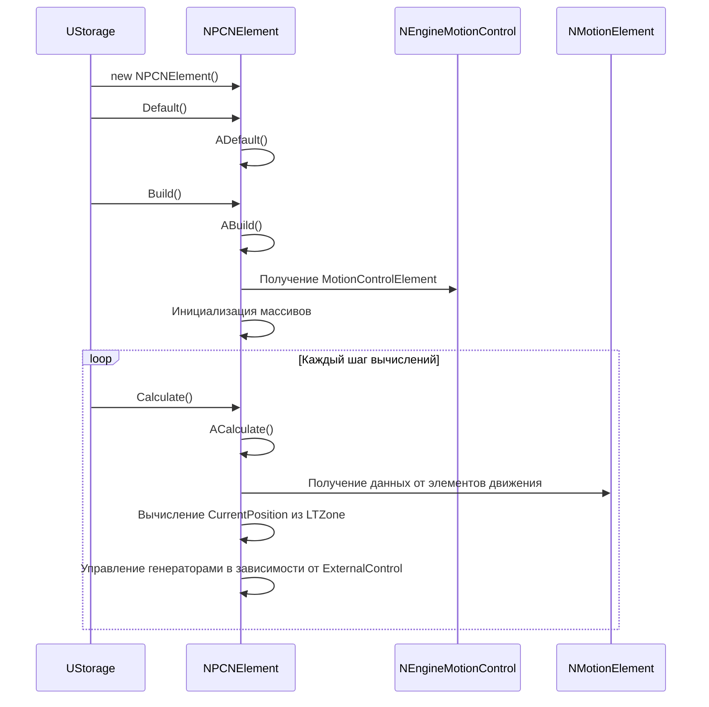
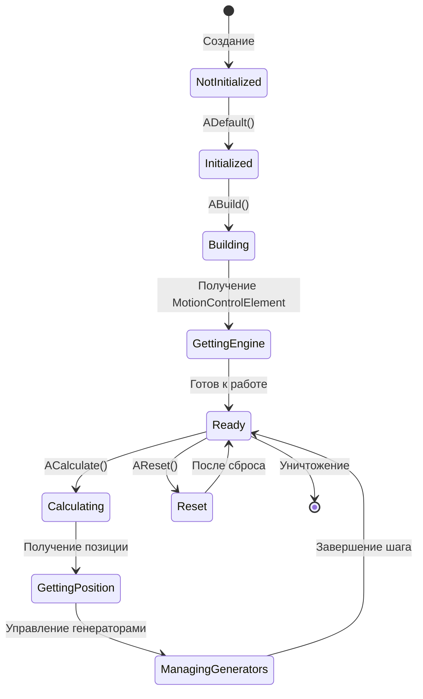
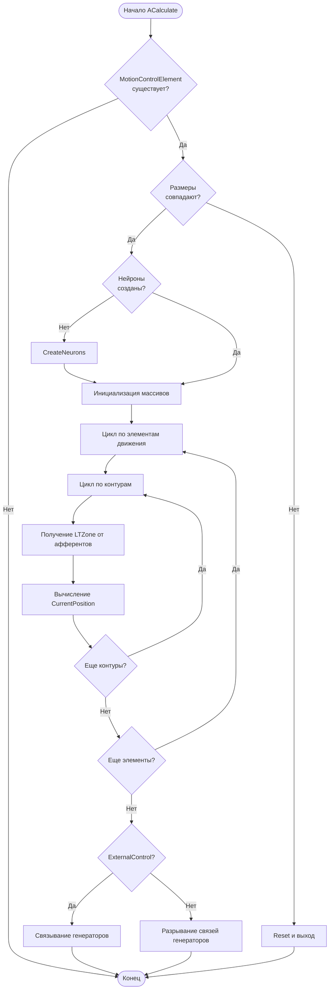
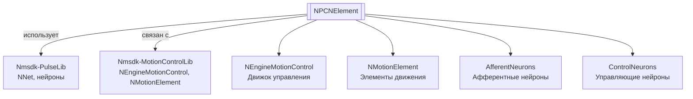

# NPCN (NPCNElement) — PCN элемент

**Класс**: `NPCNElement` (регистрируется как `NPCN`) — элемент сети контроля позиции (Position Control Network) для управления движением на основе нейросетевых вычислений.  
**Регистрация**: `NMotionControlLibrary.cpp` → `UploadClass("NPCN", ...)`.  
**Базовый класс**: `NPositionControlElement` (из Nmsdk-MotionControlLib).

NPCNElement реализует элемент сети контроля позиции, который вычисляет текущую позицию на основе данных от элементов движения через NEngineMotionControl и создает нейросетевую структуру для управления позицией с использованием афферентных нейронов.

## UML-диаграмма классов



**Иерархия наследования:**
- `UNet` (Rdk Framework) — базовый класс для сетей компонентов
- `NPositionControlElement` — базовый элемент контроля позиции
- `NPCNElement` — PCN элемент

## UML-диаграмма последовательности



## UML-диаграмма состояний



## UML-диаграмма активности



## UML-диаграмма компонентов



## Свойства

### Параметры

| Свойство | Тип | Флаги | Описание | Значение по умолчанию |
|----------|-----|-------|----------|----------------------|
| `MotionControl` | `MDMatrix<double>` | `ptPubParameter` | Связь с NEngineMotionControl | Подключается к движку управления |
| `SimControl` | `bool` | `ptPubParameter` | Режим симуляции управления | `false` |

### Внутренние коллекции

| Свойство | Тип | Описание |
|----------|-----|----------|
| `LeftInputNeurons` | `vector<vector<NNet*>>` | Входные нейроны для левых афферентов |
| `RightInputNeurons` | `vector<vector<NNet*>>` | Входные нейроны для правых афферентов |
| `LeftControlNeurons` | `vector<vector<NNet*>>` | Управляющие нейроны для левых афферентов |
| `RightControlNeurons` | `vector<vector<NNet*>>` | Управляющие нейроны для правых афферентов |
| `LeftAfferentNeurons` | `vector<vector<NNet*>>` | Афферентные нейроны для левых афферентов |
| `RightAfferentNeurons` | `vector<vector<NNet*>>` | Афферентные нейроны для правых афферентов |
| `LeftPostAfferentNeurons` | `vector<vector<NNet*>>` | Постафферентные нейроны для левых афферентов |
| `RightPostAfferentNeurons` | `vector<vector<NNet*>>` | Постафферентные нейроны для правых афферентов |
| `LeftGenerators` | `vector<vector<UNet*>>` | Генераторы для левых афферентов |
| `RightGenerators` | `vector<vector<UNet*>>` | Генераторы для правых афферентов |
| `MotionControlElement` | `UEPtr<NEngineMotionControl>` | Указатель на движок управления движением |

## Методы

### Конструкторы и деструкторы

#### `NPCNElement(void)`
**Назначение:** Конструктор компонента  
**Параметры:** Нет  
**Возвращаемое значение:** Нет

#### `virtual ~NPCNElement(void)`
**Назначение:** Деструктор компонента  
**Параметры:** Нет  
**Возвращаемое значение:** Нет

### Методы жизненного цикла

#### `virtual bool ADefault(void)`
**Назначение:** Инициализация значений по умолчанию  
**Параметры:** Нет  
**Возвращаемое значение:** `true` при успехе  
**Описание:** Вызывает ADefault() базового класса

#### `virtual bool ABuild(void)`
**Назначение:** Построение внутренней структуры компонента  
**Параметры:** Нет  
**Возвращаемое значение:** `true` при успехе  
**Описание:** Получает MotionControlElement из MotionControl, инициализирует размеры массивов позиций

#### `virtual bool AReset(void)`
**Назначение:** Сброс состояния компонента  
**Параметры:** Нет  
**Возвращаемое значение:** `true` при успехе  
**Описание:** Устанавливает RememberState=false

#### `virtual bool ACalculate(void)`
**Назначение:** Выполнение вычислений на текущем шаге  
**Параметры:** Нет  
**Возвращаемое значение:** `true` при успехе  
**Описание:** 
1. Проверяет наличие MotionControlElement
2. Вычисляет CurrentPosition на основе данных от элементов движения
3. Управляет генераторами в зависимости от ExternalControl

### Публичные методы

#### `virtual bool CreateNeurons(void)`
**Назначение:** Создание нейронов для всех контуров и элементов движения  
**Параметры:** Нет  
**Возвращаемое значение:** `true` при успехе  
**Описание:** Создает входные, управляющие и афферентные нейроны для левых и правых афферентов

#### `virtual NPCNElement* New(void)`
**Назначение:** Создание нового экземпляра компонента  
**Параметры:** Нет  
**Возвращаемое значение:** Указатель на новый экземпляр

## Примеры использования

### C++ код

```cpp
#include "NPCNElement.h"

UEPtr<NPCNElement> pcn = new NPCNElement;
pcn->MotionControl.Connect(engine);
pcn->Default();
pcn->Build();
```

### XML конфигурация

```xml
<Object Name="PCN1" ClassName="NPCN">
    <Property Name="MotionControl" Connect="MotionControlEngine" />
    <Property Name="SimControl" Value="false" />
</Object>
```

### Использование в конфигурациях

Компонент `NPCNElement` (регистрируется как `NPCN`) используется для контроля позиции в системах управления движением через сеть контроля позиции.

**Типичные сценарии использования:**
1. **Контроль позиции** - управление позицией с использованием афферентных нейронов
2. **Интеграция с NEngineMotionControl** - работа в составе системы управления движением
3. **Внешнее управление** - использование генераторов для внешнего управления

**Типичные комбинации:**
- `NPCNElement` + `NEngineMotionControl` - основной сценарий использования
- `NPCNElement` + генераторы - внешнее управление позицией

---

# NPCN (NPCNElement) — PCN element

**Class**: `NPCNElement` (registered as `NPCN`) — Position Control Network element for motion control based on neural network computations.  
**Registration**: `NMotionControlLibrary.cpp` → `UploadClass("NPCN", ...)`.  
**Base class**: `NPositionControlElement` (from Nmsdk-MotionControlLib).

NPCNElement implements a Position Control Network element that calculates current position based on data from motion elements through NEngineMotionControl and creates a neural network structure for position control using afferent neurons.

## Class Diagram

[Same as RU section]

## Sequence Diagram

[Same as RU section]

## State Diagram

[Same as RU section]

## Activity Diagram

[Same as RU section]

## Component Diagram

[Same as RU section]

## Properties

[Same structure as RU section, translated to English]

## Methods

[Same structure as RU section, translated to English]

## Usage Examples

[Same as RU section, with English comments]
