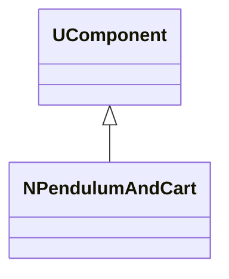
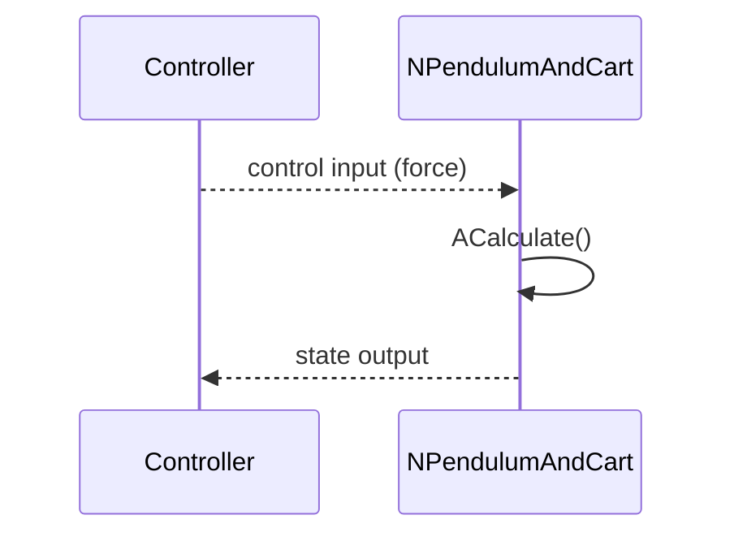
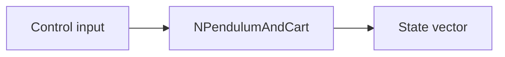
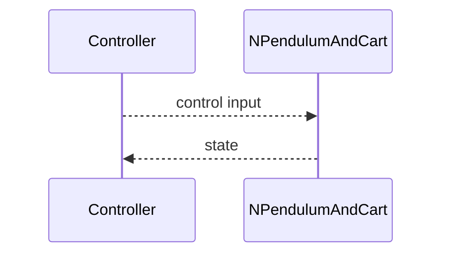

## NPendulumAndCart — маятник на тележке (Nmsdk-MotionControlLib)

**Класс**: `NPendulumAndCart` — модель/элемент управления для системы «маятник-тележка» (демо/тест управления).  
**Регистрация в UStorage**: `NMotionControlLibrary.cpp` → `UploadClass("NPendulumAndCart", ...)`.  
**Storage-инстансы**: `ClassName = "NPendulumAndCart"`.

### Lifecycle
- **ADefault**: инициализация параметров модели (массы, длины, шаг, ограничения).
- **ABuild**: подготовка связей входных воздействий и выходных наблюдений.
- **AReset**: сброс состояния (угол, скорость, позиция).
- **ACalculate**: один шаг симуляции/обновления состояния и выдача наблюдений.

### I/O (UProperty)
- **Входы**: управляющее воздействие тележки (сила/ускорение), параметры возмущений.
- **Выходы**: состояние системы (угол маятника, угловая скорость, позиция, скорость).

### Диаграмма классов



Диаграмма показывает `NPendulumAndCart` как компонент, выполняющий шаг симуляции/управления в `ACalculate()`.

### Типовой сценарий (sequence)



Диаграмма иллюстрирует цикл: контроллер подаёт воздействие, компонент обновляет модель и возвращает наблюдаемое состояние.

### Поток данных (flow)



Диаграмма отражает поток: управляющее воздействие → модель → выходное состояние.

### Config snippet

```ini
[Component]
ClassName = NPendulumAndCart
Name = Pendulum1
```

### Родственные компоненты
- `NEngineMotionControl`: [`NEngineMotionControl`](NEngineMotionControl.md)
- `NPositionControlElement`: [`NPositionControlElement`](NPositionControlElement.md)

---

## NPendulumAndCart — pendulum on a cart (EN)

**Class**: `NPendulumAndCart` — control/simulation component for the classic cart-pendulum system.  
**Registration**: `UploadClass("NPendulumAndCart", ...)` in `NMotionControlLibrary.cpp`.  
**Instances**: `ClassName = "NPendulumAndCart"`.

### Lifecycle
- **ADefault**: initialise model parameters.
- **ABuild**: wire inputs/outputs.
- **AReset**: reset state.
- **ACalculate**: simulate one step and output state.

### I/O
- **Inputs**: control force/acceleration.
- **Outputs**: state (angle, angular rate, position, velocity).


Пояснение: диаграмма классов показывает место компонента в иерархии и ключевые связи.



Пояснение: диаграмма последовательности показывает типовой сценарий взаимодействия и порядок вызовов.


Пояснение: блок-схема показывает поток данных/сигналов (входы → компонент → выходы).
