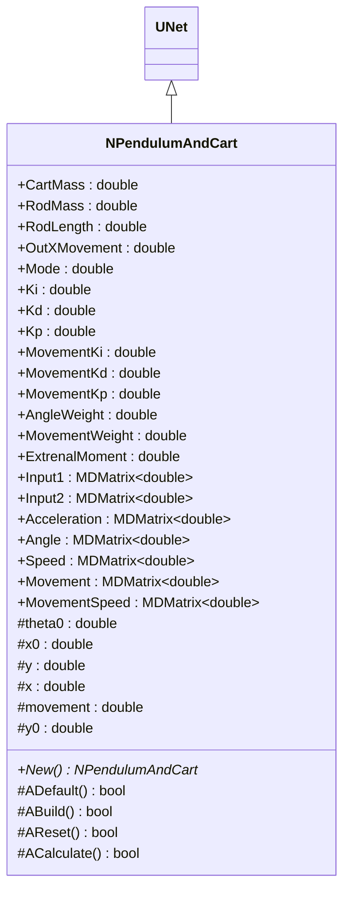
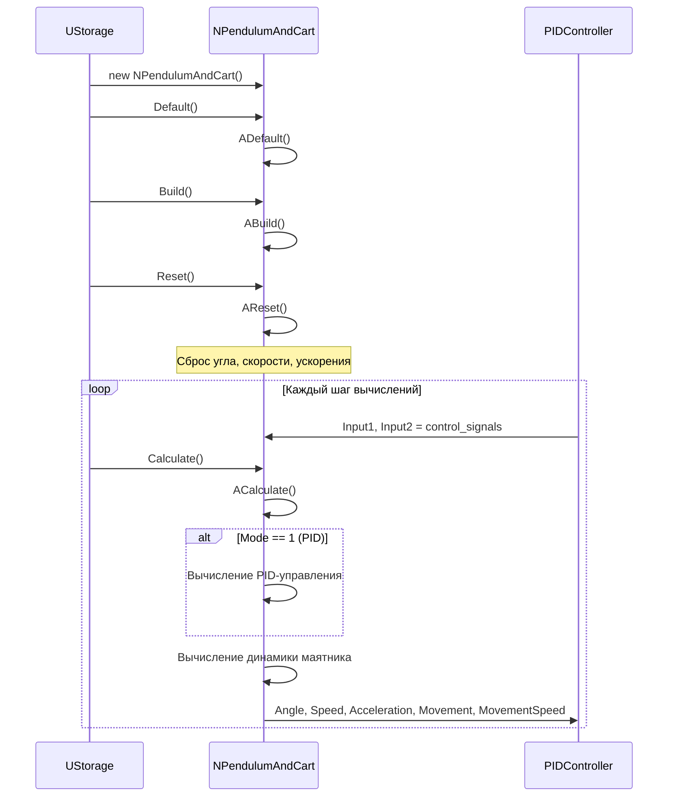
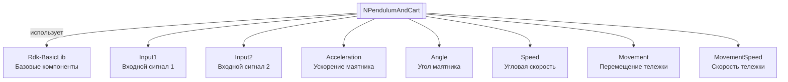

# NPendulumAndCart — маятник и тележка

## RU

**Класс**: `NPendulumAndCart` — компонент для моделирования системы маятника на тележке (inverted pendulum on a cart) с возможностью управления через PID-регулятор.
**Регистрация**: `NMotionControlLibrary.cpp` → `UploadClass("NPendulumAndCart", ...)`.
**Базовый класс**: `UNet` (из Rdk Framework).

NPendulumAndCart реализует математическую модель маятника на тележке, вычисляющую динамику системы на основе физических параметров (массы тележки, массы стержня, длины стержня) и входных управляющих сигналов. Компонент поддерживает режим управления через PID-регулятор.

## UML-диаграмма классов



**Иерархия наследования:**
- `UNet` (Rdk Framework) — базовый класс для сетей компонентов
- `NPendulumAndCart` — модель маятника на тележке

## UML-диаграмма последовательности



## UML-диаграмма состояний

```mermaid
stateDiagram-v2
    [*] --> NotInitialized: Создание
    NotInitialized --> Initialized: ADefault()
    Initialized --> Built: ABuild()
    Built --> Ready: Готов к работе
    Ready --> Calculating: ACalculate()
    Calculating --> CheckMode{Mode == 1?}
    CheckMode -->|Да| PIDControl: Вычисление PID
    CheckMode -->|Нет| DirectInput: Использование прямого входа
    PIDControl --> Dynamics: Вычисление динамики
    DirectInput --> Dynamics: Вычисление динамики
    Dynamics --> Ready: Завершение шага
    Ready --> Reset: AReset()
    Reset --> Ready: После сброса
    Ready --> [*]: Уничтожение
```

## UML-диаграмма активности

```mermaid
flowchart TD
    Start([Начало ACalculate]) --> ReadInputs[Чтение Input1 и Input2]
    ReadInputs --> CheckMode["Mode == 1<br/>PID?"]
    CheckMode -->|Да| CalcPID[Вычисление PID:<br/>input[0] = (theta0*Kp + y*Kd + Ki*theta0/TimeStep)*AngleWeight +<br/>(movement*MovementKp + x*MovementKd + MovementKi*movement/TimeStep)*MovementWeight]
    CheckMode -->|Нет| AddExternal[Добавление ExtrenalMoment]
    CalcPID --> AddExternal
    AddExternal --> CalcCoeffs["Вычисление коэффициентов:<br/>k1 = 3*g*(CartMass+RodMass)/((4*CartMass+RodMass)*RodLength)<br/>k2 = 3/(4*CartMass+RodMass)/RodLength"]
    CalcCoeffs --> CalcDynamics["Вычисление динамики:<br/>y = y + (a*theta0 + b)/TimeStep<br/>Angle = theta0 + (y-OutXMovement)/TimeStep<br/>Speed = y<br/>Acceleration = (a*theta0 + b)"]
    CalcDynamics --> CalcMovement["Вычисление движения тележки:<br/>x = x + ...<br/>Movement = x<br/>MovementSpeed = ..."]
    CalcMovement --> UpdateOutputs[Обновление выходов]
    UpdateOutputs --> End([Конец])
```

## UML-диаграмма компонентов



## Свойства

### Параметры модели

| Свойство | Тип | Флаги | Описание | Значение по умолчанию |
|----------|-----|-------|----------|----------------------|
| `CartMass` | `double` | `ptPubParameter` | Масса тележки (кг) | `1.0` |
| `RodMass` | `double` | `ptPubParameter` | Масса стержня маятника (кг) | `0.1` |
| `RodLength` | `double` | `ptPubParameter` | Длина стержня маятника (м) | `1.0` |
| `OutXMovement` | `double` | `ptPubParameter` | Выходное перемещение по X | `0.0` |

### Параметры PID-регулятора

| Свойство | Тип | Флаги | Описание | Значение по умолчанию |
|----------|-----|-------|----------|----------------------|
| `Mode` | `double` | `ptPubParameter` | Режим управления: 0=прямой вход, 1=PID | `0.0` |
| `Kp` | `double` | `ptPubParameter` | Пропорциональный коэффициент для угла | `0.0` |
| `Kd` | `double` | `ptPubParameter` | Дифференциальный коэффициент для угла | `0.0` |
| `Ki` | `double` | `ptPubParameter` | Интегральный коэффициент для угла | `0.0` |
| `MovementKp` | `double` | `ptPubParameter` | Пропорциональный коэффициент для перемещения | `0.0` |
| `MovementKd` | `double` | `ptPubParameter` | Дифференциальный коэффициент для перемещения | `0.0` |
| `MovementKi` | `double` | `ptPubParameter` | Интегральный коэффициент для перемещения | `0.0` |
| `AngleWeight` | `double` | `ptPubParameter` | Вес угла в комбинированном управлении | `1.0` |
| `MovementWeight` | `double` | `ptPubParameter` | Вес перемещения в комбинированном управлении | `1.0` |
| `ExtrenalMoment` | `double` | `ptPubState` | Внешний момент | `0.0` |

### Входы

| Свойство | Тип | Флаги | Описание | Источник данных |
|----------|-----|-------|----------|-----------------|
| `Input1` | `MDMatrix<double>` | `ptInput \| ptPubState` | Входной сигнал управления 1 | Контроллер или PID-регулятор |
| `Input2` | `MDMatrix<double>` | `ptInput \| ptPubState` | Входной сигнал управления 2 | Контроллер |

### Выходы

| Свойство | Тип | Флаги | Описание | Назначение |
|----------|-----|-------|----------|------------|
| `Acceleration` | `MDMatrix<double>` | `ptOutput \| ptPubState` | Угловое ускорение маятника (рад/с²) | Передача системам управления |
| `Angle` | `MDMatrix<double>` | `ptOutput \| ptPubState` | Угол маятника (рад) | Передача системам управления |
| `Speed` | `MDMatrix<double>` | `ptOutput \| ptPubState` | Угловая скорость маятника (рад/с) | Передача системам управления |
| `Movement` | `MDMatrix<double>` | `ptOutput \| ptPubState` | Перемещение тележки (м) | Передача системам управления |
| `MovementSpeed` | `MDMatrix<double>` | `ptOutput \| ptPubState` | Скорость тележки (м/с) | Передача системам управления |

### Защищенные переменные

| Свойство | Тип | Описание |
|----------|-----|----------|
| `theta0` | `double` | Предыдущий угол маятника |
| `x0` | `double` | Предыдущее перемещение тележки |
| `y` | `double` | Предыдущая угловая скорость |
| `x` | `double` | Предыдущая скорость тележки |
| `movement` | `double` | Предыдущее перемещение |
| `y0` | `double` | Начальная угловая скорость |

## Методы

### Конструкторы и деструкторы

#### `NPendulumAndCart(void)`
**Назначение:** Конструктор компонента
**Параметры:** Нет
**Возвращаемое значение:** Нет
**Описание:** Инициализирует theta0=0, x0=0, y=0, x=0, movement=0, y0=0

#### `virtual ~NPendulumAndCart(void)`
**Назначение:** Деструктор компонента
**Параметры:** Нет
**Возвращаемое значение:** Нет

### Методы жизненного цикла

#### `virtual bool ADefault(void)`
**Назначение:** Инициализация значений по умолчанию
**Параметры:** Нет
**Возвращаемое значение:** `true` при успехе
**Описание:** Устанавливает CartMass=1, RodMass=0.1, RodLength=1, все PID коэффициенты=0, AngleWeight=1, MovementWeight=1, инициализирует матрицы нулями

#### `virtual bool ABuild(void)`
**Назначение:** Построение внутренней структуры компонента
**Параметры:** Нет
**Возвращаемое значение:** `true` при успехе

#### `virtual bool AReset(void)`
**Назначение:** Сброс состояния компонента
**Параметры:** Нет
**Возвращаемое значение:** `true` при успехе
**Описание:** Сбрасывает theta0=0, y=0, x=0, movement=0, обнуляет выходные матрицы

#### `virtual bool ACalculate(void)`
**Назначение:** Выполнение вычислений на текущем шаге
**Параметры:** Нет
**Возвращаемое значение:** `true` при успехе
**Описание:**
1. Читает Input1 и Input2
2. Если Mode=1, вычисляет PID-управление: `input[0] = (theta0*Kp + y*Kd + Ki*theta0/TimeStep)*AngleWeight + (movement*MovementKp + x*MovementKd + MovementKi*movement/TimeStep)*MovementWeight`
3. Добавляет ExtrenalMoment
4. Вычисляет коэффициенты: `k1 = 3*g*(CartMass+RodMass)/((4*CartMass+RodMass)*RodLength)`, `k2 = 3/(4*CartMass+RodMass)/RodLength`
5. Вычисляет динамику маятника и тележки
6. Обновляет выходные свойства

### Публичные методы

#### `virtual NPendulumAndCart* New(void)`
**Назначение:** Создание нового экземпляра компонента
**Параметры:** Нет
**Возвращаемое значение:** Указатель на новый экземпляр

## Примеры использования

### C++ код

```cpp
#include "NPendulumAndCart.h"

UEPtr<NPendulumAndCart> pendulum = new NPendulumAndCart;
pendulum->Default();
pendulum->CartMass = 1.0;
pendulum->RodMass = 0.1;
pendulum->RodLength = 1.0;
pendulum->Mode = 1.0;  // PID режим
pendulum->Kp = 10.0;
pendulum->Kd = 5.0;
pendulum->Ki = 1.0;
pendulum->Build();
pendulum->Reset();
```

### XML конфигурация

```xml
<Object Name="PendulumAndCart" ClassName="NPendulumAndCart">
    <Property Name="CartMass" Value="1.0" />
    <Property Name="RodMass" Value="0.1" />
    <Property Name="RodLength" Value="1.0" />
    <Property Name="Mode" Value="1.0" />
    <Property Name="Kp" Value="10.0" />
    <Property Name="Kd" Value="5.0" />
    <Property Name="Ki" Value="1.0" />
</Object>
```

### Использование в конфигурациях

Компонент `NPendulumAndCart` используется для моделирования и управления системой маятника на тележке.

**Типичные сценарии использования:**
1. **Моделирование маятника** - симуляция динамики маятника на тележке
2. **Управление маятником** - стабилизация маятника с использованием PID-регулятора

**Типичные комбинации:**
- `NPendulumAndCart` + PID-регуляторы - управление маятником
- `NPendulumAndCart` + системы управления - интеграция в системы управления

---

## EN

NPendulumAndCart — pendulum and cart

**Class**: `NPendulumAndCart` — component for modeling an inverted pendulum on a cart system with PID controller support.
**Registration**: `NMotionControlLibrary.cpp` → `UploadClass("NPendulumAndCart", ...)`.
**Base class**: `UNet` (from Rdk Framework).

NPendulumAndCart implements a mathematical model of a pendulum on a cart, calculating system dynamics based on physical parameters (cart mass, rod mass, rod length) and input control signals. The component supports PID controller mode.

## Class Diagram

[Same as RU section]

## Sequence Diagram

[Same as RU section]

## State Diagram

[Same as RU section]

## Activity Diagram

[Same as RU section]

## Component Diagram

[Same as RU section]

## Properties

[Same structure as RU section, translated to English]

## Methods

[Same structure as RU section, translated to English]

## Usage Examples

[Same as RU section, with English comments]

## Источники

- [Literature-References.md](../Literature-References.md): [A], 23, 27 — бионические модели управления движением.
