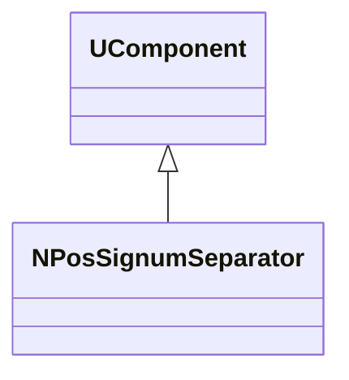
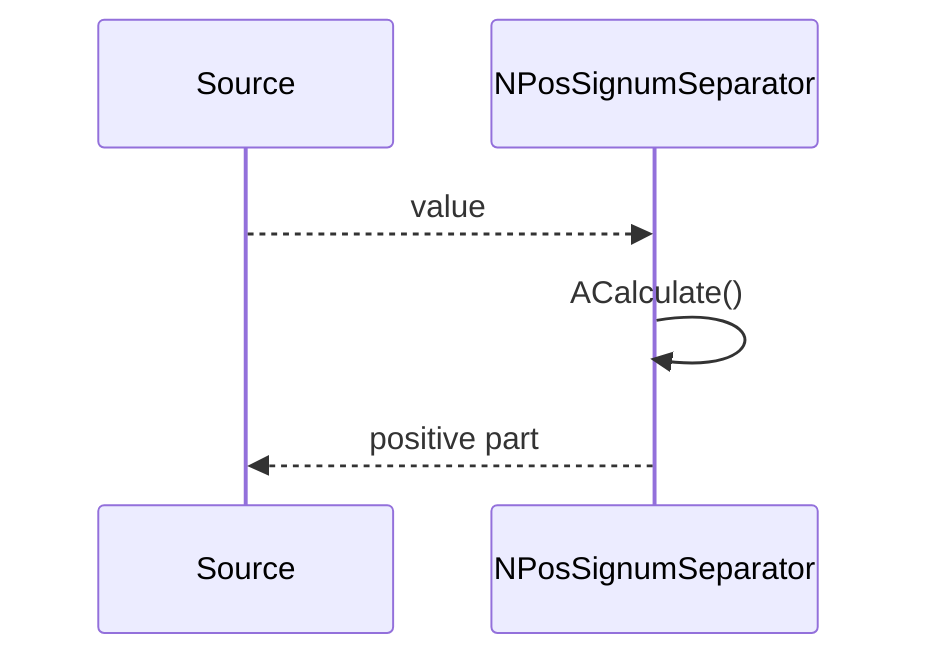
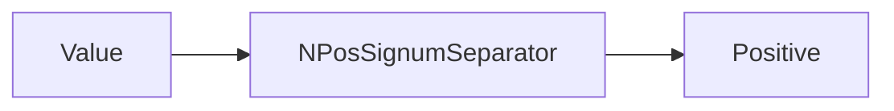
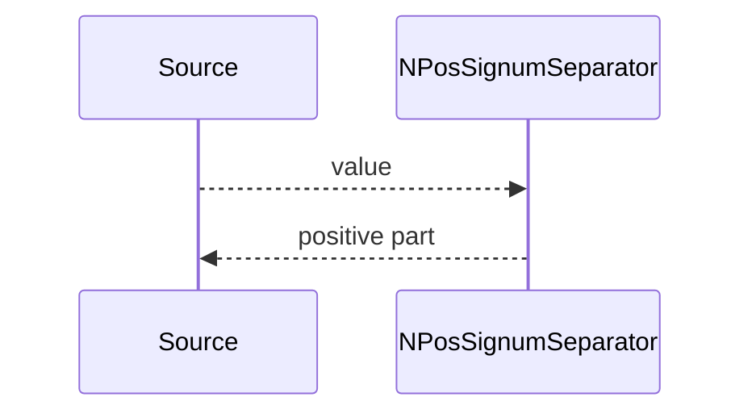

## NPosSignumSeparator — положительная часть сигнала

**Класс**: `NPosSignumSeparator` — выделяет положительную составляющую (или канал) сигнала.  
**Регистрация**: `UploadClass("NPosSignumSeparator", ...)` в `NMotionControlLibrary.cpp`.

### Lifecycle
- **ADefault/ABuild/AReset**: настройка и подготовка.
- **ACalculate**: вычисление положительной части.

### I/O
- Вход: скаляр/вектор.
- Выход: положительная часть/маска.



Диаграмма показывает специализированный разделитель знака.



Пояснение: диаграмма последовательности показывает типовой сценарий взаимодействия и порядок вызовов.



Пояснение: блок-схема показывает поток данных/сигналов (входы → компонент → выходы).

### Config snippet

```ini
[Component]
ClassName = NPosSignumSeparator
Name = PosSep1
```

---

## NPosSignumSeparator — positive channel extractor (EN)

Extracts positive part of a signal.


Description: this class diagram shows the component position in the type hierarchy and key relations.



Description: this sequence diagram shows a typical runtime interaction and call order.


Description: this flowchart shows the data/signal flow (inputs → component → outputs).
