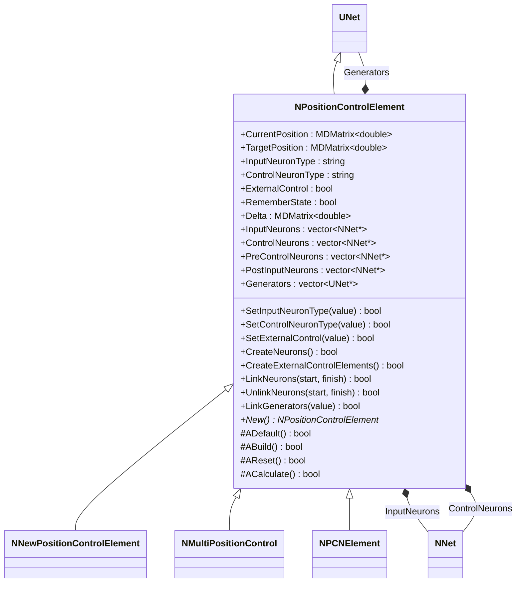
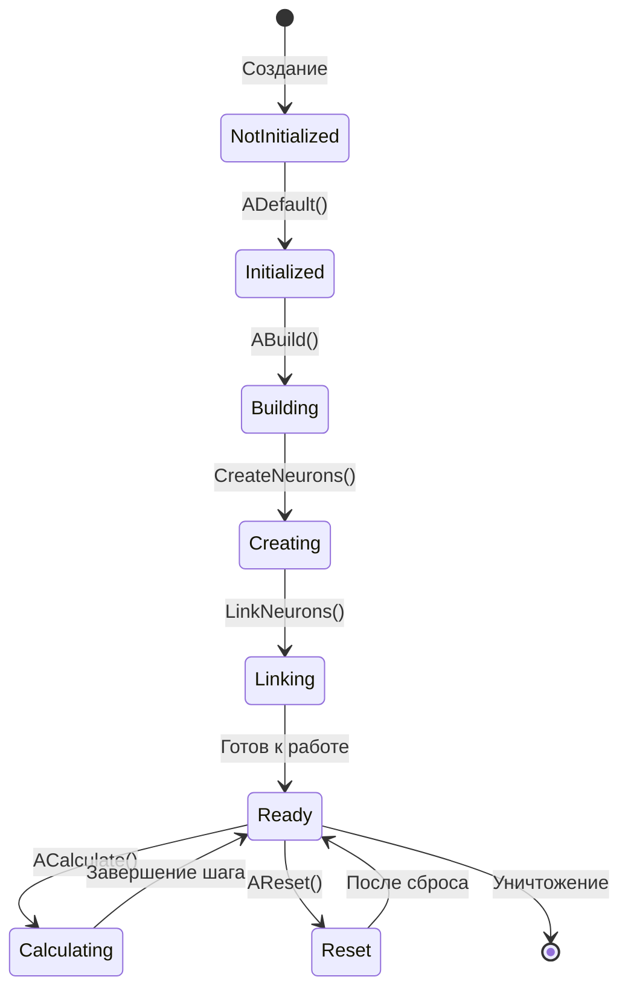
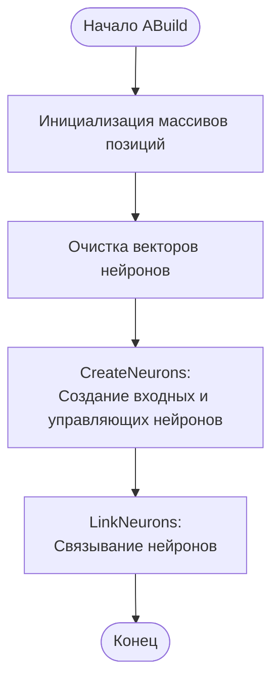
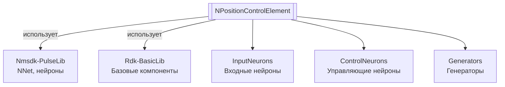

# NPositionControlElement — элемент контроля позиции

**Класс**: `NPositionControlElement` — базовый элемент для контроля позиции с использованием нейросетевых компонентов.  
**Регистрация**: `NMotionControlLibrary.cpp` → `UploadClass("NPositionControlElement", ...)`.  
**Базовый класс**: `UNet` (из Rdk Framework).

NPositionControlElement является базовым классом для элементов управления позицией. Он создает нейросетевую структуру с входными и управляющими нейронами для вычисления управляющих сигналов на основе текущей и целевой позиций.

## UML-диаграмма классов



**Иерархия наследования:**
- `UNet` (Rdk Framework) — базовый класс для сетей компонентов
- `NPositionControlElement` — базовый элемент контроля позиции
- `NNewPositionControlElement` — новый элемент контроля позиции
- `NMultiPositionControl` — множественный контроль позиции
- `NPCNElement` — PCN элемент (Position Control Network)

## UML-диаграмма последовательности

```mermaid
sequenceDiagram
    participant Storage as UStorage
    participant Element as NPositionControlElement
    participant InputNeuron as InputNeuron
    participant ControlNeuron as ControlNeuron
    
    Storage->>Element: new NPositionControlElement()
    Storage->>Element: Default()
    Element->>Element: ADefault()
    Note over Element: Инициализация параметров
    
    Storage->>Element: Build()
    Element->>Element: ABuild()
    Element->>Element: CreateNeurons()
    Element->>InputNeuron: new InputNeuron()
    Element->>ControlNeuron: new ControlNeuron()
    Element->>Element: LinkNeurons()
    
    Storage->>Element: Reset()
    Element->>Element: AReset()
    
    loop Каждый шаг вычислений
        Storage->>Element: Calculate()
        Element->>Element: ACalculate()
        Note over Element: Вычисления выполняются нейронами
    end
```



## UML-диаграмма состояний



## UML-диаграмма активности



## UML-диаграмма компонентов



**Зависимости:**
- **Nmsdk-PulseLib** - использует NNet и нейроны для создания нейросетевой структуры
- **Rdk-BasicLib** - базовые компоненты и утилиты Rdk Framework

## Свойства

### Параметры позиции

| Свойство | Тип | Флаги | Описание | Значение по умолчанию |
|----------|-----|-------|----------|----------------------|
| `CurrentPosition` | `MDMatrix<double>` | `ptPubState` | Текущая позиция (2x1) | `[0, 0]` |
| `TargetPosition` | `MDMatrix<double>` | `ptPubParameter` | Целевая позиция (2x1) | `[0, 0]` |
| `Delta` | `MDMatrix<double>` | `ptPubState` | Разность между целевой и текущей позицией (2x1) | `[0, 0]` |

### Параметры нейронов

| Свойство | Тип | Флаги | Описание | Значение по умолчанию |
|----------|-----|-------|----------|----------------------|
| `InputNeuronType` | `string` | `ptPubParameter` | Имя класса входного нейрона | `"NNewSPNeuron"` |
| `ControlNeuronType` | `string` | `ptPubParameter` | Имя класса управляющего нейрона | `"NNewSPNeuron"` |
| `ExternalControl` | `bool` | `ptPubParameter` | Использовать ли внешнее управление | `false` |
| `RememberState` | `bool` | `ptPubState` | Флаг запоминания состояния | `false` |

### Внутренние коллекции

| Свойство | Тип | Описание |
|----------|-----|----------|
| `InputNeurons` | `vector<NNet*>` | Вектор входных нейронов |
| `ControlNeurons` | `vector<NNet*>` | Вектор управляющих нейронов |
| `PreControlNeurons` | `vector<NNet*>` | Вектор предуправляющих нейронов |
| `PostInputNeurons` | `vector<NNet*>` | Вектор поствходных нейронов |
| `Generators` | `vector<UNet*>` | Вектор генераторов |

## Методы

### Конструкторы и деструкторы

#### `NPositionControlElement(void)`
**Назначение:** Конструктор компонента  
**Параметры:** Нет  
**Возвращаемое значение:** Нет

#### `virtual ~NPositionControlElement(void)`
**Назначение:** Деструктор компонента  
**Параметры:** Нет  
**Возвращаемое значение:** Нет

### Методы жизненного цикла

#### `virtual bool ADefault(void)`
**Назначение:** Инициализация значений по умолчанию  
**Параметры:** Нет  
**Возвращаемое значение:** `true` при успехе  
**Описание:** Устанавливает InputNeuronType="NNewSPNeuron", ControlNeuronType="NNewSPNeuron", ExternalControl=false

#### `virtual bool ABuild(void)`
**Назначение:** Построение внутренней структуры компонента  
**Параметры:** Нет  
**Возвращаемое значение:** `true` при успехе  
**Описание:** Инициализирует матрицы позиций (2x1), очищает векторы нейронов

#### `virtual bool AReset(void)`
**Назначение:** Сброс состояния компонента  
**Параметры:** Нет  
**Возвращаемое значение:** `true` при успехе  
**Описание:** Устанавливает RememberState=false

#### `virtual bool ACalculate(void)`
**Назначение:** Выполнение вычислений на текущем шаге  
**Параметры:** Нет  
**Возвращаемое значение:** `true` при успехе  
**Описание:** Для базового класса не выполняет вычислений (переопределяется в наследниках)

### Методы создания структуры

#### `virtual bool CreateNeurons(void)`
**Назначение:** Создание нейронов  
**Параметры:** Нет  
**Возвращаемое значение:** `true` при успехе  
**Описание:** Создает входные и управляющие нейроны (базовая реализация возвращает true, переопределяется в наследниках)

#### `virtual bool CreateExternalControlElements(void)`
**Назначение:** Создание элементов внешнего управления  
**Параметры:** Нет  
**Возвращаемое значение:** `true` при успехе

#### `virtual bool LinkNeurons(vector<NNet*> start, vector<NNet*> finish)`
**Назначение:** Связывание нейронов  
**Параметры:**
- `start` - вектор нейронов-источников
- `finish` - вектор нейронов-приемников
**Возвращаемое значение:** `true` при успехе  
**Описание:** Создает связи между нейронами через мембраны

#### `virtual bool UnlinkNeurons(vector<NNet*> start, vector<NNet*> finish)`
**Назначение:** Разрывание связей между нейронами  
**Параметры:**
- `start` - вектор нейронов-источников
- `finish` - вектор нейронов-приемников
**Возвращаемое значение:** `true` при успехе

#### `virtual bool LinkGenerators(const bool &value)`
**Назначение:** Связывание/разрывание генераторов  
**Параметры:**
- `value` - связывать (true) или разрывать (false)
**Возвращаемое значение:** `true` при успехе

#### `vector<NNet*> GetInputNeurons(void)`
**Назначение:** Получение входных нейронов  
**Параметры:** Нет  
**Возвращаемое значение:** Вектор входных нейронов

#### `vector<NNet*> GetControlNeurons(void)`
**Назначение:** Получение управляющих нейронов  
**Параметры:** Нет  
**Возвращаемое значение:** Вектор управляющих нейронов

### Сеттеры свойств

#### `bool SetInputNeuronType(const string &value)`
**Назначение:** Установка типа входного нейрона  
**Параметры:**
- `value` - имя класса нейрона
**Возвращаемое значение:** `true` при успехе  
**Описание:** Устанавливает Ready=false для перестроения

#### `bool SetControlNeuronType(const string &value)`
**Назначение:** Установка типа управляющего нейрона  
**Параметры:**
- `value` - имя класса нейрона
**Возвращаемое значение:** `true` при успехе  
**Описание:** Устанавливает Ready=false для перестроения

#### `bool SetExternalControl(const bool &value)`
**Назначение:** Установка режима внешнего управления  
**Параметры:**
- `value` - использовать внешнее управление
**Возвращаемое значение:** `true` при успехе  
**Описание:** Вызывает LinkGenerators(value), устанавливает Ready=false

### Публичные методы

#### `virtual NPositionControlElement* New(void)`
**Назначение:** Создание нового экземпляра компонента  
**Параметры:** Нет  
**Возвращаемое значение:** Указатель на новый экземпляр

## Примеры использования

### C++ код

```cpp
#include "NPositionControlElement.h"

UEPtr<NPositionControlElement> element = new NPositionControlElement;
element->Default();
element->InputNeuronType = "NNewSPNeuron";
element->ControlNeuronType = "NNewSPNeuron";
element->Build();
```

### XML конфигурация

```xml
<Object Name="PositionControl" ClassName="NPositionControlElement">
    <Property Name="InputNeuronType" Value="NNewSPNeuron" />
    <Property Name="ControlNeuronType" Value="NNewSPNeuron" />
    <Property Name="TargetPosition" Value="10.0,5.0" />
</Object>
```

### Использование в конфигурациях

Компонент `NPositionControlElement` используется как базовый класс для элементов управления позицией. Обычно используются его наследники: `NNewPositionControlElement`, `NMultiPositionControl`, `NPCNElement`.

---

# NPositionControlElement — position control element

**Class**: `NPositionControlElement` — base element for position control using neural network components.  
**Registration**: `NMotionControlLibrary.cpp` → `UploadClass("NPositionControlElement", ...)`.  
**Base class**: `UNet` (from Rdk Framework).

NPositionControlElement is a base class for position control elements. It creates a neural network structure with input and control neurons for computing control signals based on current and target positions.

## Class Diagram

[Same as RU section]

## Sequence Diagram

[Same as RU section]

## State Diagram

[Same as RU section]

## Activity Diagram

[Same as RU section]

## Component Diagram

[Same as RU section]

## Properties

[Same structure as RU section, translated to English]

## Methods

[Same structure as RU section, translated to English]

## Usage Examples

[Same as RU section, with English comments]
