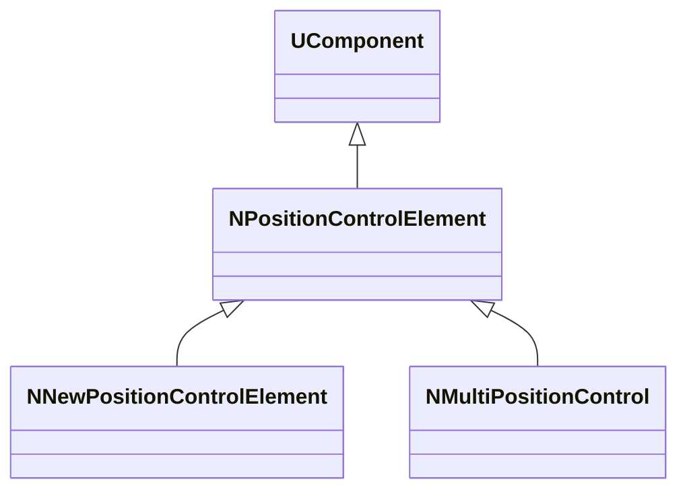
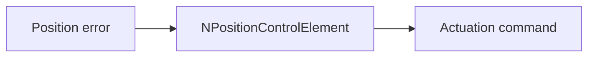
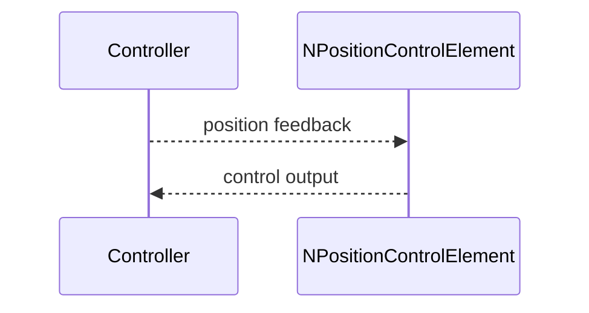

## NPositionControlElement — контроль позиции

**Класс**: `NPositionControlElement` (и `NNewPositionControlElement`, `NMultiPositionControl`) — элементы позиционного управления.  
**Регистрация**: `NMotionControlLibrary.cpp` → `UploadClass("NPositionControlElement", ...)` и др.

### Входы/выходы
- Вход: текущая позиция/ошибка.
- Выход: управляющий сигнал для привода/траектории.

Пояснение: блок-схема показывает поток данных/сигналов (входы → компонент → выходы).

Пояснение: диаграмма последовательности показывает типовой сценарий взаимодействия и порядок вызовов.

---

## NPositionControlElement — position control

Computes control output from position error; variants support new or multi-DOF control.
