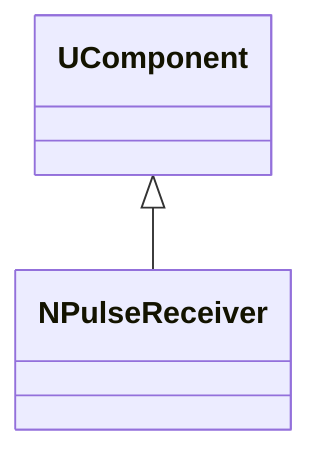
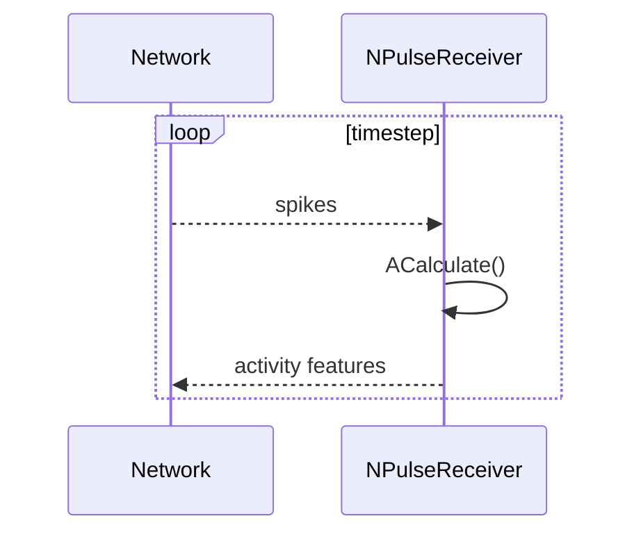
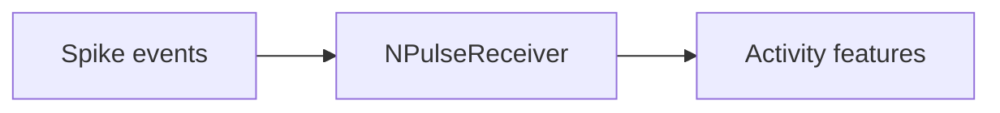
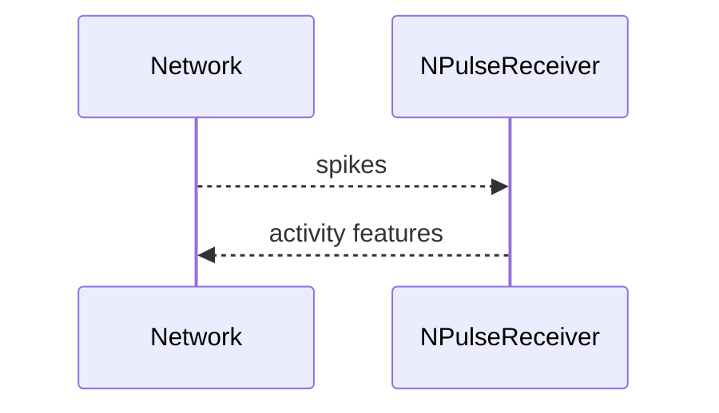

## NPulseReceiver — приёмник импульсных сигналов (Nmsdk-MotionControlLib)

**Класс**: `NPulseReceiver` — принимает спайковые/импульсные сигналы (обычно из SNN-блоков) и преобразует в формат для управления/аналитики.  
**Регистрация**: `NMotionControlLibrary.cpp` → `UploadClass("NPulseReceiver", ...)`.  
**Storage-инстансы**: `ClassName = "NPulseReceiver"`.

### Lifecycle
- **ADefault**: параметры окна/интеграции импульсов.
- **ABuild**: подключение к источнику спайков/импульсов.
- **AReset**: очистка накопленной активности.
- **ACalculate**: агрегация импульсов и выдача выходных признаков.

### I/O
- **Входы**: импульсные события/векторы активности.
- **Выходы**: скаляр/вектор активности (например, частота/интенсивность).



Диаграмма фиксирует `NPulseReceiver` как компонент-приёмник.



Диаграмма показывает интеграцию спайков по шагам и выдачу признаков активности.



Пояснение: блок-схема показывает поток данных/сигналов (входы → компонент → выходы).

### Config snippet

```ini
[Component]
ClassName = NPulseReceiver
Name = PulseRcv1
```

---

## NPulseReceiver — spike/pulse receiver (EN)

Aggregates spikes/pulses into activity features usable by motion-control modules.


Description: this class diagram shows the component position in the type hierarchy and key relations.



Description: this sequence diagram shows a typical runtime interaction and call order.


Description: this flowchart shows the data/signal flow (inputs → component → outputs).
