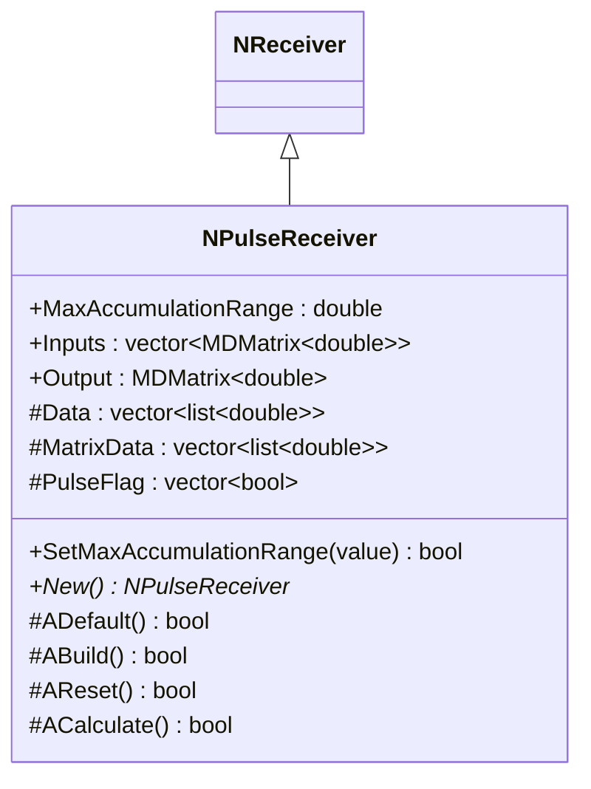
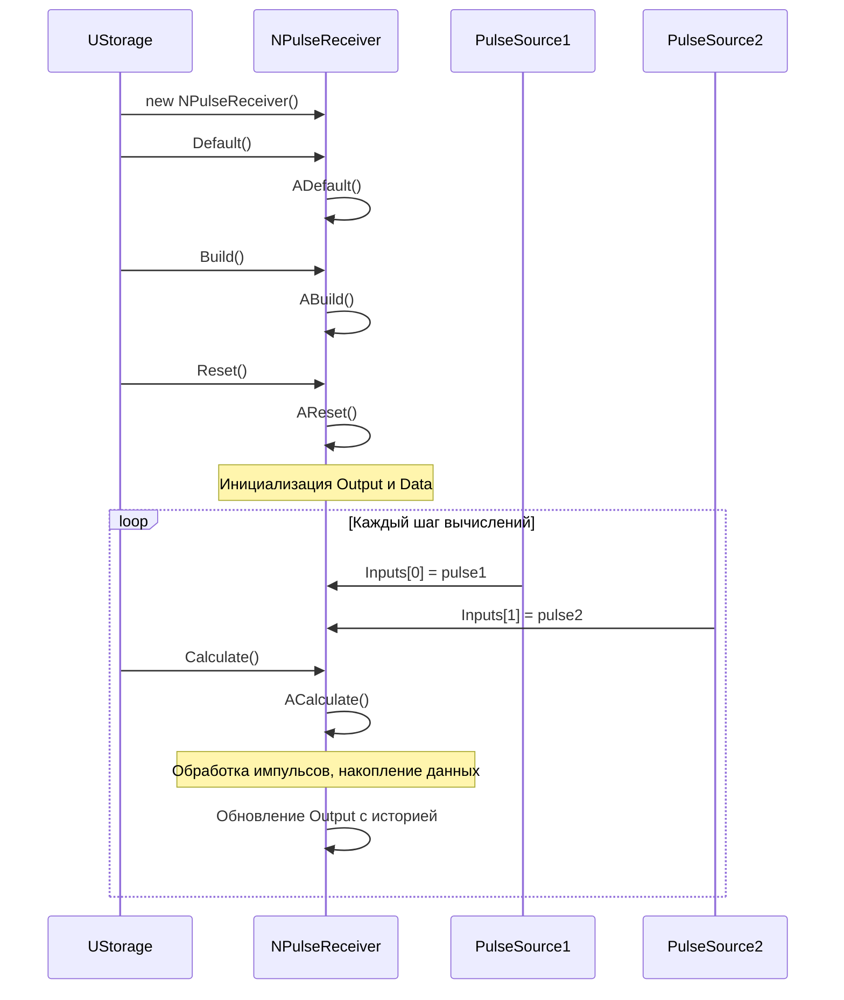
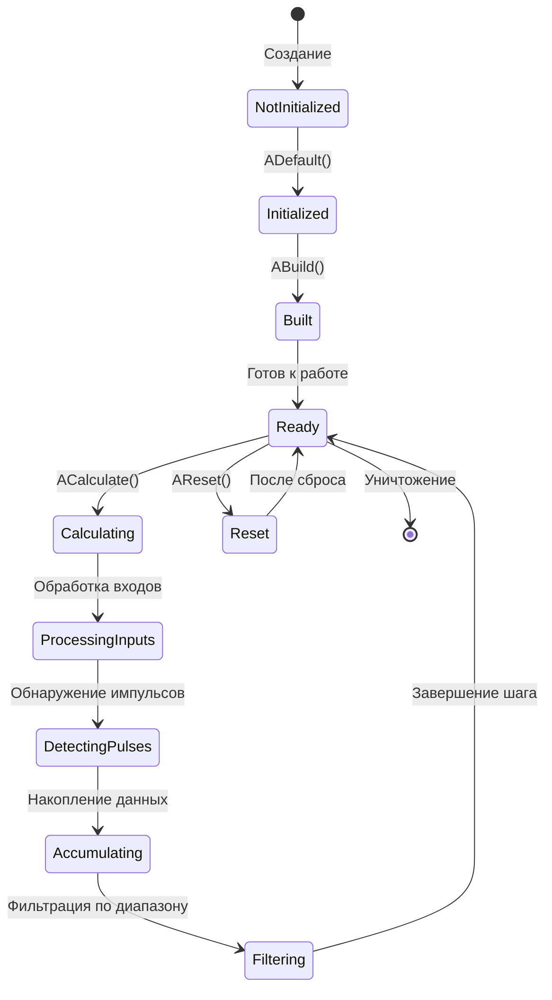
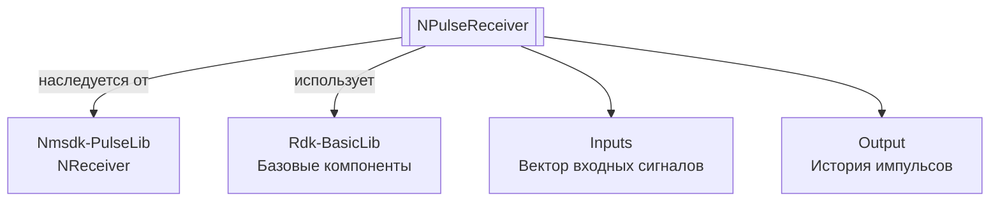

# NPulseReceiver — приемник импульсов

**Класс**: `NPulseReceiver` — приемник для накопления и обработки импульсных сигналов от нескольких источников.  
**Регистрация**: `NMotionControlLibrary.cpp` → `UploadClass("NPulseReceiver", ...)`.  
**Базовый класс**: `NReceiver` (из Nmsdk-PulseLib).

NPulseReceiver накапливает импульсные сигналы от нескольких входов, отслеживает моменты начала и окончания импульсов, и предоставляет историю импульсов в пределах заданного диапазона накопления.

## UML-диаграмма классов



**Иерархия наследования:**
- `NReceiver` (Nmsdk-PulseLib) — базовый класс для приемников
- `NPulseReceiver` — приемник импульсов

## UML-диаграмма последовательности



## UML-диаграмма состояний



## UML-диаграмма активности

```mermaid
flowchart TD
    Start([Начало ACalculate]) --> ResizeData[Изменение размеров Data и MatrixData]
    ResizeData --> ResizePulseFlag[Изменение размера PulseFlag]
    ResizePulseFlag --> LoopInputs[Цикл по всем входам]
    LoopInputs --> CheckPulse{Inputs[i] > 0?}
    CheckPulse -->|Да| CheckFlag{PulseFlag[i]?}
    CheckPulse -->|Нет| CheckFlag2{PulseFlag[i]?}
    CheckFlag -->|Нет| AddStart[Добавление времени начала импульса]
    CheckFlag -->|Да| NextInput
    CheckFlag2 -->|Да| AddStop[Добавление времени окончания импульса]
    CheckFlag2 -->|Нет| NextInput
    AddStart --> SetFlag[Установка PulseFlag[i]=true]
    AddStop --> ClearFlag[Сброс PulseFlag[i]=false]
    SetFlag --> CheckRange{MaxAccumulationRange > 0?}
    ClearFlag --> CheckRange
    CheckRange -->|Да| FilterData[Фильтрация данных по диапазону]
    CheckRange -->|Нет| UpdateOutput
    FilterData --> UpdateOutput[Обновление Output матрицы]
    UpdateOutput --> NextInput{Еще входы?}
    NextInput -->|Да| LoopInputs
    NextInput -->|Нет| End([Конец])
```

## UML-диаграмма компонентов



## Свойства

### Параметры

| Свойство | Тип | Флаги | Описание | Значение по умолчанию |
|----------|-----|-------|----------|----------------------|
| `MaxAccumulationRange` | `double` | `ptPubParameter` | Максимальный диапазон накопления данных (с) | `10.0` |

### Входы

| Свойство | Тип | Флаги | Описание | Источник данных |
|----------|-----|-------|----------|-----------------|
| `Inputs` | `std::vector<MDMatrix<double>>` | `ptInput \| ptPubState` | Вектор входных импульсных сигналов | Несколько источников импульсов |

### Выходы

| Свойство | Тип | Флаги | Описание | Назначение |
|----------|-----|-------|----------|------------|
| `Output` | `MDMatrix<double>` | `ptOutput \| ptPubState` | Матрица истории импульсов (2*N входов x M моментов времени) | Передача другим компонентам |

### Защищенные переменные

| Свойство | Тип | Описание |
|----------|-----|----------|
| `Data` | `std::vector<std::list<double>>` | Данные для каждого входа |
| `MatrixData` | `std::vector<std::list<double>>` | Матричные данные для каждого входа |
| `PulseFlag` | `std::vector<bool>` | Флаги активных импульсов для каждого входа |

## Методы

### Конструкторы и деструкторы

#### `NPulseReceiver(void)`
**Назначение:** Конструктор компонента  
**Параметры:** Нет  
**Возвращаемое значение:** Нет

#### `virtual ~NPulseReceiver(void)`
**Назначение:** Деструктор компонента  
**Параметры:** Нет  
**Возвращаемое значение:** Нет

### Методы жизненного цикла

#### `virtual bool ADefault(void)`
**Назначение:** Инициализация значений по умолчанию  
**Параметры:** Нет  
**Возвращаемое значение:** `true` при успехе  
**Описание:** Устанавливает MaxAccumulationRange=10.0

#### `virtual bool ABuild(void)`
**Назначение:** Построение внутренней структуры компонента  
**Параметры:** Нет  
**Возвращаемое значение:** `true` при успехе

#### `virtual bool AReset(void)`
**Назначение:** Сброс состояния компонента  
**Параметры:** Нет  
**Возвращаемое значение:** `true` при успехе  
**Описание:** Инициализирует Output (2*Inputs.size() x 1), очищает MatrixData, сбрасывает все PulseFlag

#### `virtual bool ACalculate(void)`
**Назначение:** Выполнение вычислений на текущем шаге  
**Параметры:** Нет  
**Возвращаемое значение:** `true` при успехе  
**Описание:** 
1. Изменяет размеры Data, MatrixData, PulseFlag в соответствии с количеством входов
2. Для каждого входа:
   - Обнаруживает начало импульса (переход от 0 к >0) - добавляет время в MatrixData
   - Обнаруживает окончание импульса (переход от >0 к 0) - добавляет время в MatrixData
   - Фильтрует данные по MaxAccumulationRange
   - Обновляет Output матрицу

### Сеттеры свойств

#### `bool SetMaxAccumulationRange(const double &value)`
**Назначение:** Установка максимального диапазона накопления  
**Параметры:**
- `value` - диапазон в секундах (должен быть >= 0)
**Возвращаемое значение:** `true` при успехе, `false` при ошибке  
**Описание:** Устанавливает Ready=false для перестроения

### Публичные методы

#### `virtual NPulseReceiver* New(void)`
**Назначение:** Создание нового экземпляра компонента  
**Параметры:** Нет  
**Возвращаемое значение:** Указатель на новый экземпляр

## Примеры использования

### C++ код

```cpp
#include "NPulseReceiver.h"

UEPtr<NPulseReceiver> receiver = new NPulseReceiver;
receiver->Default();
receiver->MaxAccumulationRange = 5.0;  // 5 секунд истории
receiver->Build();
receiver->Reset();

// Подключение нескольких источников
UEPtr<PulseSource> source1 = new PulseSource;
UEPtr<PulseSource> source2 = new PulseSource;
receiver->Inputs->push_back(source1->Output);
receiver->Inputs->push_back(source2->Output);

// Использование в цикле
for (int step = 0; step < numSteps; step++) {
    source1->Calculate();
    source2->Calculate();
    receiver->Calculate();
    
    // Получение истории импульсов
    MDMatrix<double> history = receiver->Output;
}
```

### XML конфигурация

```xml
<Object Name="PulseReceiver" ClassName="NPulseReceiver">
    <Property Name="MaxAccumulationRange" Value="5.0" />
    <!-- Подключение входов через Inputs -->
</Object>
```

### Использование в конфигурациях

Компонент `NPulseReceiver` используется для накопления и анализа импульсных сигналов от нескольких источников.

**Типичные сценарии использования:**
1. **Накопление импульсов** - сбор истории импульсов от нескольких нейронов
2. **Анализ паттернов** - анализ временных паттернов импульсов
3. **Мониторинг активности** - отслеживание активности нескольких источников

**Типичные комбинации:**
- `NPulseReceiver` + нейроны - накопление импульсов от нескольких нейронов
- `NPulseReceiver` + генераторы - анализ паттернов генераторов

---

# NPulseReceiver — pulse receiver

**Class**: `NPulseReceiver` — receiver for accumulating and processing pulse signals from multiple sources.  
**Registration**: `NMotionControlLibrary.cpp` → `UploadClass("NPulseReceiver", ...)`.  
**Base class**: `NReceiver` (from Nmsdk-PulseLib).

NPulseReceiver accumulates pulse signals from multiple inputs, tracks pulse start and end times, and provides pulse history within a specified accumulation range.

## Class Diagram

[Same as RU section]

## Sequence Diagram

[Same as RU section]

## State Diagram

[Same as RU section]

## Activity Diagram

[Same as RU section]

## Component Diagram

[Same as RU section]

## Properties

[Same structure as RU section, translated to English]

## Methods

[Same structure as RU section, translated to English]

## Источники

- [Literature-References.md](../Literature-References.md): [A], 25, 28, 29 — приём импульсных сигналов в нейронных структурах.

## Usage Examples

[Same as RU section, with English comments]
