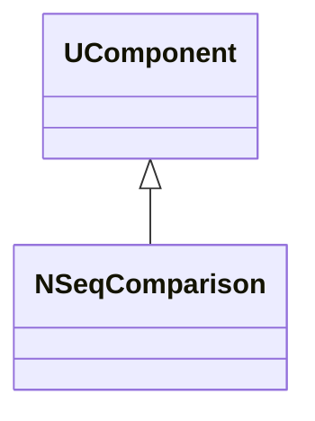
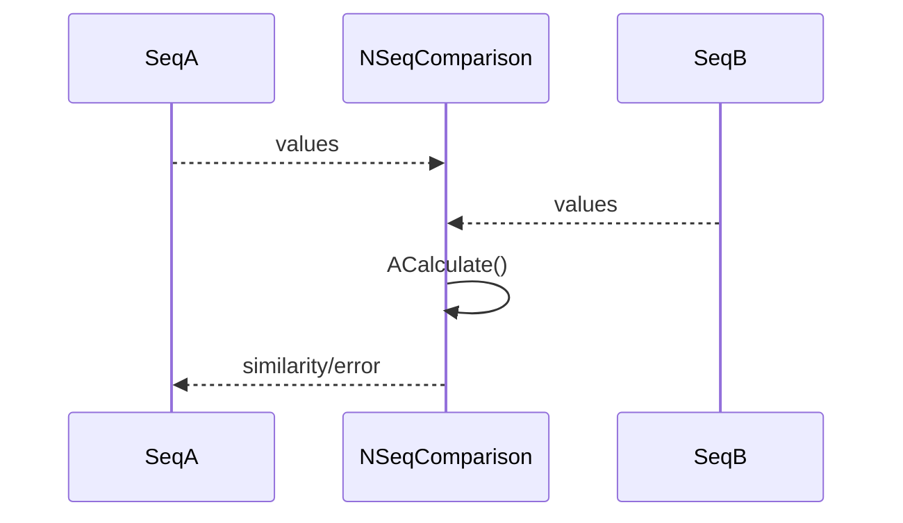
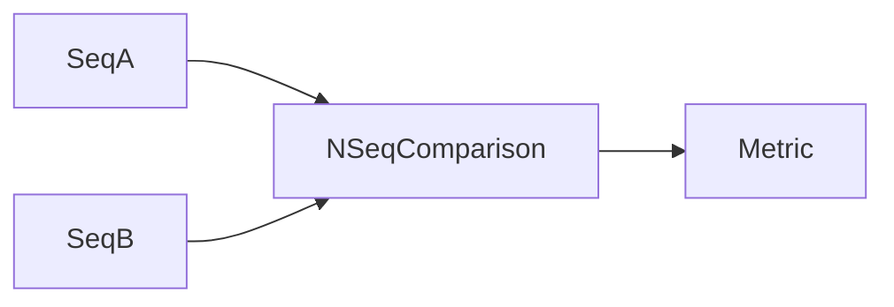
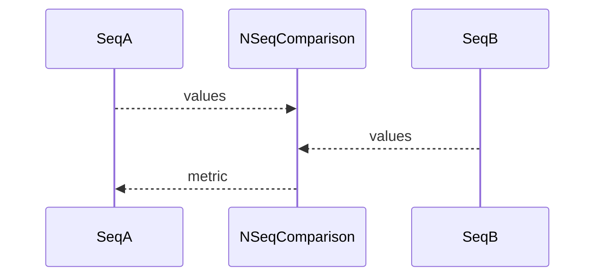

## NSeqComparison — сравнение последовательностей

**Класс**: `NSeqComparison` — сравнение последовательностей сигналов/состояний (например, для оценки совпадения траекторий).  
**Регистрация**: `UploadClass("NSeqComparison", ...)` в `NMotionControlLibrary.cpp`.

### Lifecycle
- **ADefault**: настройка метрики сравнения.
- **ABuild**: подключение двух входных последовательностей.
- **AReset**: сброс накопителей.
- **ACalculate**: расчёт меры сходства/ошибки.

### I/O
- Вход: две последовательности (векторы/скаляры по шагам).
- Выход: мера сходства/ошибка.



Пояснение: диаграмма классов показывает место компонента в иерархии и ключевые связи.



Пояснение: диаграмма последовательности показывает типовой сценарий взаимодействия и порядок вызовов.



Пояснение: блок-схема показывает поток данных/сигналов (входы → компонент → выходы).

### Config snippet

```ini
[Component]
ClassName = NSeqComparison
Name = SeqCmp1
```

---

## NSeqComparison — sequence comparison (EN)

Compares two signal sequences and outputs similarity/error metric.


Description: this class diagram shows the component position in the type hierarchy and key relations.



Description: this sequence diagram shows a typical runtime interaction and call order.


Description: this flowchart shows the data/signal flow (inputs → component → outputs).
