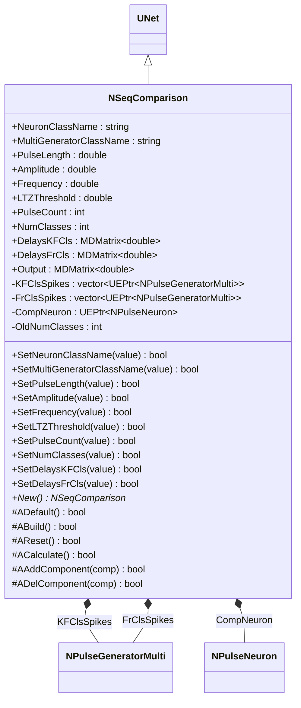
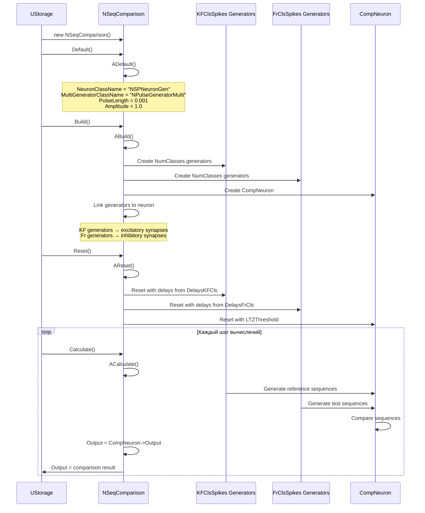
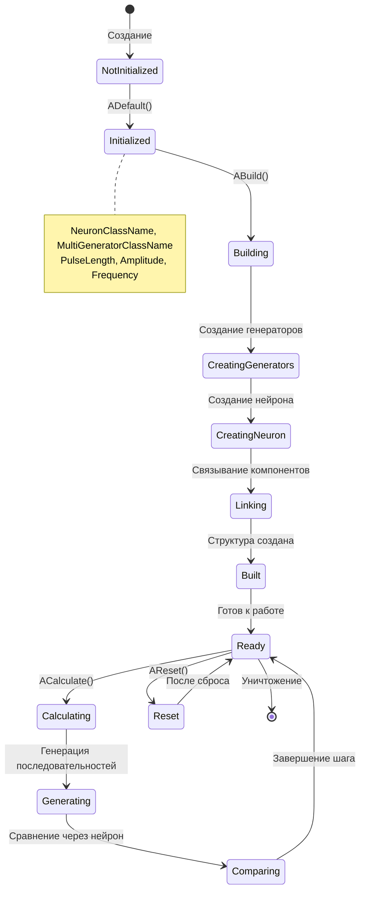
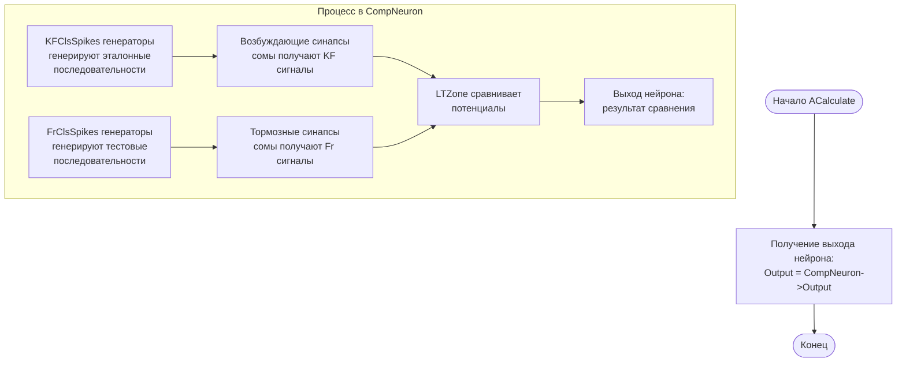
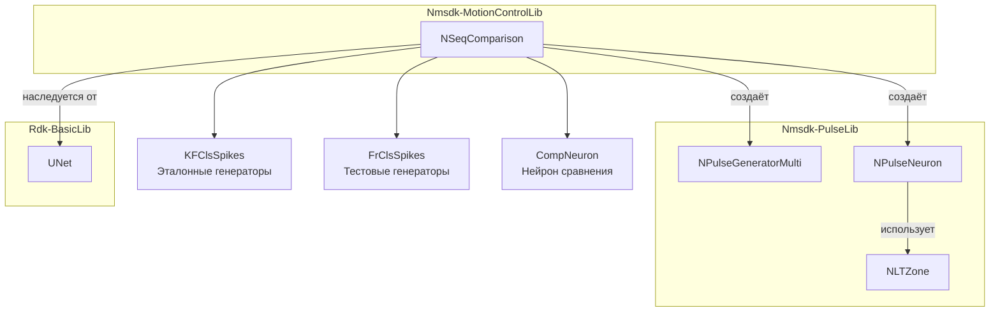
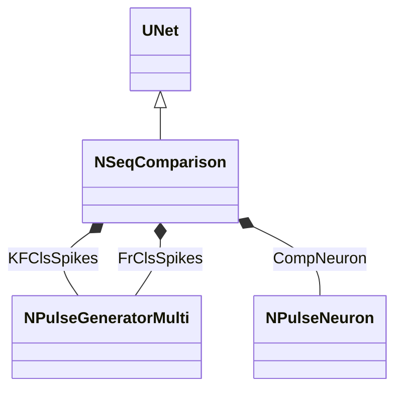
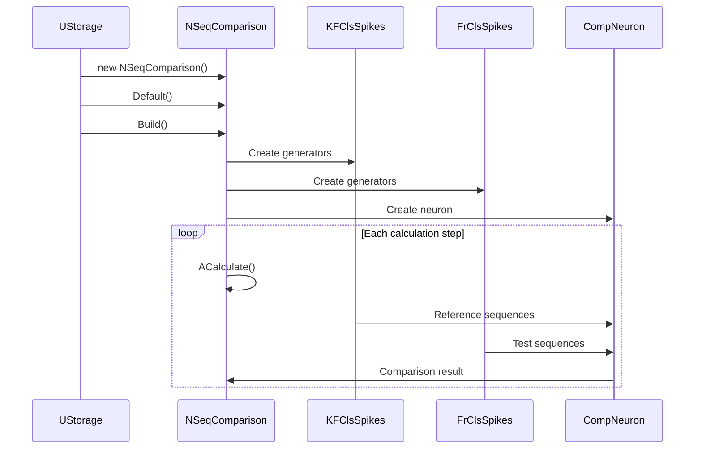
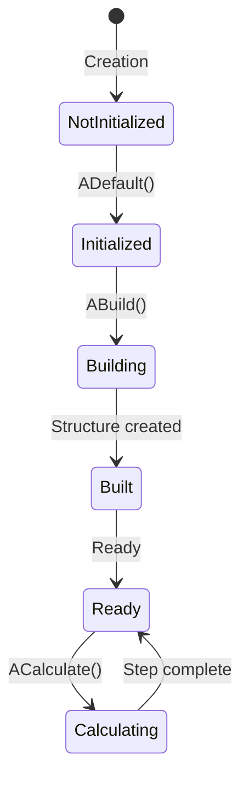
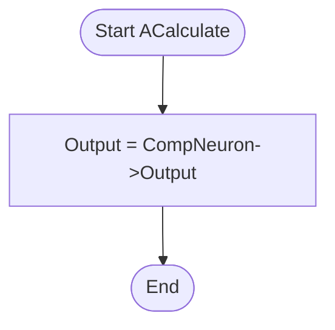
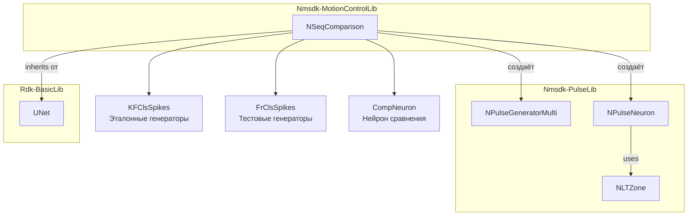

# NSeqComparison — сравнение последовательностей

## RU

**Класс**: `NSeqComparison` — компонент для сравнения последовательностей импульсных сигналов с использованием нейросетевых структур.
**Регистрация**: `NMotionControlLibrary.cpp` → `UploadClass("NSeqComparison", ...)`.
**Базовый класс**: `UNet` (из Rdk Framework).

NSeqComparison реализует сравнение последовательностей импульсных сигналов через нейросетевую структуру. Компонент создаёт генераторы многоимпульсных последовательностей (NPulseGeneratorMulti) для эталонных (KF) и тестовых (Fr) классов, и использует нейрон сравнения (NPulseNeuron) для определения совпадения последовательностей. Компонент используется для распознавания и сравнения паттернов импульсных сигналов.

## UML-диаграмма классов



**Иерархия наследования:**
- `UNet` (Rdk Framework) — базовый класс для сетей компонентов
- `NSeqComparison` — компонент сравнения последовательностей

**Связи с другими компонентами:**
- **Композиция**: создаёт и управляет `NPulseGeneratorMulti` для эталонных и тестовых последовательностей
- **Композиция**: создаёт и управляет `NPulseNeuron` для сравнения последовательностей

## UML-диаграмма последовательности



**Описание жизненного цикла:**
1. **Создание** - компонент создаётся через конструктор
2. **Инициализация (ADefault)** - установка параметров по умолчанию для генераторов и нейрона
3. **Построение (ABuild)** - создание генераторов для каждого класса, создание нейрона сравнения, связывание генераторов с нейроном
4. **Сброс (AReset)** - настройка генераторов с задержками из DelaysKFCls и DelaysFrCls, сброс нейрона
5. **Вычисление (ACalculate)** - генерация последовательностей, сравнение через нейрон, вывод результата

## UML-диаграмма состояний



**Состояния компонента:**
- **NotInitialized** - компонент создан, но не инициализирован
- **Initialized** - компонент инициализирован с параметрами по умолчанию
- **Building** - создаётся нейросетевая структура
- **CreatingGenerators** - создаются генераторы последовательностей
- **CreatingNeuron** - создаётся нейрон сравнения
- **Linking** - связываются генераторы с нейроном
- **Built** - структура построена, готов к работе
- **Ready** - готов к вычислениям
- **Calculating** - выполняется вычисление
- **Generating** - генерируются последовательности импульсов
- **Comparing** - выполняется сравнение через нейрон
- **Reset** - состояние после сброса

## UML-диаграмма активности



**Алгоритм работы ACalculate:**
1. Генераторы KFClsSpikes создают эталонные последовательности импульсов с задержками из DelaysKFCls
2. Генераторы FrClsSpikes создают тестовые последовательности импульсов с задержками из DelaysFrCls
3. KF генераторы подключены к возбуждающим синапсам сомы нейрона
4. Fr генераторы подключены к тормозным синапсам сомы нейрона
5. Нейрон сравнивает последовательности через LTZone
6. Результат сравнения выводится через Output

## UML-диаграмма компонентов



**Зависимости:**
- **Nmsdk-PulseLib**: базовые классы для импульсных нейросетей (`NPulseGeneratorMulti`, `NPulseNeuron`, `NLTZone`)
- **Rdk-BasicLib**: базовый фреймворк (`UNet`)

## Свойства компонента

### Параметры (ptPubParameter)

| Свойство | Тип | Значение по умолчанию | Описание |
|----------|-----|----------------------|----------|
| `NeuronClassName` | `string` | `"NSPNeuronGen"` | Имя класса нейрона для сравнения |
| `MultiGeneratorClassName` | `string` | `"NPulseGeneratorMulti"` | Имя класса генератора многоимпульсных последовательностей |
| `PulseLength` | `double` | `0.001` | Длительность импульса (секунды) |
| `Amplitude` | `double` | `1.0` | Амплитуда импульсов |
| `Frequency` | `double` | `0.0` | Частота генерации (Гц) |
| `LTZThreshold` | `double` | `0.0115` | Порог низкопороговой зоны нейрона |
| `PulseCount` | `int` | `1` | Количество импульсов в последовательности |
| `NumClasses` | `int` | `1` | Количество классов для сравнения |
| `DelaysKFCls` | `MDMatrix<double>` | `NumClasses × PulseCount` | Матрица задержек для эталонных последовательностей (KF) |
| `DelaysFrCls` | `MDMatrix<double>` | `NumClasses × PulseCount` | Матрица задержек для тестовых последовательностей (Fr) |

### Выходы (ptOutput | ptPubState)

| Свойство | Тип | Флаги | Описание |
|----------|-----|-------|----------|
| `Output` | `MDMatrix<double>` | `ptOutput \| ptPubState` | Выходной сигнал сравнения (результат работы CompNeuron) |

### Защищённые свойства

| Свойство | Тип | Описание |
|----------|-----|----------|
| `KFClsSpikes` | `vector<UEPtr<NPulseGeneratorMulti>>` | Вектор генераторов эталонных последовательностей |
| `FrClsSpikes` | `vector<UEPtr<NPulseGeneratorMulti>>` | Вектор генераторов тестовых последовательностей |
| `CompNeuron` | `UEPtr<NPulseNeuron>` | Нейрон для сравнения последовательностей |
| `OldNumClasses` | `int` | Предыдущее количество классов (для отслеживания изменений) |

## Методы компонента

### Управление свойствами

#### `SetPulseLength(value) -> bool`
**Назначение**: Установка длительности импульсов для всех генераторов.

**Описание**: Обновляет `PulseLength` для всех генераторов в `KFClsSpikes` и `FrClsSpikes`.

#### `SetAmplitude(value) -> bool`
**Назначение**: Установка амплитуды импульсов для всех генераторов.

**Описание**: Обновляет `Amplitude` для всех генераторов.

#### `SetFrequency(value) -> bool`
**Назначение**: Установка частоты генерации для всех генераторов.

**Описание**: Обновляет `Frequency` для всех генераторов.

#### `SetLTZThreshold(value) -> bool`
**Назначение**: Установка порога низкопороговой зоны нейрона.

**Описание**: Обновляет `Threshold` в `LTZone` компонента `CompNeuron`.

#### `SetPulseCount(value) -> bool`
**Назначение**: Установка количества импульсов в последовательности.

**Описание**: Обновляет `PulseCount` для всех генераторов и изменяет размер матриц `DelaysKFCls` и `DelaysFrCls`.

#### `SetNumClasses(value) -> bool`
**Назначение**: Установка количества классов для сравнения.

**Описание**: Устанавливает `Ready = false` для перестроения структуры при следующем `Build()`.

#### `SetDelaysKFCls(value) -> bool`
**Назначение**: Установка задержек для эталонных последовательностей.

**Описание**: Обновляет задержки в генераторах `KFClsSpikes` из матрицы `value`.

#### `SetDelaysFrCls(value) -> bool`
**Назначение**: Установка задержек для тестовых последовательностей.

**Описание**: Обновляет задержки в генераторах `FrClsSpikes` из матрицы `value`.

### Жизненный цикл

#### `ADefault() -> bool`
**Назначение**: Инициализация параметров по умолчанию.

**Описание**: Устанавливает значения по умолчанию для всех параметров, инициализирует матрицы задержек и выход.

#### `ABuild() -> bool`
**Назначение**: Создание нейросетевой структуры для сравнения.

**Алгоритм:**
1. Изменение размера матриц задержек
2. Удаление лишних генераторов (если `NumClasses` уменьшилось)
3. Создание генераторов `KFClsSpikes` и `FrClsSpikes` для каждого класса
4. Создание нейрона сравнения `CompNeuron`
5. Настройка структуры нейрона (количество частей сомы = `NumClasses`)
6. Связывание генераторов с нейроном:
   - `KFClsSpikes[i]` → возбуждающие синапсы сомы `Soma[i+1]`
   - `FrClsSpikes[i]` → тормозные синапсы сомы `Soma[i+1]`

#### `AReset() -> bool`
**Назначение**: Сброс состояния компонента.

**Описание**: Настраивает все генераторы с текущими параметрами, устанавливает задержки, настраивает порог LTZone в нейроне и сбрасывает все компоненты.

#### `ACalculate() -> bool`
**Назначение**: Выполнение сравнения последовательностей.

**Описание**: Получает выход нейрона сравнения: `Output = CompNeuron->Output`. Нейрон автоматически сравнивает последовательности от генераторов через LTZone.

## Примеры использования

### C++ код

```cpp
#include "NSeqComparison.h"

// Создание компонента
UEPtr<NSeqComparison> comparison = storage->CreateComponent<NSeqComparison>("SeqCmp1");

// Настройка параметров
comparison->NumClasses = 3;
comparison->PulseCount = 5;
comparison->PulseLength = 0.001;
comparison->Amplitude = 1.0;
comparison->LTZThreshold = 0.0115;

// Установка задержек для эталонных последовательностей (3 класса × 5 импульсов)
MDMatrix<double> delaysKF;
delaysKF.Assign(3, 5, 0.0);
// Класс 1: задержки [0.0, 0.01, 0.02, 0.03, 0.04]
delaysKF(0, 0) = 0.0; delaysKF(0, 1) = 0.01; delaysKF(0, 2) = 0.02;
delaysKF(0, 3) = 0.03; delaysKF(0, 4) = 0.04;
// Класс 2: задержки [0.0, 0.02, 0.04, 0.06, 0.08]
delaysKF(1, 0) = 0.0; delaysKF(1, 1) = 0.02; delaysKF(1, 2) = 0.04;
delaysKF(1, 3) = 0.06; delaysKF(1, 4) = 0.08;
// Класс 3: задержки [0.0, 0.005, 0.01, 0.015, 0.02]
delaysKF(2, 0) = 0.0; delaysKF(2, 1) = 0.005; delaysKF(2, 2) = 0.01;
delaysKF(2, 3) = 0.015; delaysKF(2, 4) = 0.02;
comparison->DelaysKFCls = delaysKF;

// Установка задержек для тестовых последовательностей
MDMatrix<double> delaysFr;
delaysFr.Assign(3, 5, 0.0);
// Инициализация тестовых задержек...
comparison->DelaysFrCls = delaysFr;

// Инициализация
comparison->Default();
comparison->Build();
comparison->Reset();

// В цикле вычислений
while (simulation_running) {
    comparison->Calculate();

    // Получение результата сравнения
    double result = comparison->Output(0, 0);
    // result > 0 означает совпадение последовательностей
}
```

### XML конфигурация

```xml
<Component>
    <ClassName>NSeqComparison</ClassName>
    <Name>SeqCmp1</Name>
    <Properties>
        <NeuronClassName>NSPNeuronGen</NeuronClassName>
        <MultiGeneratorClassName>NPulseGeneratorMulti</MultiGeneratorClassName>
        <PulseLength>0.001</PulseLength>
        <Amplitude>1.0</Amplitude>
        <Frequency>0.0</Frequency>
        <LTZThreshold>0.0115</LTZThreshold>
        <PulseCount>5</PulseCount>
        <NumClasses>3</NumClasses>
        <DelaysKFCls>
            <!-- Матрица 3×5 для эталонных задержек -->
        </DelaysKFCls>
        <DelaysFrCls>
            <!-- Матрица 3×5 для тестовых задержек -->
        </DelaysFrCls>
    </Properties>
</Component>
```

## Связи с конфигурационными проектами

Компонент `NSeqComparison` используется в проектах, требующих:
- **Распознавания паттернов** - для сравнения входных последовательностей с эталонными
- **Классификации сигналов** - для определения принадлежности последовательности к определённому классу
- **Оценки сходства** - для измерения степени совпадения двух последовательностей
- **Обучения и адаптации** - для сравнения текущих последовательностей с запомненными

Типичные сценарии использования:
- Распознавание траекторий движения
- Классификация паттернов активности нейронов
- Сравнение эталонных и текущих последовательностей команд
- Оценка качества обучения нейросетей

**Принцип работы:**
- Эталонные последовательности (KF) генерируются генераторами `KFClsSpikes` с задержками из `DelaysKFCls`
- Тестовые последовательности (Fr) генерируются генераторами `FrClsSpikes` с задержками из `DelaysFrCls`
- Оба типа генераторов подключены к соме нейрона: KF → возбуждающие синапсы, Fr → тормозные синапсы
- Нейрон сравнивает последовательности через LTZone: если последовательности совпадают, возбуждение от KF превосходит торможение от Fr, и нейрон генерирует выходной импульс

---

## EN

## NSeqComparison — sequence comparison (EN)

**Class**: `NSeqComparison` — component for comparing pulse signal sequences using neural network structures.
**Registration**: `NMotionControlLibrary.cpp` → `UploadClass("NSeqComparison", ...)`.
**Base class**: `UNet` (from Rdk Framework).

NSeqComparison implements comparison of pulse signal sequences through a neural network structure. The component creates multi-pulse sequence generators (NPulseGeneratorMulti) for reference (KF) and test (Fr) classes, and uses a comparison neuron (NPulseNeuron) to determine sequence matches. Used for recognition and comparison of pulse signal patterns.

## Class Diagram



## Sequence Diagram



## State Diagram



## Activity Diagram



## Properties

| Property | Type | Default | Description |
|----------|------|---------|-------------|
| `NeuronClassName` | `string` | `"NSPNeuronGen"` | Neuron class name for comparison |
| `MultiGeneratorClassName` | `string` | `"NPulseGeneratorMulti"` | Multi-pulse generator class name |
| `PulseLength` | `double` | `0.001` | Pulse duration (seconds) |
| `Amplitude` | `double` | `1.0` | Pulse amplitude |
| `LTZThreshold` | `double` | `0.0115` | Low-threshold zone threshold |
| `PulseCount` | `int` | `1` | Number of pulses in sequence |
| `NumClasses` | `int` | `1` | Number of classes for comparison |
| `DelaysKFCls` | `MDMatrix<double>` | - | Reference sequence delays matrix |
| `DelaysFrCls` | `MDMatrix<double>` | - | Test sequence delays matrix |



## Methods

### Lifecycle Methods

#### `ADefault() -> bool`
**Purpose**: Initialize default parameters.

**Description**: Sets default values for all parameters, initializes delay matrices and output.

#### `ABuild() -> bool`
**Purpose**: Create neural network structure for comparison.

**Description**: Creates generators for each class, creates comparison neuron, and links generators to neuron synapses.

#### `ACalculate() -> bool`
**Purpose**: Execute sequence comparison.

**Description**: Gets comparison neuron output: `Output = CompNeuron->Output`.

## Usage Examples

### C++ Code

```cpp
UEPtr<NSeqComparison> comparison = storage->CreateComponent<NSeqComparison>("SeqCmp1");
comparison->NumClasses = 3;
comparison->PulseCount = 5;
comparison->Default();
comparison->Build();
comparison->Reset();

while (simulation_running) {
    comparison->Calculate();
    double result = comparison->Output(0, 0);
}
```

### XML Configuration

```xml
<Component>
    <ClassName>NSeqComparison</ClassName>
    <Name>SeqCmp1</Name>
    <Properties>
        <NumClasses>3</NumClasses>
        <PulseCount>5</PulseCount>
        <PulseLength>0.001</PulseLength>
        <Amplitude>1.0</Amplitude>
    </Properties>
</Component>
```

## References

- [Literature-References.md](../Literature-References.md): [A], 25, 28, 29 — pulse sequence comparison in neural control structures.
