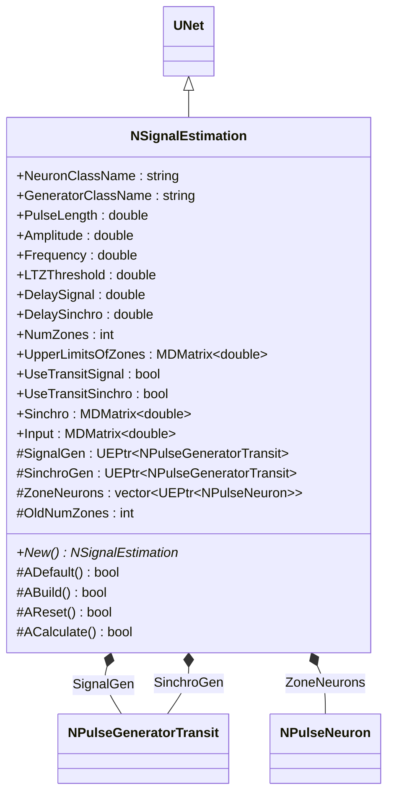
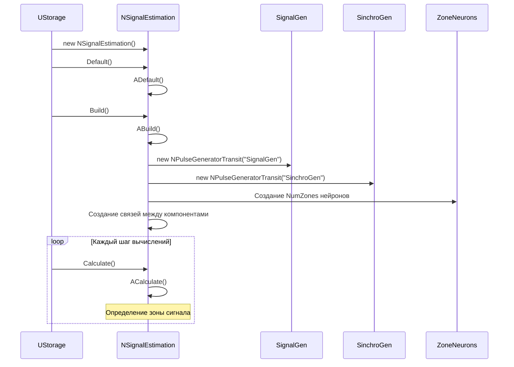
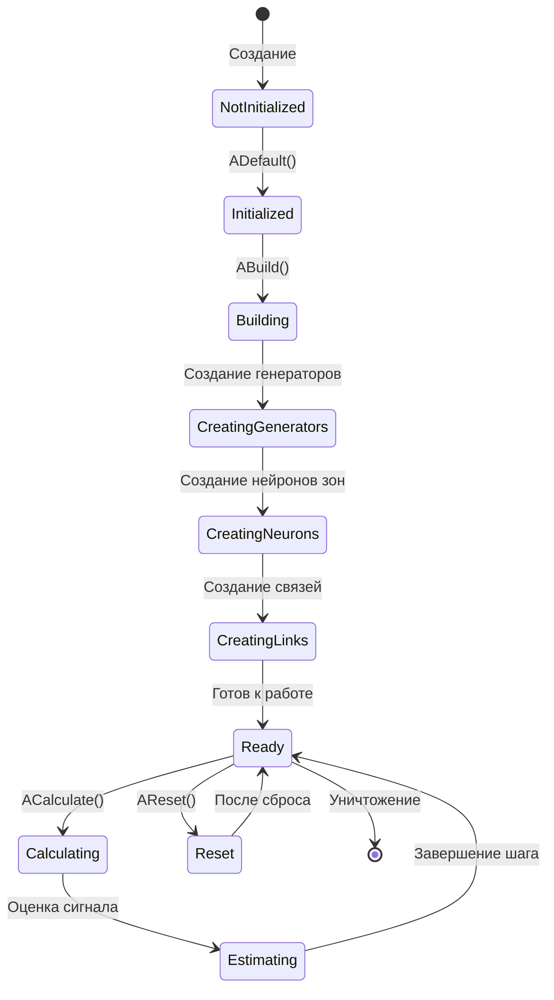
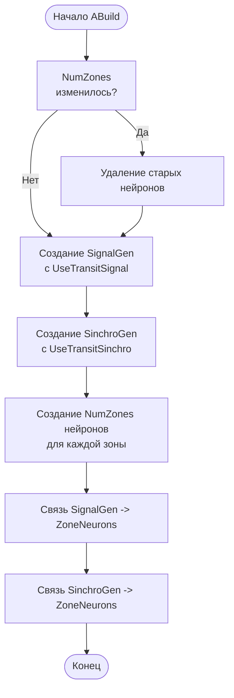
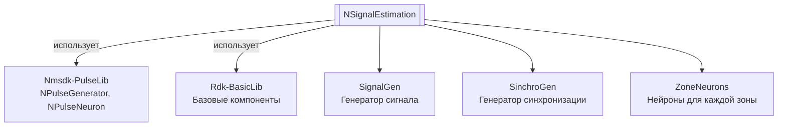

# NSignalEstimation — оценка сигнала

**Класс**: `NSignalEstimation` — компонент для зонирования сигнала, разделяющий входной сигнал на зоны по верхним пределам.
**Регистрация**: `NMotionControlLibrary.cpp` → `UploadClass("NSignalEstimation", ...)`.
**Базовый класс**: `UNet` (из Rdk Framework).

NSignalEstimation разделяет входной сигнал на зоны на основе верхних пределов зон. Компонент использует генераторы импульсов и нейроны для каждой зоны, создавая структуру для определения принадлежности сигнала к определенной зоне.

## UML-диаграмма классов



**Иерархия наследования:**
- `UNet` (Rdk Framework) — базовый класс для сетей компонентов
- `NSignalEstimation` — оценка сигнала

## UML-диаграмма последовательности



## UML-диаграмма состояний



## UML-диаграмма активности



## UML-диаграмма компонентов



## Свойства

### Параметры классов

| Свойство | Тип | Флаги | Описание | Значение по умолчанию |
|----------|-----|-------|----------|----------------------|
| `NeuronClassName` | `std::string` | `ptPubParameter` | Имя класса нейрона | Задается пользователем |
| `GeneratorClassName` | `std::string` | `ptPubParameter` | Имя класса генератора | Задается пользователем |

### Параметры импульсов

| Свойство | Тип | Флаги | Описание | Значение по умолчанию |
|----------|-----|-------|----------|----------------------|
| `PulseLength` | `double` | `ptPubParameter` | Длительность импульсов (с) | Задается пользователем |
| `Amplitude` | `double` | `ptPubParameter` | Амплитуда импульсов | Задается пользователем |
| `Frequency` | `double` | `ptPubParameter` | Частота генерации (Гц) | Задается пользователем |
| `LTZThreshold` | `double` | `ptPubParameter` | Порог низкопороговой зоны нейронов | Задается пользователем |

### Параметры зон

| Свойство | Тип | Флаги | Описание | Значение по умолчанию |
|----------|-----|-------|----------|----------------------|
| `DelaySignal` | `double` | `ptPubParameter` | Задержка сигнала (с) | Задается пользователем |
| `DelaySinchro` | `double` | `ptPubParameter` | Задержка синхронизации (с) | Задается пользователем |
| `NumZones` | `int` | `ptPubParameter` | Количество зон | Задается пользователем |
| `UpperLimitsOfZones` | `MDMatrix<double>` | `ptPubParameter` | Верхние пределы зон | Задается пользователем |
| `UseTransitSignal` | `bool` | `ptPubParameter` | Использовать транзитный сигнал | Задается пользователем |
| `UseTransitSinchro` | `bool` | `ptPubParameter` | Использовать транзитную синхронизацию | Задается пользователем |

### Входы

| Свойство | Тип | Флаги | Описание | Источник данных |
|----------|-----|-------|----------|-----------------|
| `Input` | `MDMatrix<double>` | `ptInput \| ptPubState` | Входной сигнал для оценки | Другие компоненты системы |
| `Sinchro` | `MDMatrix<double>` | `ptInput \| ptPubState` | Сигнал синхронизации | Другие компоненты системы |

### Защищенные переменные

| Свойство | Тип | Описание |
|----------|-----|----------|
| `SignalGen` | `UEPtr<NPulseGeneratorTransit>` | Генератор сигнала |
| `SinchroGen` | `UEPtr<NPulseGeneratorTransit>` | Генератор синхронизации |
| `ZoneNeurons` | `std::vector<UEPtr<NPulseNeuron>>` | Вектор нейронов для каждой зоны |
| `OldNumZones` | `int` | Предыдущее количество зон |

## Методы

### Конструкторы и деструкторы

#### `NSignalEstimation(void)`
**Назначение:** Конструктор компонента
**Параметры:** Нет
**Возвращаемое значение:** Нет
**Описание:** Инициализирует OldNumZones=0, очищает ZoneNeurons, устанавливает генераторы в NULL

#### `virtual ~NSignalEstimation(void)`
**Назначение:** Деструктор компонента
**Параметры:** Нет
**Возвращаемое значение:** Нет

### Методы жизненного цикла

#### `virtual bool ADefault(void)`
**Назначение:** Инициализация значений по умолчанию
**Параметры:** Нет
**Возвращаемое значение:** `true` при успехе
**Описание:** Устанавливает значения по умолчанию для всех параметров

#### `virtual bool ABuild(void)`
**Назначение:** Построение внутренней структуры компонента
**Параметры:** Нет
**Возвращаемое значение:** `true` при успехе
**Описание:** Создает структуру:
1. Удаляет старые нейроны, если NumZones изменилось
2. Создает SignalGen с UseTransitSignal
3. Создает SinchroGen с UseTransitSinchro
4. Создает NumZones нейронов для каждой зоны
5. Создает связи между генераторами и нейронами зон

#### `virtual bool AReset(void)`
**Назначение:** Сброс состояния компонента
**Параметры:** Нет
**Возвращаемое значение:** `true` при успехе

#### `virtual bool ACalculate(void)`
**Назначение:** Выполнение вычислений на текущем шаге
**Параметры:** Нет
**Возвращаемое значение:** `true` при успехе
**Описание:** Вычисления выполняются нейронами внутри структуры автоматически

### Сеттеры свойств

Все сеттеры свойств обновляют параметры соответствующих генераторов и нейронов при их существовании.

### Публичные методы

#### `virtual NSignalEstimation* New(void)`
**Назначение:** Создание нового экземпляра компонента
**Параметры:** Нет
**Возвращаемое значение:** Указатель на новый экземпляр

## Примеры использования

### C++ код

```cpp
#include "NSignalEstimation.h"

UEPtr<NSignalEstimation> estimator = new NSignalEstimation;
estimator->Default();
estimator->NumZones = 5;
MDMatrix<double> limits(1, 5);  // Верхние пределы для 5 зон
limits(0,0) = 0.2;
limits(0,1) = 0.4;
limits(0,2) = 0.6;
limits(0,3) = 0.8;
limits(0,4) = 1.0;
estimator->UpperLimitsOfZones = limits;
estimator->Build();
```

### XML конфигурация

```xml
<Object Name="SignalEstimation" ClassName="NSignalEstimation">
    <Property Name="NumZones" Value="5" />
    <Property Name="UpperLimitsOfZones" Value="0.2,0.4,0.6,0.8,1.0" />
    <Property Name="Input" Connect="Source.Output" />
    <Property Name="Sinchro" Connect="SynchroSource.Output" />
</Object>
```

### Использование в конфигурациях

Компонент `NSignalEstimation` используется для зонирования сигналов и определения принадлежности сигнала к определенной зоне.

**Типичные сценарии использования:**
1. **Зонирование сигналов** - разделение сигналов на зоны по значениям
2. **Классификация сигналов** - определение принадлежности сигнала к зоне

**Типичные комбинации:**
- `NSignalEstimation` + источники сигналов - зонирование сигналов от источников

---

# NSignalEstimation — signal estimation

**Class**: `NSignalEstimation` — component for signal zoning that divides input signal into zones based on upper zone limits.
**Registration**: `NMotionControlLibrary.cpp` → `UploadClass("NSignalEstimation", ...)`.
**Base class**: `UNet` (from Rdk Framework).

NSignalEstimation divides input signal into zones based on upper zone limits. The component uses pulse generators and neurons for each zone, creating a structure for determining signal membership in a specific zone.

## Class Diagram

[Same as RU section]

## Sequence Diagram

[Same as RU section]

## State Diagram

[Same as RU section]

## Activity Diagram

[Same as RU section]

## Component Diagram

[Same as RU section]

## Properties

[Same structure as RU section, translated to English]

## Methods

[Same structure as RU section, translated to English]

## Источники

- [Literature-References.md](../Literature-References.md): [A], 25, 28, 29 — оценка сигналов, преобразование импульсных потоков.

## Usage Examples

[Same as RU section, with English comments]
