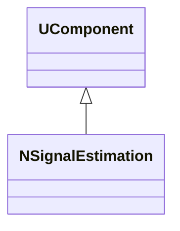
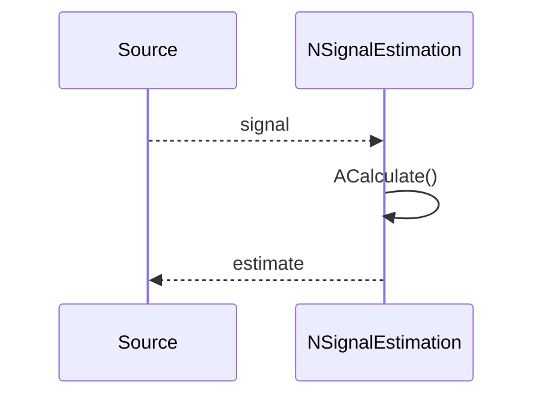
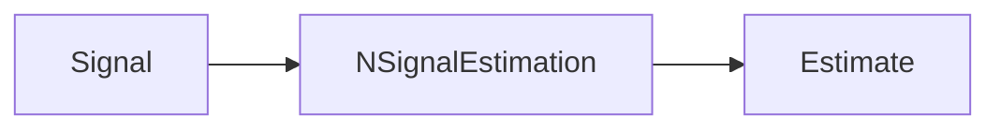
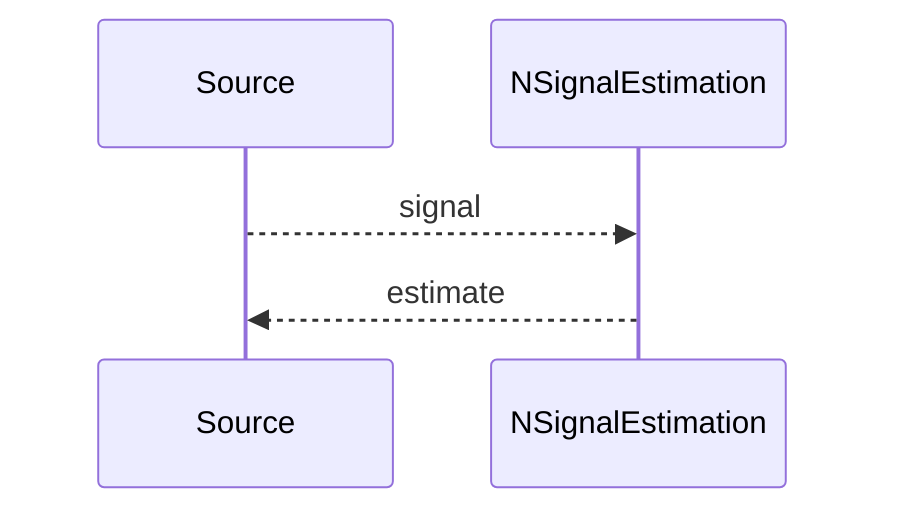

## NSignalEstimation — оценка сигнала

**Класс**: `NSignalEstimation` — оценка/фильтрация сигнала (например, сглаживание, вычисление характеристик).  
**Регистрация**: `UploadClass("NSignalEstimation", ...)` в `NMotionControlLibrary.cpp`.

### Lifecycle
- **ADefault**: параметры фильтра/оценки.
- **ABuild**: подключение входного сигнала.
- **AReset**: сброс фильтров.
- **ACalculate**: вычисление оценки на текущем шаге.

### I/O
- Вход: сигнал (скаляр/вектор).
- Выход: оценка/фильтрованный сигнал.



Пояснение: диаграмма классов показывает место компонента в иерархии и ключевые связи.



Пояснение: диаграмма последовательности показывает типовой сценарий взаимодействия и порядок вызовов.



Пояснение: блок-схема показывает поток данных/сигналов (входы → компонент → выходы).

### Config snippet

```ini
[Component]
ClassName = NSignalEstimation
Name = Est1
```

---

## NSignalEstimation — signal estimation (EN)

Filters/estimates a signal and outputs the estimate.


Description: this class diagram shows the component position in the type hierarchy and key relations.



Description: this sequence diagram shows a typical runtime interaction and call order.


Description: this flowchart shows the data/signal flow (inputs → component → outputs).
