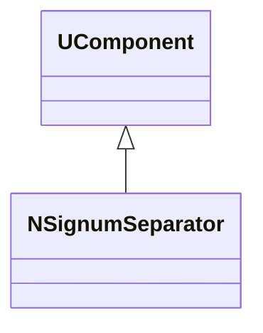
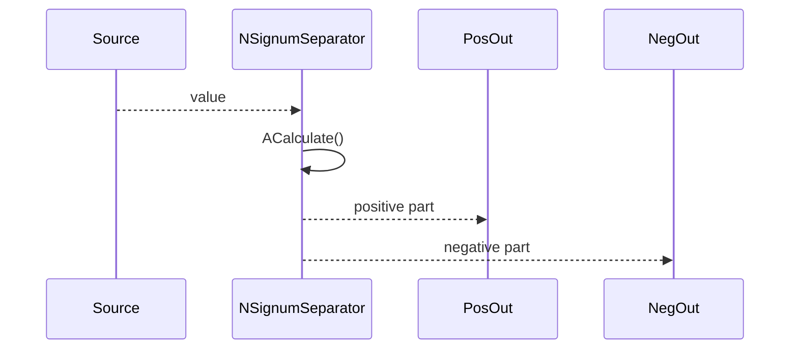
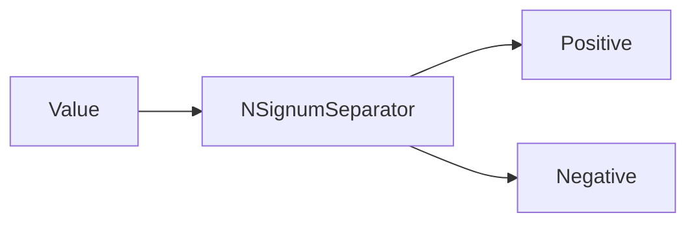
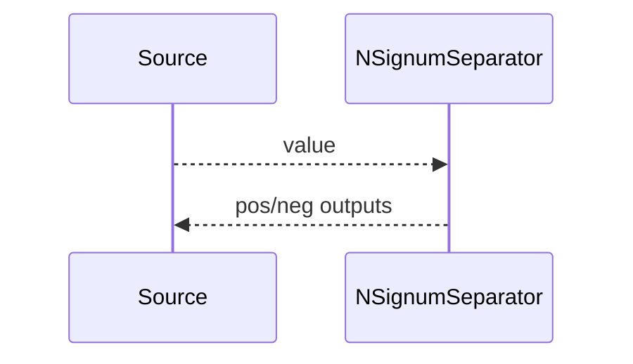

## NSignumSeparator — разделитель по знаку (Nmsdk-MotionControlLib)

**Класс**: `NSignumSeparator` — разделяет входной сигнал по знаку/порогам (например, на положительную/отрицательную части).  
**Регистрация**: `NMotionControlLibrary.cpp` → `UploadClass("NSignumSeparator", ...)`.

### Lifecycle
- **ADefault**: инициализация порога/режима разделения.
- **ABuild**: проверка подключения входа и выходов.
- **AReset**: сброс внутренних состояний.
- **ACalculate**: вычисление signum/масок и отправка в разные выходы.

### I/O
- Вход: скаляр/вектор.
- Выход: раздельные каналы (pos/neg/zero) или маски.



Диаграмма показывает компонент-разделитель, который в `ACalculate()` раскладывает сигнал по каналам.



Пояснение: диаграмма последовательности показывает типовой сценарий взаимодействия и порядок вызовов.



Пояснение: блок-схема показывает поток данных/сигналов (входы → компонент → выходы).

### Config snippet

```ini
[Component]
ClassName = NSignumSeparator
Name = SignSep1
```

---

## NSignumSeparator — sign-based splitter (EN)

Splits a scalar/vector signal into positive/negative channels.


Description: this class diagram shows the component position in the type hierarchy and key relations.



Description: this sequence diagram shows a typical runtime interaction and call order.


Description: this flowchart shows the data/signal flow (inputs → component → outputs).
