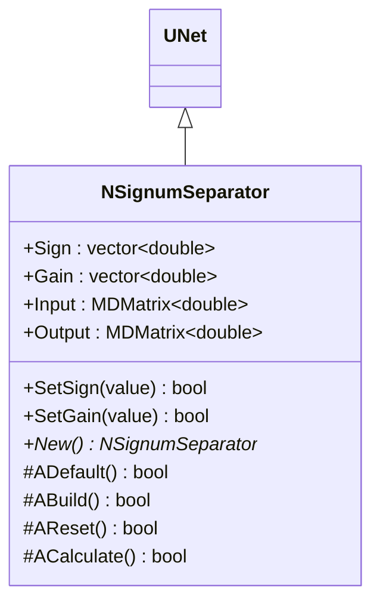
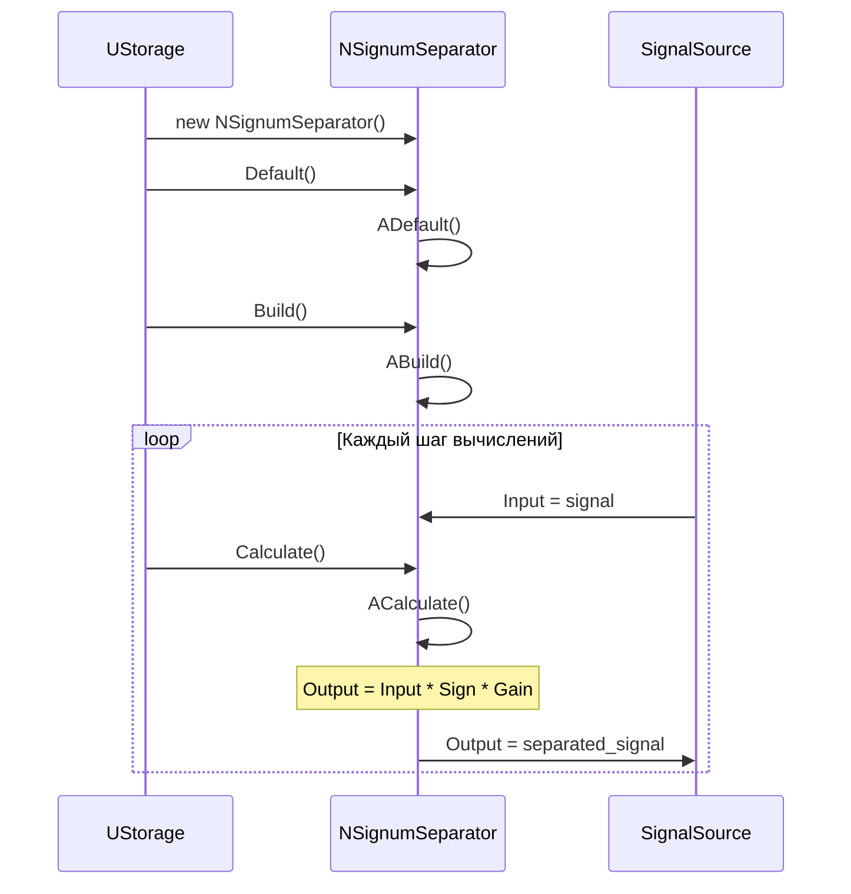
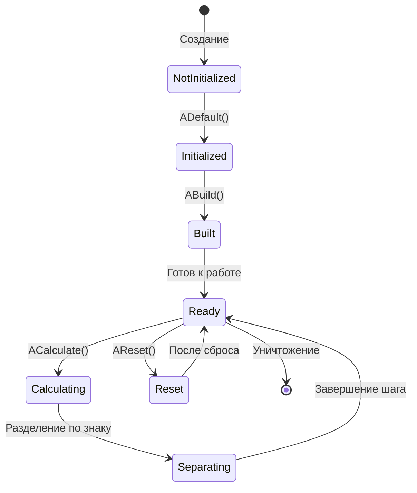
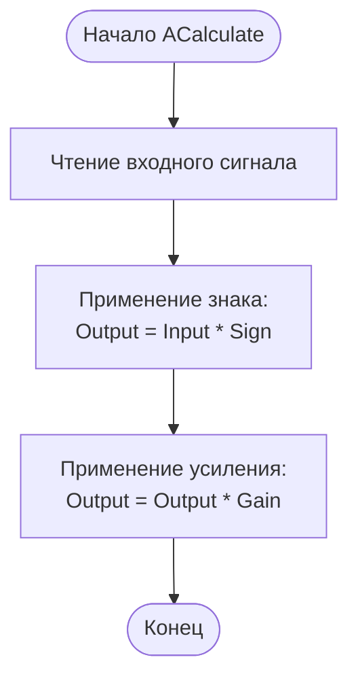
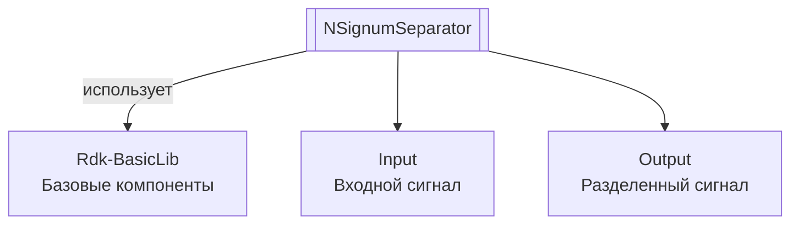

# NSignumSeparator — разделитель по знаку

## RU

**Класс**: `NSignumSeparator` — компонент для разделения входного сигнала по знаку с применением усиления.
**Регистрация**: `NMotionControlLibrary.cpp` → `UploadClass("NSignumSeparator", ...)`.
**Базовый класс**: `UNet` (из Rdk Framework).

NSignumSeparator разделяет входной сигнал на части в зависимости от знака. Компонент умножает входной сигнал на коэффициент знака (Sign) и применяет усиление (Gain) для формирования выходного сигнала.

## UML-диаграмма классов



**Иерархия наследования:**
- `UNet` (Rdk Framework) — базовый класс для сетей компонентов
- `NSignumSeparator` — разделитель по знаку

## UML-диаграмма последовательности



## UML-диаграмма состояний



## UML-диаграмма активности



## UML-диаграмма компонентов



## Свойства

### Параметры

| Свойство | Тип | Флаги | Описание | Значение по умолчанию |
|----------|-----|-------|----------|----------------------|
| `Sign` | `std::vector<double>` | `ptPubParameter` | Коэффициенты знака для разделения (обычно +1 или -1) | `[1.0]` |
| `Gain` | `std::vector<double>` | `ptPubParameter` | Коэффициенты усиления | `[1.0]` |

### Входы

| Свойство | Тип | Флаги | Описание | Источник данных |
|----------|-----|-------|----------|-----------------|
| `Input` | `MDMatrix<double>` | `ptInput \| ptPubState` | Входной сигнал для разделения | Другие компоненты системы |

### Выходы

| Свойство | Тип | Флаги | Описание | Назначение |
|----------|-----|-------|----------|------------|
| `Output` | `MDMatrix<double>` | `ptOutput \| ptPubState` | Разделенный сигнал (Input * Sign * Gain) | Передача другим компонентам |

## Методы

### Конструкторы и деструкторы

#### `NSignumSeparator(void)`
**Назначение:** Конструктор компонента
**Параметры:** Нет
**Возвращаемое значение:** Нет

#### `virtual ~NSignumSeparator(void)`
**Назначение:** Деструктор компонента
**Параметры:** Нет
**Возвращаемое значение:** Нет

### Методы жизненного цикла

#### `virtual bool ADefault(void)`
**Назначение:** Инициализация значений по умолчанию
**Параметры:** Нет
**Возвращаемое значение:** `true` при успехе
**Описание:** Устанавливает Sign=[1.0], Gain=[1.0]

#### `virtual bool ABuild(void)`
**Назначение:** Построение внутренней структуры компонента
**Параметры:** Нет
**Возвращаемое значение:** `true` при успехе

#### `virtual bool AReset(void)`
**Назначение:** Сброс состояния компонента
**Параметры:** Нет
**Возвращаемое значение:** `true` при успехе

#### `virtual bool ACalculate(void)`
**Назначение:** Выполнение вычислений на текущем шаге
**Параметры:** Нет
**Возвращаемое значение:** `true` при успехе
**Описание:** Вычисляет `Output = Input * Sign * Gain`

### Сеттеры свойств

#### `bool SetSign(const double &value)`
**Назначение:** Установка коэффициента знака
**Параметры:**
- `value` - значение знака
**Возвращаемое значение:** `true` при успехе

#### `bool SetGain(const double &value)`
**Назначение:** Установка коэффициента усиления
**Параметры:**
- `value` - значение усиления
**Возвращаемое значение:** `true` при успехе

### Публичные методы

#### `virtual NSignumSeparator* New(void)`
**Назначение:** Создание нового экземпляра компонента
**Параметры:** Нет
**Возвращаемое значение:** Указатель на новый экземпляр

## Примеры использования

### C++ код

```cpp
#include "NSignumSeparator.h"

UEPtr<NSignumSeparator> separator = new NSignumSeparator;
separator->Default();
std::vector<double> sign(1, 1.0);  // Положительный знак
separator->Sign = sign;
std::vector<double> gain(1, 2.0);  // Усиление 2
separator->Gain = gain;
separator->Build();
```

### XML конфигурация

```xml
<Object Name="SignumSeparator" ClassName="NSignumSeparator">
    <Property Name="Sign" Value="1.0" />
    <Property Name="Gain" Value="2.0" />
    <Property Name="Input" Connect="Source.Output" />
</Object>
```

### Использование в конфигурациях

Компонент `NSignumSeparator` используется для разделения сигналов по знаку. Варианты конфигурации: `NPosSignumSeparator` (Sign=1.0) и `NNegSignumSeparator` (Sign=-1.0).

**Типичные сценарии использования:**
1. **Разделение сигналов** - выделение положительных или отрицательных частей сигнала
2. **Обработка афферентных сигналов** - разделение афферентных сигналов в системах управления движением

**Типичные комбинации:**
- `NSignumSeparator` + `NEngineMotionControl` - разделение афферентных сигналов
- `NPosSignumSeparator` / `NNegSignumSeparator` - специализированные варианты для положительных/отрицательных сигналов

---

## EN

NSignumSeparator — signum separator

**Class**: `NSignumSeparator` — component for separating input signal by sign with gain application.
**Registration**: `NMotionControlLibrary.cpp` → `UploadClass("NSignumSeparator", ...)`.
**Base class**: `UNet` (from Rdk Framework).

NSignumSeparator separates input signal into parts depending on sign. The component multiplies input signal by sign coefficient (Sign) and applies gain (Gain) to form output signal.

## Class Diagram

[Same as RU section]

## Sequence Diagram

[Same as RU section]

## State Diagram

[Same as RU section]

## Activity Diagram

[Same as RU section]

## Component Diagram

[Same as RU section]

## Properties

[Same structure as RU section, translated to English]

## Methods

[Same structure as RU section, translated to English]

## Источники

- [Literature-References.md](../Literature-References.md): [A], 25, 28 — разделение сигнум-сигналов в контурах управления.

## Usage Examples

[Same as RU section, with English comments]
