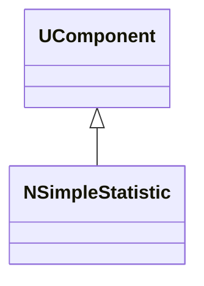
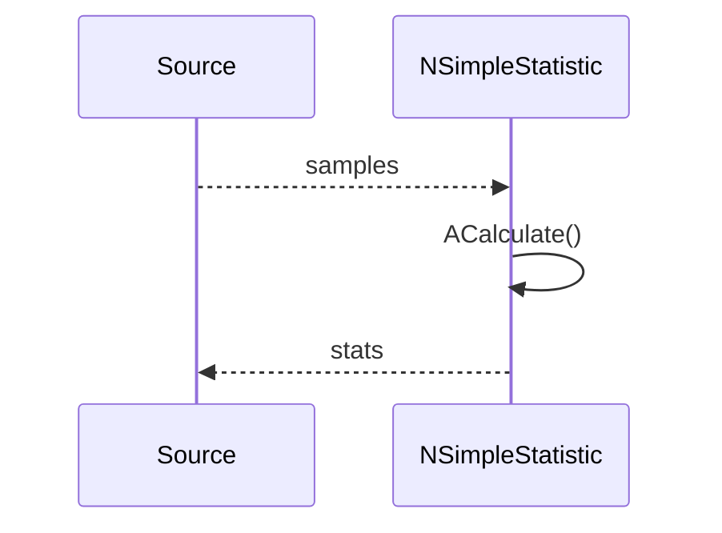
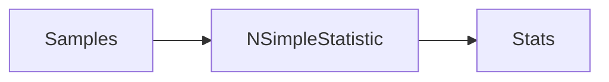
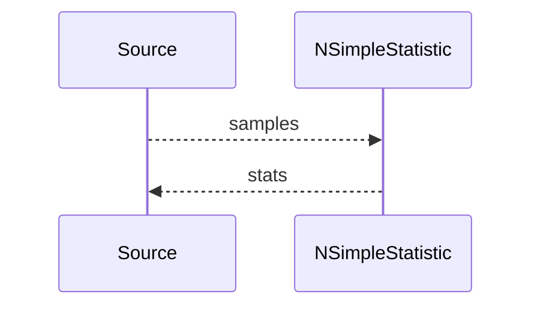

## NSimpleStatistic — простая статистика

**Класс**: `NSimpleStatistic` — вычисляет простые статистические метрики по входному сигналу.  
**Регистрация**: `UploadClass("NSimpleStatistic", ...)` в `NMotionControlLibrary.cpp`.

### Lifecycle
- **ADefault**: выбор метрик/окна.
- **ABuild**: подключение входа.
- **AReset**: сброс накоплений.
- **ACalculate**: обновление статистики.

### I/O
- Вход: сигнал (скаляр/вектор).
- Выход: метрики (среднее/мин/макс и т.п.).



Пояснение: диаграмма классов показывает место компонента в иерархии и ключевые связи.



Пояснение: диаграмма последовательности показывает типовой сценарий взаимодействия и порядок вызовов.



Пояснение: блок-схема показывает поток данных/сигналов (входы → компонент → выходы).

### Config snippet

```ini
[Component]
ClassName = NSimpleStatistic
Name = Stat1
```

---

## NSimpleStatistic — simple statistics (EN)

Computes basic statistics over input samples.


Description: this class diagram shows the component position in the type hierarchy and key relations.



Description: this sequence diagram shows a typical runtime interaction and call order.


Description: this flowchart shows the data/signal flow (inputs → component → outputs).
