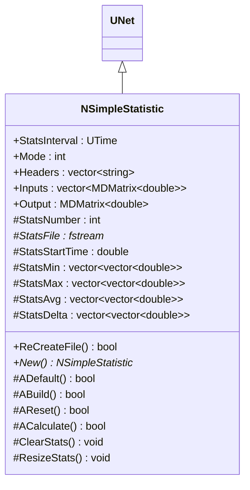
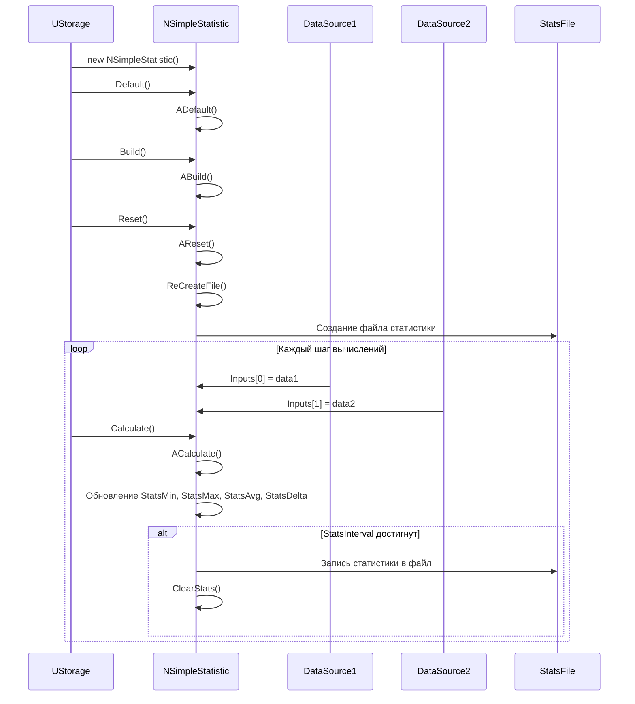
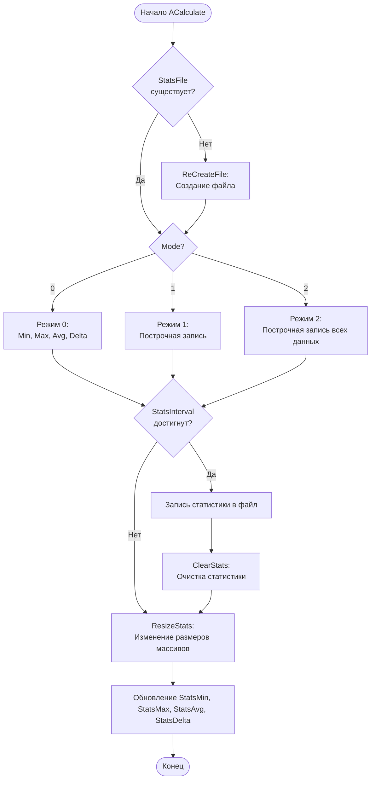
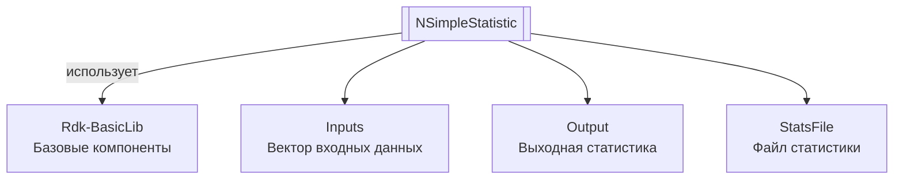

# NSimpleStatistic — простая статистика

**Класс**: `NSimpleStatistic` — компонент для сбора и записи статистики по входным данным в файл.  
**Регистрация**: `NMotionControlLibrary.cpp` → `UploadClass("NSimpleStatistic", ...)`.  
**Базовый класс**: `UNet` (из Rdk Framework).

NSimpleStatistic собирает статистику (минимум, максимум, среднее, размах) по входным данным и записывает результаты в текстовый файл с заданным интервалом. Поддерживает три режима записи данных.

## UML-диаграмма классов



**Иерархия наследования:**
- `UNet` (Rdk Framework) — базовый класс для сетей компонентов
- `NSimpleStatistic` — компонент статистики

## UML-диаграмма последовательности



## UML-диаграмма состояний

```mermaid
stateDiagram-v2
    [*] --> NotInitialized: Создание
    NotInitialized --> Initialized: ADefault()
    Initialized --> Built: ABuild()
    Built --> Ready: Готов к работе
    Ready --> Calculating: ACalculate()
    Calculating --> Collecting: Сбор статистики
    Collecting --> CheckingInterval{StatsInterval<br/>достигнут?}
    CheckingInterval -->|Да| WritingFile: Запись в файл
    CheckingInterval -->|Нет| Ready: Завершение шага
    WritingFile --> Clearing: ClearStats()
    Clearing --> Ready: После очистки
    Ready --> Reset: AReset()
    Reset --> Ready: После сброса
    Ready --> [*]: Уничтожение
```

## UML-диаграмма активности



## UML-диаграмма компонентов



## Свойства

### Параметры

| Свойство | Тип | Флаги | Описание | Значение по умолчанию |
|----------|-----|-------|----------|----------------------|
| `StatsInterval` | `UTime` | `ptPubParameter` | Интервал записи статистики в файл | `1.0` |
| `Mode` | `int` | `ptPubParameter` | Режим записи: 0=Min/Max/Avg/Delta, 1=построчная запись по входам, 2=построчная запись всех данных | `0` |
| `Headers` | `std::vector<string>` | `ptPubParameter` | Заголовки столбцов для файла | Задается пользователем |

### Входы

| Свойство | Тип | Флаги | Описание | Источник данных |
|----------|-----|-------|----------|-----------------|
| `Inputs` | `std::vector<MDMatrix<double>>` | `ptInput \| ptPubState` | Вектор входных данных для статистики | Различные компоненты системы |

### Выходы

| Свойство | Тип | Флаги | Описание | Назначение |
|----------|-----|-------|----------|------------|
| `Output` | `MDMatrix<double>` | `ptOutput \| ptPubState` | Выходная статистика | Передача другим компонентам |

### Защищенные переменные

| Свойство | Тип | Описание |
|----------|-----|----------|
| `StatsNumber` | `int` | Номер файла статистики |
| `StatsFile` | `fstream*` | Указатель на файл статистики |
| `StatsStartTime` | `double` | Время начала сбора статистики |
| `StatsMin` | `vector<vector<double>>` | Минимальные значения по входам |
| `StatsMax` | `vector<vector<double>>` | Максимальные значения по входам |
| `StatsAvg` | `vector<vector<double>>` | Средние значения по входам |
| `StatsDelta` | `vector<vector<double>>` | Размах значений (Max-Min) по входам |

## Методы

### Конструкторы и деструкторы

#### `NSimpleStatistic(void)`
**Назначение:** Конструктор компонента  
**Параметры:** Нет  
**Возвращаемое значение:** Нет  
**Описание:** Инициализирует StatsFile=0, StatsNumber=0, Mode=0, StatsInterval=0, StatsStartTime=0

#### `virtual ~NSimpleStatistic(void)`
**Назначение:** Деструктор компонента  
**Параметры:** Нет  
**Возвращаемое значение:** Нет  
**Описание:** Закрывает и удаляет StatsFile, если он был открыт

### Методы жизненного цикла

#### `virtual bool ADefault(void)`
**Назначение:** Инициализация значений по умолчанию  
**Параметры:** Нет  
**Возвращаемое значение:** `true` при успехе  
**Описание:** Устанавливает StatsInterval=1, Mode=0

#### `virtual bool ABuild(void)`
**Назначение:** Построение внутренней структуры компонента  
**Параметры:** Нет  
**Возвращаемое значение:** `true` при успехе

#### `virtual bool AReset(void)`
**Назначение:** Сброс состояния компонента  
**Параметры:** Нет  
**Возвращаемое значение:** `true` при успехе  
**Описание:** Вызывает ClearStats(), устанавливает StatsStartTime=текущее время

#### `virtual bool ACalculate(void)`
**Назначение:** Выполнение вычислений на текущем шаге  
**Параметры:** Нет  
**Возвращаемое значение:** `true` при успехе  
**Описание:** 
1. Создает файл, если он не существует
2. В зависимости от Mode:
   - Mode=0: собирает Min/Max/Avg/Delta, записывает в файл при достижении StatsInterval
   - Mode=1: записывает данные построчно по входам при достижении StatsInterval
   - Mode=2: записывает все данные построчно при достижении StatsInterval
3. Обновляет статистику на каждом шаге

### Публичные методы

#### `bool ReCreateFile(void)`
**Назначение:** Пересоздание файла статистики  
**Параметры:** Нет  
**Возвращаемое значение:** `true` при успехе  
**Описание:** Закрывает существующий файл, создает новый с номером StatsNumber, записывает заголовки

#### `virtual NSimpleStatistic* New(void)`
**Назначение:** Создание нового экземпляра компонента  
**Параметры:** Нет  
**Возвращаемое значение:** Указатель на новый экземпляр

### Защищенные методы

#### `void ClearStats(void)`
**Назначение:** Очистка текущей статистики  
**Параметры:** Нет  
**Возвращаемое значение:** Нет  
**Описание:** Очищает векторы StatsMin, StatsMax, StatsAvg, StatsDelta

#### `void ResizeStats(void)`
**Назначение:** Изменение размеров векторов статистики  
**Параметры:** Нет  
**Возвращаемое значение:** Нет  
**Описание:** Изменяет размеры векторов статистики в соответствии с размерами Inputs

## Примеры использования

### C++ код

```cpp
#include "NSimpleStatistic.h"

UEPtr<NSimpleStatistic> stats = new NSimpleStatistic;
stats->Default();
stats->StatsInterval = 0.1;  // Запись каждые 0.1 секунды
stats->Mode = 0;  // Режим Min/Max/Avg/Delta
stats->Headers = {"Signal1", "Signal2", "Signal3"};
stats->Build();
stats->Reset();

// Подключение входных данных
UEPtr<DataSource> source1 = new DataSource;
UEPtr<DataSource> source2 = new DataSource;
stats->Inputs->push_back(source1->Output);
stats->Inputs->push_back(source2->Output);

// Использование в цикле
for (int step = 0; step < numSteps; step++) {
    source1->Calculate();
    source2->Calculate();
    stats->Calculate();
    // Статистика записывается в файл автоматически
}
```

### XML конфигурация

```xml
<Object Name="Statistics" ClassName="NSimpleStatistic">
    <Property Name="StatsInterval" Value="0.1" />
    <Property Name="Mode" Value="0" />
    <Property Name="Headers" Value="Signal1,Signal2,Signal3" />
</Object>
```

### Использование в конфигурациях

Компонент `NSimpleStatistic` используется для сбора и записи статистики по различным сигналам системы.

**Типичные сценарии использования:**
1. **Сбор статистики** - запись статистики по сигналам системы в файл
2. **Анализ производительности** - анализ характеристик работы системы
3. **Отладка** - отслеживание значений сигналов во времени

**Типичные комбинации:**
- `NSimpleStatistic` + любые компоненты - сбор статистики по выходным сигналам
- `NSimpleStatistic` + `NEngineMotionControl` - статистика работы движка управления

---

# NSimpleStatistic — simple statistics

**Class**: `NSimpleStatistic` — component for collecting and writing statistics on input data to a file.  
**Registration**: `NMotionControlLibrary.cpp` → `UploadClass("NSimpleStatistic", ...)`.  
**Base class**: `UNet` (from Rdk Framework).

NSimpleStatistic collects statistics (minimum, maximum, average, range) on input data and writes results to a text file at specified intervals. Supports three data recording modes.

## Class Diagram

[Same as RU section]

## Sequence Diagram

[Same as RU section]

## State Diagram

[Same as RU section]

## Activity Diagram

[Same as RU section]

## Component Diagram

[Same as RU section]

## Properties

[Same structure as RU section, translated to English]

## Methods

[Same structure as RU section, translated to English]

## Источники

- [Literature-References.md](../Literature-References.md): [A], 19, 22 — статистика в контурах управления движением.

## Usage Examples

[Same as RU section, with English comments]
