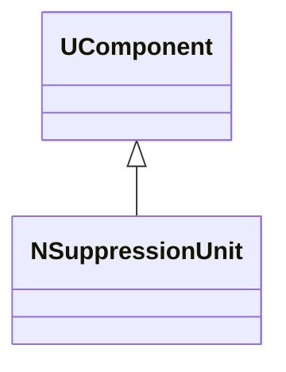
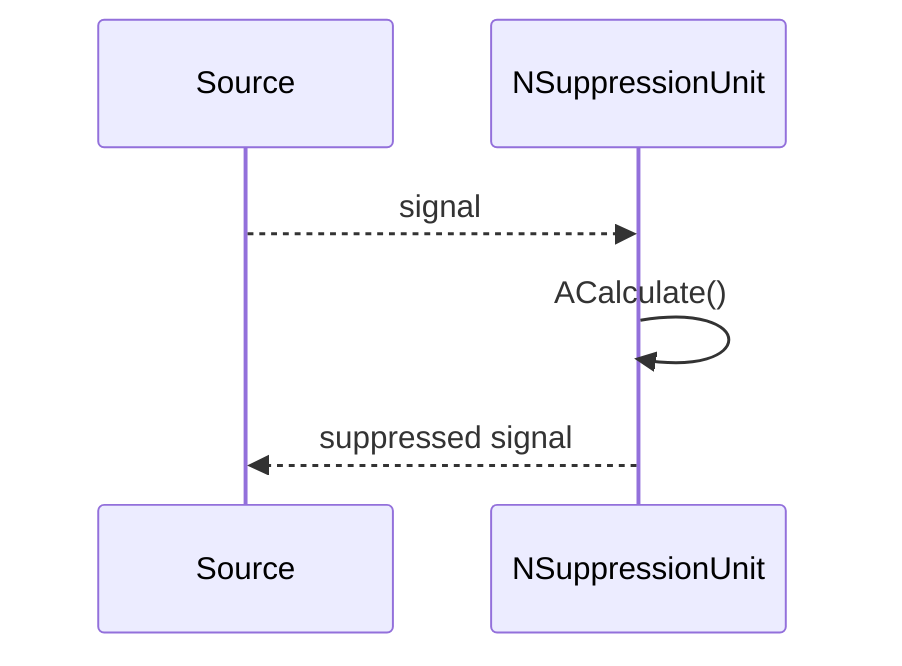
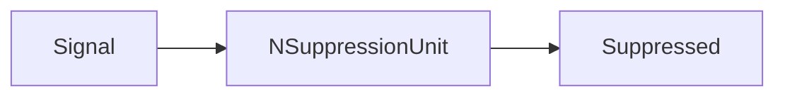
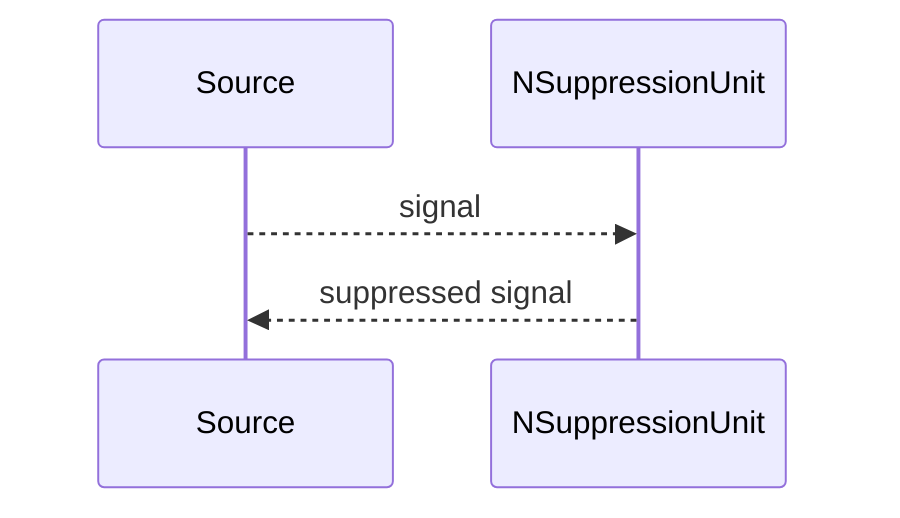

## NSuppressionUnit — подавляющий блок

**Класс**: `NSuppressionUnit` — подавляет/ограничивает сигнал (например, при конфликтующих командах).  
**Регистрация**: `UploadClass("NSuppressionUnit", ...)` в `NMotionControlLibrary.cpp`.

### Lifecycle
- **ADefault**: параметры подавления/порогов.
- **ABuild**: подключение входов.
- **AReset**: сброс.
- **ACalculate**: подавление/маскирование сигналов.

### I/O
- Вход: сигнал/команды.
- Выход: подавленный сигнал.



Пояснение: диаграмма классов показывает место компонента в иерархии и ключевые связи.



Пояснение: диаграмма последовательности показывает типовой сценарий взаимодействия и порядок вызовов.



Пояснение: блок-схема показывает поток данных/сигналов (входы → компонент → выходы).

### Config snippet

```ini
[Component]
ClassName = NSuppressionUnit
Name = Supp1
```

---

## NSuppressionUnit — suppression unit (EN)

Applies suppression/masking to input signals.


Description: this class diagram shows the component position in the type hierarchy and key relations.



Description: this sequence diagram shows a typical runtime interaction and call order.


Description: this flowchart shows the data/signal flow (inputs → component → outputs).
