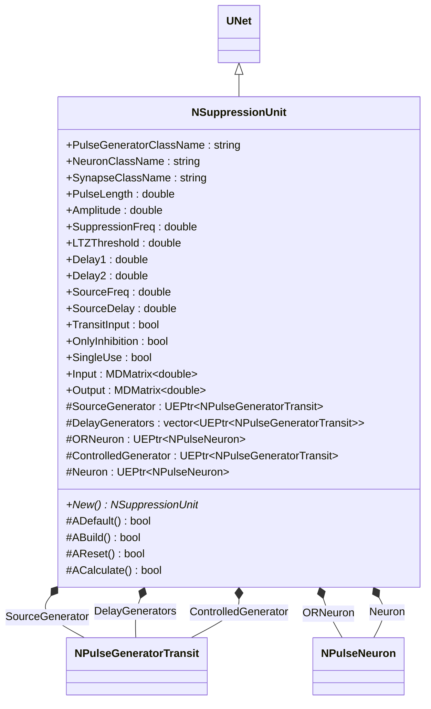
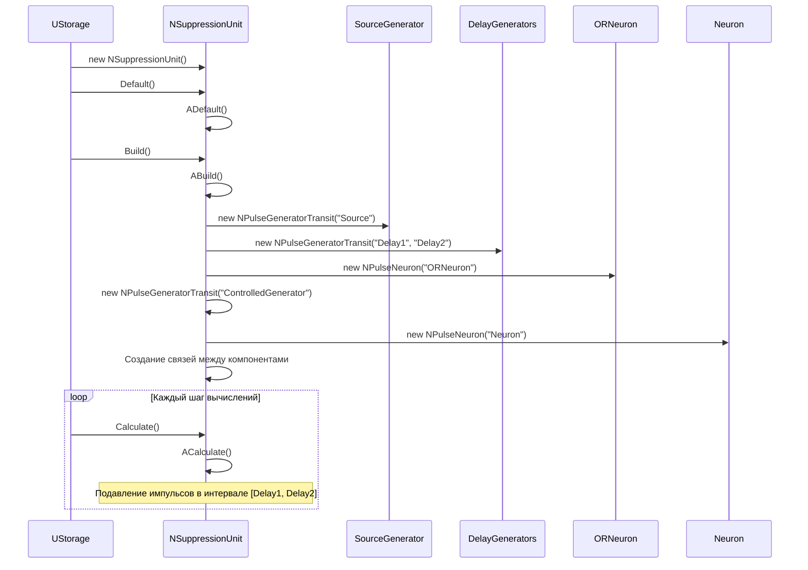
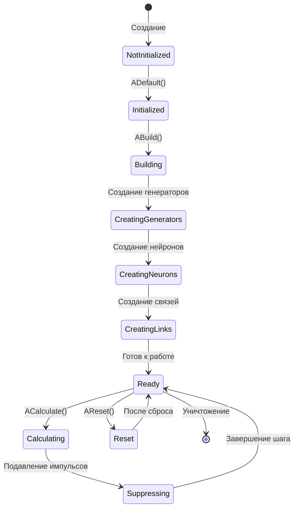
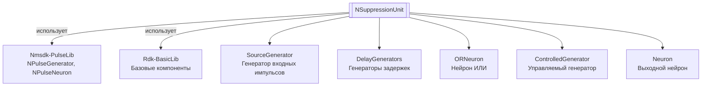
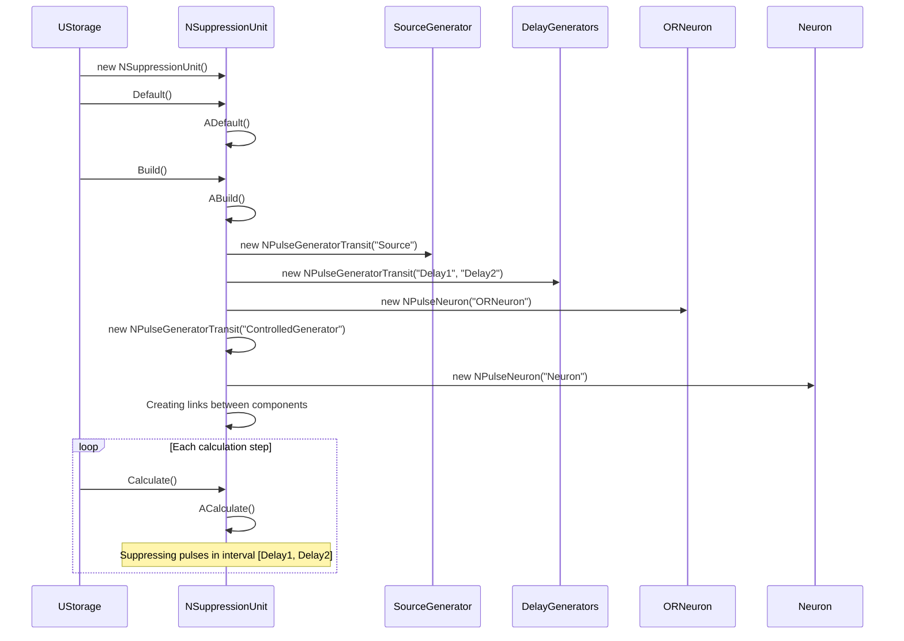
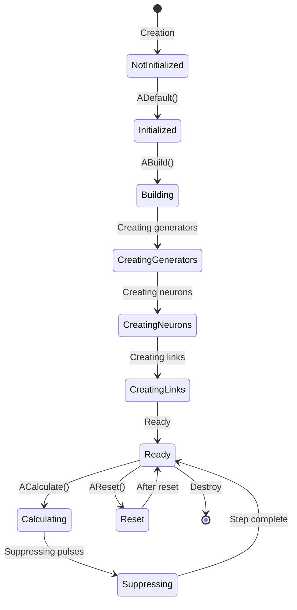
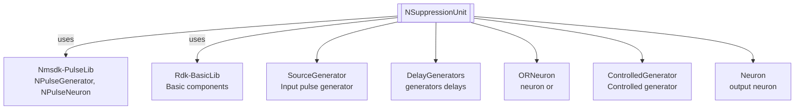

# NSuppressionUnit — блок подавления

## RU

**Класс**: `NSuppressionUnit` — компонент для подавления входных импульсов в заданном временном интервале [Delay1, Delay2].
**Регистрация**: `NMotionControlLibrary.cpp` → `UploadClass("NSuppressionUnit", ...)`.
**Базовый класс**: `UNet` (из Rdk Framework).

NSuppressionUnit подавляет входные импульсы в заданном временном интервале с использованием нейросетевой структуры из генераторов импульсов и нейронов. Компонент создает структуру для управления подавлением сигналов.

## UML-диаграмма классов



**Иерархия наследования:**
- `UNet` (Rdk Framework) — базовый класс для сетей компонентов
- `NSuppressionUnit` — блок подавления

## UML-диаграмма последовательности



## UML-диаграмма состояний



## UML-диаграмма активности

```mermaid
flowchart TD
    Start([Начало ABuild]) --> CreateSourceGen[Создание SourceGenerator]
    CreateSourceGen --> CreateDelayGens[Создание DelayGenerators[0,1]]
    CreateDelayGens --> CreateORNeuron["Создание ORNeuron<br/>с 2 возбуждающими синапсами"]
    CreateORNeuron --> CreateControlledGen["Создание ControlledGenerator<br/>с UsePatternOutput=true"]
    CreateControlledGen --> CreateNeuron[Создание Neuron]
    CreateNeuron --> LinkSourceToOR[Связь SourceGenerator -> ORNeuron]
    LinkSourceToOR --> LinkDelaysToOR[Связь DelayGenerators -> ORNeuron]
    LinkDelaysToOR --> LinkORToControlled[Связь ORNeuron -> ControlledGenerator]
    LinkORToControlled --> LinkControlledToNeuron[Связь ControlledGenerator -> Neuron]
    LinkControlledToNeuron --> LinkNeuronOutput[Связь Neuron -> Output]
    LinkNeuronOutput --> End([Конец])
```

## UML-диаграмма компонентов



## Свойства

### Параметры классов

| Свойство | Тип | Флаги | Описание | Значение по умолчанию |
|----------|-----|-------|----------|----------------------|
| `PulseGeneratorClassName` | `std::string` | `ptPubParameter` | Имя класса генератора импульсов | `"NPulseGeneratorTransit"` |
| `NeuronClassName` | `std::string` | `ptPubParameter` | Имя класса нейрона | `"NSPNeuronGen"` |
| `SynapseClassName` | `std::string` | `ptPubParameter` | Имя класса синапса | `"NPSynapseBio"` |

### Параметры импульсов

| Свойство | Тип | Флаги | Описание | Значение по умолчанию |
|----------|-----|-------|----------|----------------------|
| `PulseLength` | `double` | `ptPubParameter` | Длительность импульсов (с) | `0.001` |
| `Amplitude` | `double` | `ptPubParameter` | Амплитуда импульсов | `1.0` |
| `SuppressionFreq` | `double` | `ptPubParameter` | Частота подавляющего генератора (Гц) | `500.0` |
| `LTZThreshold` | `double` | `ptPubParameter` | Порог низкопороговой зоны нейрона | `0.0115` |

### Параметры задержек

| Свойство | Тип | Флаги | Описание | Значение по умолчанию |
|----------|-----|-------|----------|----------------------|
| `Delay1` | `double` | `ptPubParameter` | Момент начала подавления (с) | `0.0` |
| `Delay2` | `double` | `ptPubParameter` | Момент окончания подавления (с) | `0.0` |
| `SourceFreq` | `double` | `ptPubParameter` | Частота источника сигнала (Гц) | `0.0` |
| `SourceDelay` | `double` | `ptPubParameter` | Задержка источника сигнала (с) | `0.0` |

### Флаги режимов

| Свойство | Тип | Флаги | Описание | Значение по умолчанию |
|----------|-----|-------|----------|----------------------|
| `TransitInput` | `bool` | `ptPubParameter` | Использовать транзитный входной сигнал | `false` |
| `OnlyInhibition` | `bool` | `ptPubParameter` | Использовать только подавление | `false` |
| `SingleUse` | `bool` | `ptPubParameter` | Единоразовое подавление | `false` |

### Входы

| Свойство | Тип | Флаги | Описание | Источник данных |
|----------|-----|-------|----------|-----------------|
| `Input` | `MDMatrix<double>` | `ptInput \| ptPubState` | Входной импульсный сигнал | Другие компоненты системы |

### Выходы

| Свойство | Тип | Флаги | Описание | Назначение |
|----------|-----|-------|----------|------------|
| `Output` | `MDMatrix<double>` | `ptOutput \| ptPubState` | Выходной сигнал (подавленный или исходный) | Передача другим компонентам |

## Методы

### Конструкторы и деструкторы

#### `NSuppressionUnit(void)`
**Назначение:** Конструктор компонента
**Параметры:** Нет
**Возвращаемое значение:** Нет
**Описание:** Инициализирует указатели на компоненты как NULL

#### `virtual ~NSuppressionUnit(void)`
**Назначение:** Деструктор компонента
**Параметры:** Нет
**Возвращаемое значение:** Нет

### Методы жизненного цикла

#### `virtual bool ADefault(void)`
**Назначение:** Инициализация значений по умолчанию
**Параметры:** Нет
**Возвращаемое значение:** `true` при успехе
**Описание:** Устанавливает значения по умолчанию для всех параметров

#### `virtual bool ABuild(void)`
**Назначение:** Построение внутренней структуры компонента
**Параметры:** Нет
**Возвращаемое значение:** `true` при успехе
**Описание:** Создает нейросетевую структуру:
1. SourceGenerator - генератор входных импульсов
2. DelayGenerators[0,1] - генераторы задержек для Delay1 и Delay2
3. ORNeuron - нейрон ИЛИ с 2 возбуждающими синапсами
4. ControlledGenerator - управляемый генератор с UsePatternOutput=true
5. Neuron - выходной нейрон
6. Создает связи между компонентами

#### `virtual bool AReset(void)`
**Назначение:** Сброс состояния компонента
**Параметры:** Нет
**Возвращаемое значение:** `true` при успехе

#### `virtual bool ACalculate(void)`
**Назначение:** Выполнение вычислений на текущем шаге
**Параметры:** Нет
**Возвращаемое значение:** `true` при успехе
**Описание:** Вычисления выполняются нейронами внутри структуры автоматически

### Сеттеры свойств

Все сеттеры свойств имеют сигнатуру `bool SetPropertyName(const Type &value)` и обновляют соответствующие параметры внутренних компонентов при их существовании.

### Публичные методы

#### `virtual NSuppressionUnit* New(void)`
**Назначение:** Создание нового экземпляра компонента
**Параметры:** Нет
**Возвращаемое значение:** Указатель на новый экземпляр

## Примеры использования

### C++ код

```cpp
#include "NSuppressionUnit.h"

UEPtr<NSuppressionUnit> unit = new NSuppressionUnit;
unit->Default();
unit->Delay1 = 0.1;  // Начало подавления через 0.1 с
unit->Delay2 = 0.3;  // Конец подавления через 0.3 с
unit->SuppressionFreq = 1000.0;  // Частота подавления 1000 Гц
unit->Build();
```

### XML конфигурация

```xml
<Object Name="SuppressionUnit" ClassName="NSuppressionUnit">
    <Property Name="Delay1" Value="0.1" />
    <Property Name="Delay2" Value="0.3" />
    <Property Name="SuppressionFreq" Value="1000.0" />
    <Property Name="Input" Connect="Source.Output" />
</Object>
```

### Использование в конфигурациях

Компонент `NSuppressionUnit` используется для подавления импульсных сигналов в заданных временных интервалах.

**Типичные сценарии использования:**
1. **Подавление импульсов** - подавление входных импульсов в заданном временном окне
2. **Временная фильтрация** - фильтрация сигналов по времени

**Типичные комбинации:**
- `NSuppressionUnit` + источники импульсов - подавление импульсов от источников
- `NSuppressionUnit` + `NObjInArea` - используется внутри NObjInArea

---

## EN

NSuppressionUnit — suppression unit

**Class**: `NSuppressionUnit` — component for suppressing input pulses in a specified time interval [Delay1, Delay2].
**Registration**: `NMotionControlLibrary.cpp` → `UploadClass("NSuppressionUnit", ...)`.
**Base class**: `UNet` (from Rdk Framework).

NSuppressionUnit suppresses input pulses in a specified time interval using a neural network structure of pulse generators and neurons. The component creates a structure for managing signal suppression.

## Class Diagram


## Sequence Diagram



## State Diagram



## Activity Diagram

```mermaid
flowchart TD
    Start([Start ABuild]) --> CreateSourceGen[Creation SourceGenerator]
    CreateSourceGen --> CreateDelayGens[Creation DelayGenerators[0,1]]
    CreateDelayGens --> CreateORNeuron["Creating ORNeuron<br/>with 2 excitatory synapses"]
    CreateORNeuron --> CreateControlledGen["Creation ControlledGenerator<br/>with UsePatternOutput=true"]
    CreateControlledGen --> CreateNeuron[Creation Neuron]
    CreateNeuron --> LinkSourceToOR[Link SourceGenerator -> ORNeuron]
    LinkSourceToOR --> LinkDelaysToOR[Link DelayGenerators -> ORNeuron]
    LinkDelaysToOR --> LinkORToControlled[Link ORNeuron -> ControlledGenerator]
    LinkORToControlled --> LinkControlledToNeuron[Link ControlledGenerator -> Neuron]
    LinkControlledToNeuron --> LinkNeuronOutput[Link Neuron -> Output]
    LinkNeuronOutput --> End([End])
```

## Component Diagram



## Properties

[Same structure as RU section, translated to English]

## Methods

[Same structure as RU section, translated to English]

## References

- [Literature-References.md](../Literature-References.md): [A], 28, 29 — signal suppression in neural structures.

## Usage Examples

[Same as RU section, with English comments]
