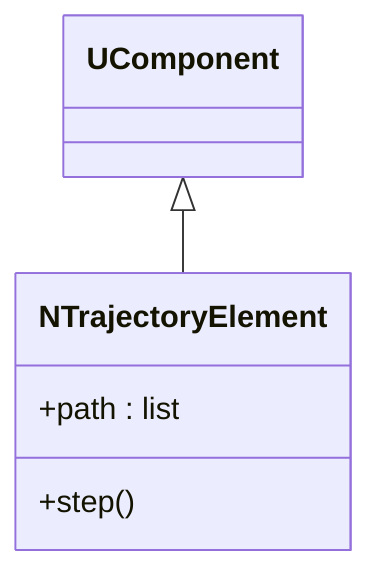
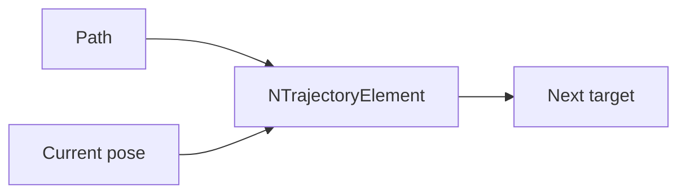
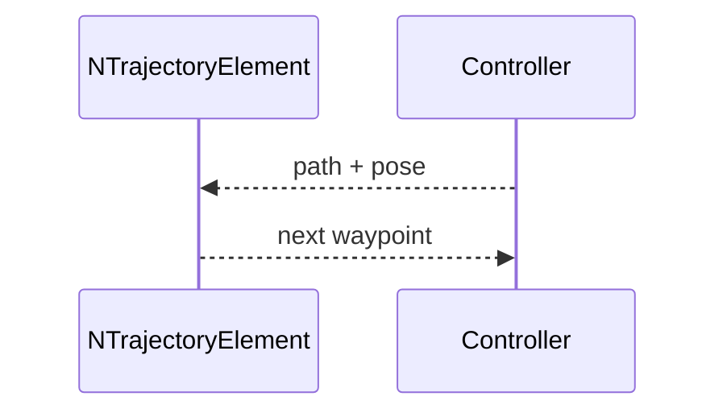

## NTrajectoryElement — траектория

**Класс**: `NTrajectoryElement` — формирование/следование траектории.  
**Регистрация**: `NMotionControlLibrary.cpp` → `UploadClass("NTrajectoryElement", ...)`.

### Входы/выходы
- Вход: текущая позиция, целевой путь.
- Выход: следующая точка/команда движения.

Пояснение: блок-схема показывает поток данных/сигналов (входы → компонент → выходы).

Пояснение: диаграмма последовательности показывает типовой сценарий взаимодействия и порядок вызовов.

---

## NTrajectoryElement — trajectory element

Generates next waypoints along a path using current pose feedback.
