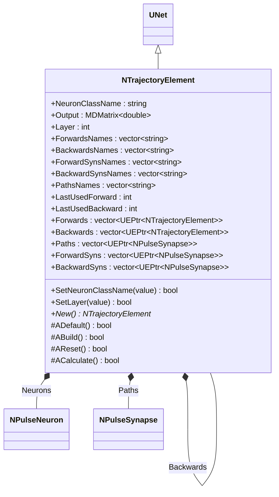
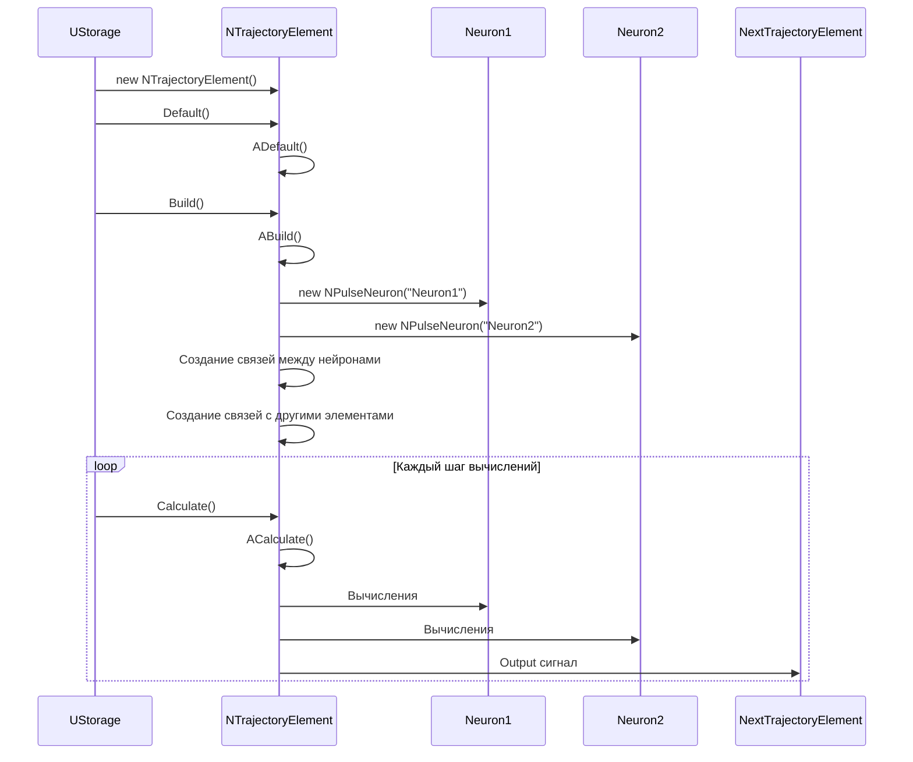
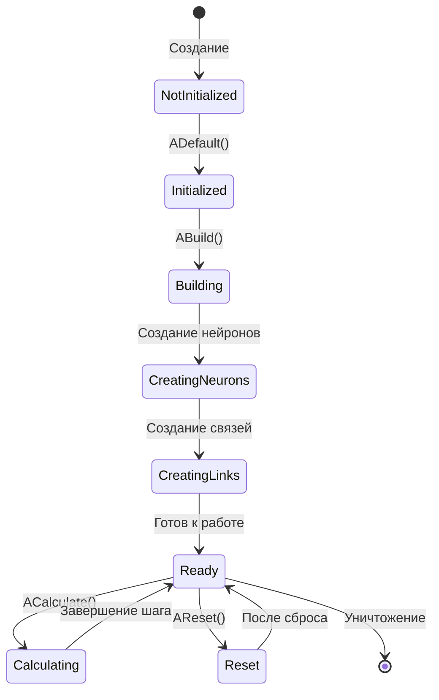
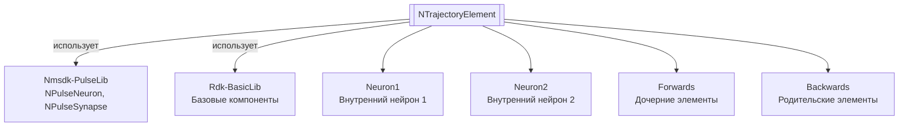

# NTrajectoryElement — элемент траектории

## RU

**Класс**: `NTrajectoryElement` — элемент траектории для построения и следования по траекториям движения, используется в системах навигации и памяти лабиринта.
**Регистрация**: `NMotionControlLibrary.cpp` → `UploadClass("NTrajectoryElement", ...)`.
**Базовый класс**: `UNet` (из Rdk Framework).

NTrajectoryElement представляет точку в пространстве траекторий с возможностью перехода к следующим элементам (Forwards) и обратных связей к предыдущим (Backwards). Компонент создает нейросетевую структуру из двух нейронов для управления переходами между элементами траектории.

## UML-диаграмма классов



**Иерархия наследования:**
- `UNet` (Rdk Framework) — базовый класс для сетей компонентов
- `NTrajectoryElement` — элемент траектории

**Связи с другими компонентами:**
- **Агрегация**: содержит указатели на другие элементы траектории (Forwards, Backwards)
- **Композиция**: создает и управляет внутренними нейронами (Neurons)
- **Зависимости**: использует компоненты из `Nmsdk-PulseLib` (NPulseNeuron, NPulseSynapse)

## UML-диаграмма последовательности



## UML-диаграмма состояний



## UML-диаграмма активности

```mermaid
flowchart TD
    Start([Начало ABuild]) --> CreateNeuron1[Создание Neuron1<br/>SomaSize=1, DendSizes1=[5]]
    CreateNeuron1 --> CreateNeuron2[Создание Neuron2<br/>SomaSize=1, DendSizes2=[3]]
    CreateNeuron2 --> LinkN1toN2["Связь от N1 к N2:<br/>LTZone -> Dendrite1_1, Dendrite1_3"]
    LinkN1toN2 --> LinkN2toN1["Связь от N2 к N1:<br/>LTZone -> Dendrite1_2, Dendrite1_5"]
    LinkN2toN1 --> LinkForwards["Связи с дочерними элементами<br/>через ForwardSyns"]
    LinkForwards --> LinkBackwards["Связи с родительскими элементами<br/>через BackwardSyns"]
    LinkBackwards --> End([Конец])
```

## UML-диаграмма компонентов



## Свойства

### Параметры

| Свойство | Тип | Флаги | Описание | Значение по умолчанию |
|----------|-----|-------|----------|----------------------|
| `NeuronClassName` | `string` | `ptPubParameter` | Имя класса нейрона для создания внутренних нейронов | `"NSPNeuronGen"` |
| `Layer` | `int` | `ptPubParameter` | Номер слоя элемента траектории (для MazeMemory) | `0` |

### Выходы

| Свойство | Тип | Флаги | Описание | Назначение |
|----------|-----|-------|----------|------------|
| `Output` | `MDMatrix<double>` | `ptOutput \| ptPubState` | Выходной сигнал на следующий элемент траектории | Передача следующему элементу траектории |

### Параметры для MazeMemory

| Свойство | Тип | Флаги | Описание |
|----------|-----|-------|----------|
| `ForwardsNames` | `std::vector<string>` | `ptPubParameter` | Имена дочерних элементов траектории |
| `BackwardsNames` | `std::vector<string>` | `ptPubParameter` | Имена родительских элементов траектории |
| `ForwardSynsNames` | `std::vector<string>` | `ptPubParameter` | Имена синапсов на дочерние элементы |
| `BackwardSynsNames` | `std::vector<string>` | `ptPubParameter` | Имена синапсов на родительские элементы |
| `PathsNames` | `std::vector<string>` | `ptPubParameter` | Имена всех узлов (синапсов), доступных из данного элемента |
| `LastUsedForward` | `int` | `ptPubParameter` | Индекс последнего использованного дочернего элемента | `-1` |
| `LastUsedBackward` | `int` | `ptPubParameter` | Индекс последнего использованного родительского элемента | `-1` |

### Внутренние указатели

| Свойство | Тип | Описание |
|----------|-----|----------|
| `Forwards` | `std::vector<UEPtr<NTrajectoryElement>>` | Вектор указателей на дочерние элементы траектории |
| `Backwards` | `std::vector<UEPtr<NTrajectoryElement>>` | Вектор указателей на родительские элементы траектории |
| `Paths` | `std::vector<UEPtr<NPulseSynapse>>` | Вектор всех доступных синапсов (путей) |
| `ForwardSyns` | `std::vector<UEPtr<NPulseSynapse>>` | Вектор синапсов на дочерние элементы |
| `BackwardSyns` | `std::vector<UEPtr<NPulseSynapse>>` | Вектор синапсов на родительские элементы |
| `Neurons` | `std::vector<UEPtr<NPulseNeuron>>` | Вектор внутренних нейронов (2 нейрона) |

### Защищенные свойства

| Свойство | Тип | Описание |
|----------|-----|----------|
| `SomaSize` | `int` | Размер сомы нейронов (1) |
| `DendSizes1` | `std::vector<int>` | Размеры дендритов нейрона 1 ([5]) |
| `DendSizes2` | `std::vector<int>` | Размеры дендритов нейрона 2 ([3]) |
| `LastUsedPath` | `int` | Индекс последнего использованного пути |

## Методы

### Конструкторы и деструкторы

#### `NTrajectoryElement(void)`
**Назначение:** Конструктор компонента
**Параметры:** Нет
**Возвращаемое значение:** Нет

#### `virtual ~NTrajectoryElement(void)`
**Назначение:** Деструктор компонента
**Параметры:** Нет
**Возвращаемое значение:** Нет

### Методы жизненного цикла

#### `virtual bool ADefault(void)`
**Назначение:** Инициализация значений по умолчанию
**Параметры:** Нет
**Возвращаемое значение:** `true` при успехе
**Описание:** Устанавливает NeuronClassName="NSPNeuronGen", SomaSize=1, размеры дендритов, инициализирует векторы имен пустыми строками, LastUsedForward=-1, LastUsedBackward=-1

#### `virtual bool ABuild(void)`
**Назначение:** Построение внутренней структуры компонента
**Параметры:** Нет
**Возвращаемое значение:** `true` при успехе
**Описание:** Создает два нейрона (Neuron1 и Neuron2) с заданными размерами сомы и дендритов, создает связи между нейронами:
- От Neuron1 к Neuron2: LTZone -> Dendrite1_1.ExcSynapse1, Dendrite1_3.ExcSynapse1
- От Neuron2 к Neuron1: LTZone -> Dendrite1_2.ExcSynapse1, Dendrite1_5.ExcSynapse1

#### `virtual bool AReset(void)`
**Назначение:** Сброс состояния компонента
**Параметры:** Нет
**Возвращаемое значение:** `true` при успехе

#### `virtual bool ACalculate(void)`
**Назначение:** Выполнение вычислений на текущем шаге
**Параметры:** Нет
**Возвращаемое значение:** `true` при успехе
**Описание:** Вычисления выполняются нейронами внутри структуры автоматически

### Сеттеры свойств

#### `bool SetNeuronClassName(const std::string &value)`
**Назначение:** Установка имени класса нейрона
**Параметры:**
- `value` - имя класса нейрона
**Возвращаемое значение:** `true` при успехе
**Описание:** Устанавливает Ready=false для перестроения

#### `bool SetLayer(const int &value)`
**Назначение:** Установка номера слоя
**Параметры:**
- `value` - номер слоя
**Возвращаемое значение:** `true` при успехе
**Описание:** Устанавливает Ready=false для перестроения

### Публичные методы

#### `virtual NTrajectoryElement* New(void)`
**Назначение:** Создание нового экземпляра компонента
**Параметры:** Нет
**Возвращаемое значение:** Указатель на новый экземпляр

## Примеры использования

### C++ код

```cpp
#include "NTrajectoryElement.h"

UEPtr<NTrajectoryElement> element = new NTrajectoryElement;
element->Default();
element->NeuronClassName = "NNewSPNeuron";
element->Layer = 0;
element->Build();
```

### XML конфигурация

```xml
<Object Name="TrajectoryElement1" ClassName="NTrajectoryElement">
    <Property Name="NeuronClassName" Value="NNewSPNeuron" />
    <Property Name="Layer" Value="0" />
    <Property Name="ForwardsNames" Value="TrajectoryElement2,TrajectoryElement3" />
</Object>
```

### Использование в конфигурациях

Компонент `NTrajectoryElement` используется в системах навигации и памяти лабиринта (NMazeMemory) для построения графа траекторий движения.

**Типичные сценарии использования:**
1. **Построение графа траекторий** - создание сети элементов траектории для навигации
2. **Память лабиринта** - использование в NMazeMemory для запоминания путей
3. **Планирование движения** - выбор следующего элемента траектории на основе нейросетевых вычислений

**Типичные комбинации:**
- `NTrajectoryElement` + `NMazeMemory` - построение памяти лабиринта
- `NTrajectoryElement` + другие `NTrajectoryElement` - построение графа траекторий

---

## EN

NTrajectoryElement — trajectory element

**Class**: `NTrajectoryElement` — trajectory element for building and following motion trajectories, used in navigation systems and maze memory.
**Registration**: `NMotionControlLibrary.cpp` → `UploadClass("NTrajectoryElement", ...)`.
**Base class**: `UNet` (from Rdk Framework).

NTrajectoryElement represents a point in trajectory space with the ability to transition to next elements (Forwards) and backward links to previous ones (Backwards). The component creates a neural network structure of two neurons for managing transitions between trajectory elements.

## Class Diagram


## Sequence Diagram


## State Diagram


## Activity Diagram

```mermaid
flowchart TD
    Start([Начало ABuild]) --> CreateNeuron1[Создание Neuron1<br/>SomaSize=1, DendSizes1=[5]]
    CreateNeuron1 --> CreateNeuron2[Создание Neuron2<br/>SomaSize=1, DendSizes2=[3]]
    CreateNeuron2 --> LinkN1toN2["Связь от N1 к N2:<br/>LTZone -> Dendrite1_1, Dendrite1_3"]
    LinkN1toN2 --> LinkN2toN1["Связь от N2 к N1:<br/>LTZone -> Dendrite1_2, Dendrite1_5"]
    LinkN2toN1 --> LinkForwards["Связи с дочерними элементами<br/>через ForwardSyns"]
    LinkForwards --> LinkBackwards["Связи с родительскими элементами<br/>через BackwardSyns"]
    LinkBackwards --> End([Конец])
```

## Component Diagram


## Properties

### Parameters

| Property | Type | Description |
|----------|------|-------------|
| `NeuronClassName` | `string` | Neuron class name for trajectory nodes |
| `Forwards` | `vector<NTrajectoryElement*>` | Next elements in trajectory |
| `Backwards` | `vector<NTrajectoryElement*>` | Previous elements |
| `Neurons` | neural structure | Pulse neurons for transitions |

### State

Output reflects current trajectory node activity (from neural structure).

## Methods

### Lifecycle

- **`ADefault()`** — set default parameters
- **`ABuild()`** — create neurons and synapses for Forwards/Backwards
- **`AReset()`** — reset state
- **`ACalculate()`** — update neuron outputs (trajectory transitions)

## References
- [Literature-References.md](../Literature-References.md): [A], 22, 24 — элемент траектории, память и навигация.

## Usage Examples

### C++ Code

See RU section for full examples. Typical usage: create several NTrajectoryElement instances, set Forwards/Backwards to form a graph, Default/Build/Reset, then Calculate() in loop. Used with [NMazeMemory](NMazeMemory.md), [NNavMousePrimitive](NNavMousePrimitive.md) for navigation and trajectory memory.

### Usage in Configurations

Used in navigation and maze memory systems; example configs: `Bin/Configs/SpikeSamples/Memory/`, configs using trajectory/maze components.
