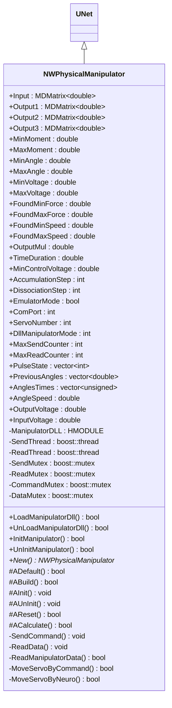
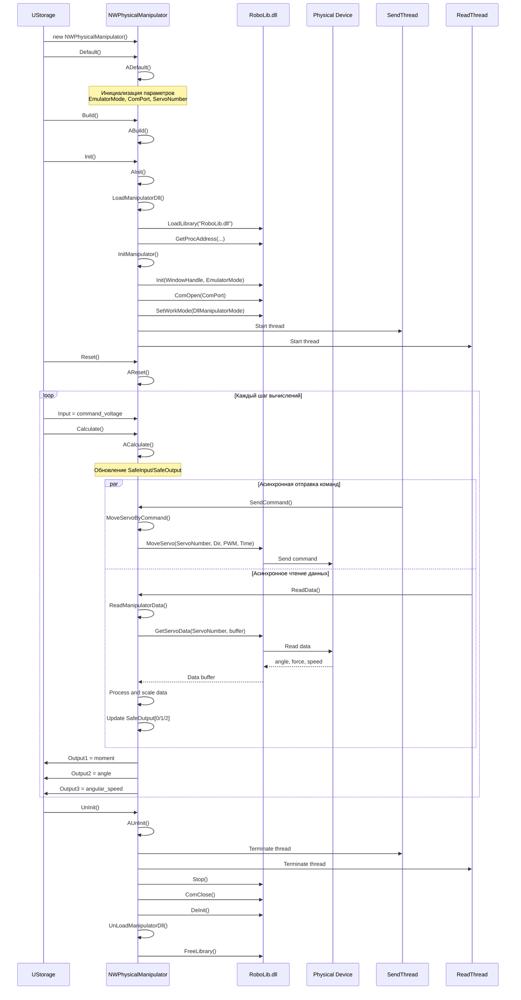
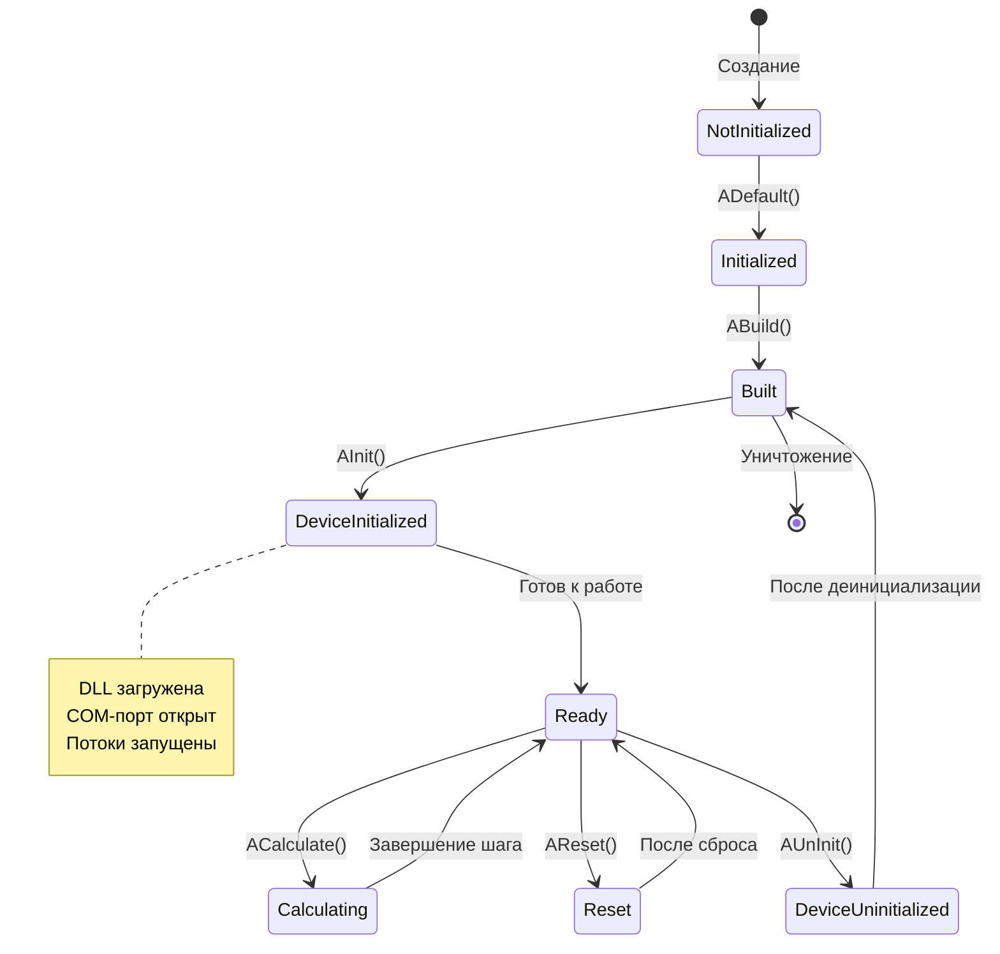
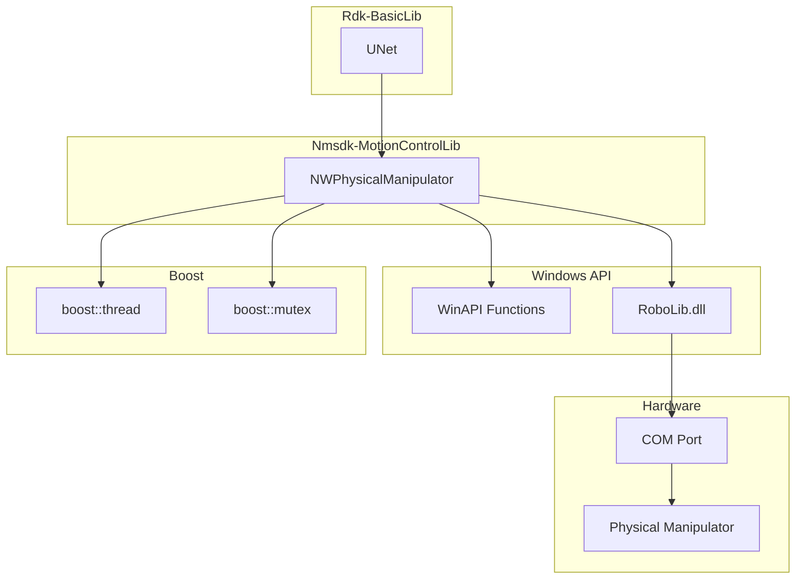
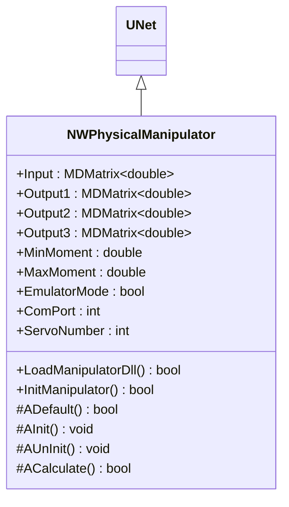
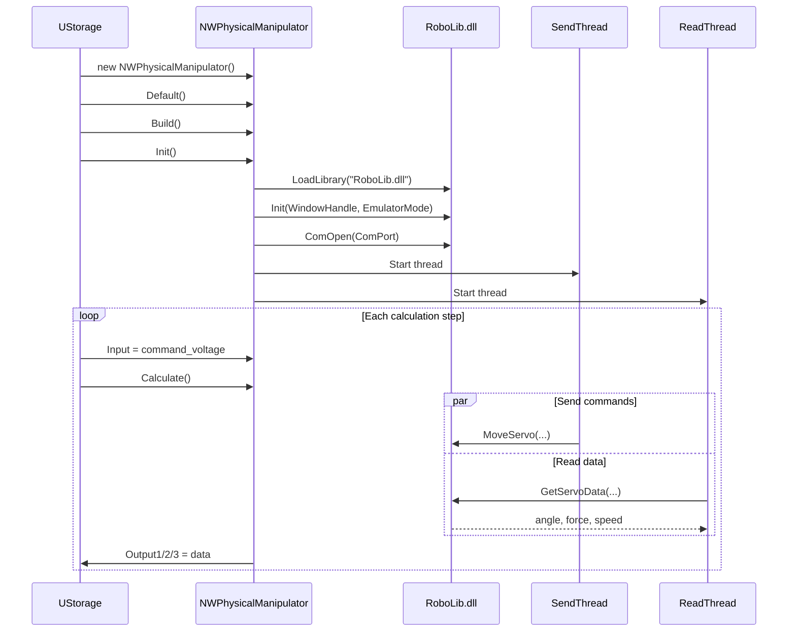
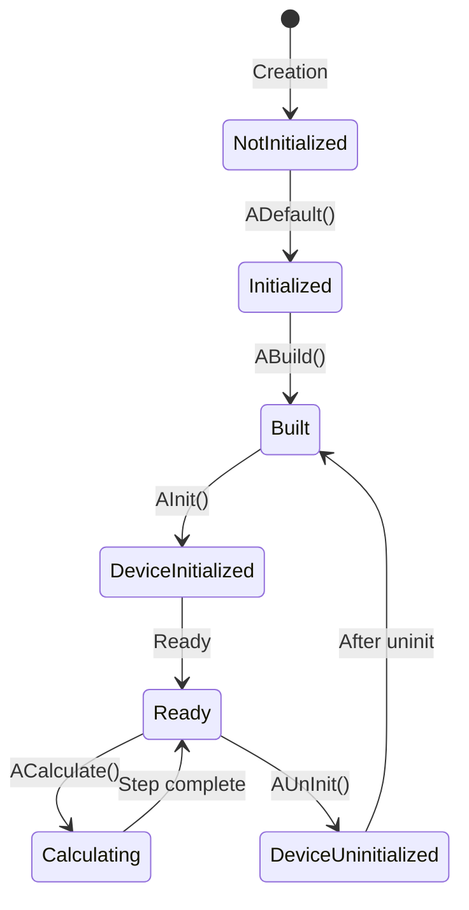
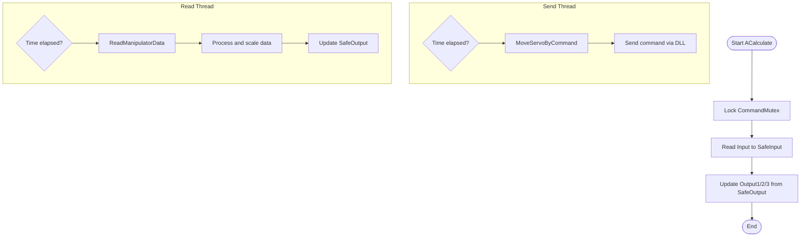
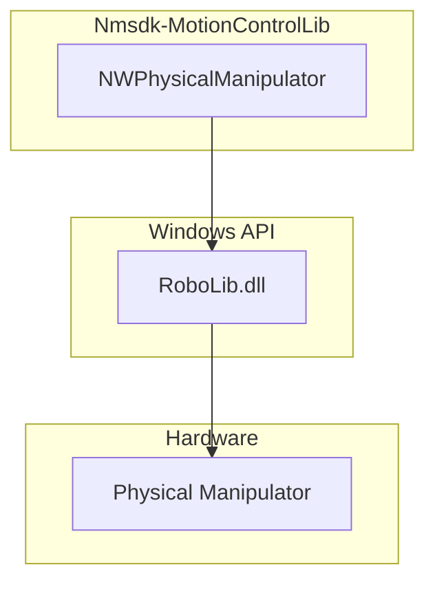

# NWPhysicalManipulator — WinAPI физический манипулятор

## RU

**Класс**: `NWPhysicalManipulator` — компонент для управления физическим манипулятором через WinAPI и внешнюю DLL (RoboLib.dll).
**Регистрация**: `Libraries/Nmsdk-MotionControlLib/Core/WinAPI/NWinAPIActLibrary.cpp` → `UploadClass("NWPhysicalManipulator", ...)`.
**Базовый класс**: `UNet` (из Rdk Framework).

NWPhysicalManipulator обеспечивает интерфейс для управления физическим манипулятором через WinAPI. Компонент загружает внешнюю DLL (RoboLib.dll), инициализирует COM-порт для связи с устройством, и использует многопоточность (boost::thread) для асинхронной отправки команд и чтения данных. Компонент поддерживает несколько режимов работы (командный режим, нейроуправление, эмулятор) и автоматически масштабирует данные между внутренним представлением и физическими единицами устройства.

## UML-диаграмма классов



**Иерархия наследования:**
- `UNet` (Rdk Framework) — базовый класс для сетей компонентов
- `NWPhysicalManipulator` — интерфейс для физического манипулятора

**Связи с другими компонентами:**
- **Входы**: получает команды управления (напряжение) от других компонентов через `Input`
- **Выходы**: предоставляет данные о состоянии манипулятора (момент, угол, угловая скорость) через `Output1`, `Output2`, `Output3`
- **Зависимости**: требует наличия `RoboLib.dll` для работы с физическим устройством

## UML-диаграмма последовательности



**Описание жизненного цикла:**
1. **Создание** - компонент создаётся через конструктор
2. **Инициализация (ADefault)** - установка значений по умолчанию для параметров подключения
3. **Построение (ABuild)** - подготовка к работе (для NWPhysicalManipulator не требуется дополнительных действий)
4. **Инициализация устройства (AInit)** - загрузка DLL, открытие COM-порта, запуск потоков отправки и чтения
5. **Сброс (AReset)** - сброс внутренних счётчиков и статистики
6. **Вычисление (ACalculate)** - обновление защищённых переменных для потоков
7. **Деинициализация (AUnInit)** - остановка потоков, закрытие COM-порта, выгрузка DLL

## UML-диаграмма состояний



**Состояния компонента:**
- **NotInitialized** - компонент создан, но не инициализирован
- **Initialized** - компонент инициализирован (после ADefault)
- **Built** - готов к работе (после ABuild)
- **DeviceInitialized** - устройство инициализировано, потоки запущены
- **Ready** - готов к вычислениям и обмену данными
- **Calculating** - выполняется обновление данных (ACalculate)
- **Reset** - состояние после сброса (AReset)
- **DeviceUninitialized** - устройство деинициализировано, потоки остановлены

## UML-диаграмма активности

```mermaid
flowchart TD
    Start([Начало ACalculate]) --> LockCommand[Блокировка CommandMutex]
    LockCommand --> ReadInput[Чтение Input в SafeInput]
    ReadInput --> UnlockCommand[Разблокировка CommandMutex]
    UnlockCommand --> LockRead[Блокировка ReadMutex]
    LockRead --> UpdateOutputs[Обновление Output1/2/3 из SafeOutput]
    UpdateOutputs --> UnlockRead[Разблокировка ReadMutex]
    UnlockRead --> End([Конец])

    subgraph SendThread["Поток отправки (SendCommand)"]
        STStart([Начало потока]) --> STCheck["ManipulatorDLL<br/>загружена?"]
        STCheck -->|Нет| STSleep[Ожидание 10 мс]
        STCheck -->|Да| STLock[Блокировка SendMutex]
        STLock --> STCheckTime["Время прошло<br/>> MaxSendCounter?"]
        STCheckTime -->|Нет| STWait[Ожидание]
        STCheckTime -->|Да| STLockCmd[Блокировка CommandMutex]
        STLockCmd --> STMove[MoveServoByCommand]
        STMove --> STCalcVoltage[Вычисление OutputVoltage]
        STCalcVoltage --> STSend[Отправка команды через DLL]
        STSend --> STUnlock[Разблокировка мьютексов]
        STUnlock --> STCheckTerm["Поток<br/>завершён?"]
        STCheckTerm -->|Нет| STCheck
        STCheckTerm -->|Да| STEnd([Конец потока])
        STWait --> STCheckTerm
        STSleep --> STCheckTerm
    end

    subgraph ReadThread["Поток чтения (ReadData)"]
        RTStart([Начало потока]) --> RTCheck["ManipulatorDLL<br/>загружена?"]
        RTCheck -->|Нет| RTSleep[Ожидание 10 мс]
        RTCheck -->|Да| RTLock[Блокировка ReadMutex]
        RTLock --> RTCheckTime["Время прошло<br/>> MaxReadCounter?"]
        RTCheckTime -->|Нет| RTWait[Ожидание]
        RTCheckTime -->|Да| RTLockData[Блокировка DataMutex]
        RTLockData --> RTRead[ReadManipulatorData]
        RTRead --> RTGetData[Получение данных через DLL]
        RTGetData --> RTProcess[Обработка и масштабирование]
        RTProcess --> RTUpdate[Обновление SafeOutput]
        RTUpdate --> RTUnlock[Разблокировка мьютексов]
        RTUnlock --> RTCheckTerm["Поток<br/>завершён?"]
        RTCheckTerm -->|Нет| RTCheck
        RTCheckTerm -->|Да| RTEnd([Конец потока])
        RTWait --> RTCheckTerm
        RTSleep --> RTCheckTerm
    end
```



**Алгоритм работы:**
1. **ACalculate**: обновляет защищённые переменные для потоков
2. **SendThread**: асинхронно отправляет команды управления с заданной частотой
3. **ReadThread**: асинхронно читает данные о состоянии устройства с заданной частотой
4. **MoveServoByCommand**: вычисляет PWM-сигнал из входного напряжения и отправляет команду
5. **ReadManipulatorData**: читает данные устройства, масштабирует их и обновляет выходы

## UML-диаграмма компонентов



**Зависимости:**
- **Rdk-BasicLib**: базовый фреймворк (`UNet`)
- **Windows API**: функции для работы с DLL и COM-портом
- **RoboLib.dll**: внешняя DLL для управления манипулятором
- **Boost**: библиотека для многопоточности (`boost::thread`, `boost::mutex`)

## Свойства компонента

### Входы/Выходы

| Свойство | Тип | Флаги | Описание |
|----------|-----|-------|----------|
| `Input` | `MDMatrix<double>` | `ptInput \| ptPubState` | Входное управляющее напряжение (команда) |
| `Output1` | `MDMatrix<double>` | `ptOutput \| ptPubState` | Выход: момент/сила манипулятора (нормализовано) |
| `Output2` | `MDMatrix<double>` | `ptOutput \| ptPubState` | Выход: угол манипулятора (радианы) |
| `Output3` | `MDMatrix<double>` | `ptOutput \| ptPubState` | Выход: угловая скорость манипулятора (рад/с) |

### Параметры (ptPubParameter)

| Свойство | Тип | Значение по умолчанию | Описание |
|----------|-----|----------------------|----------|
| `MinMoment` | `double` | `-0.7` | Минимальный момент (Н·м) |
| `MaxMoment` | `double` | `0.7` | Максимальный момент (Н·м) |
| `MinAngle` | `double` | `0` | Минимальный угол (градусы) |
| `MaxAngle` | `double` | `190` | Максимальный угол (градусы) |
| `MinVoltage` | `double` | `-5` | Минимальное входное напряжение (В) |
| `MaxVoltage` | `double` | `5` | Максимальное входное напряжение (В) |
| `OutputMul` | `double` | `2` | Множитель выходного управляющего напряжения |
| `TimeDuration` | `double` | `1` | Длительность управляющего воздействия (с) |
| `MinControlVoltage` | `double` | `0` | Минимальная величина управляющего воздействия (PWM) |
| `AccumulationStep` | `int` | `100` | Шаг по накоплению в контроллере за 1 мс (для нейрорежима) |
| `DissociationStep` | `int` | `5` | Шаг по разряду в контроллере за 1 мс (для нейрорежима) |
| `EmulatorMode` | `bool` | `true` | Режим эмулятора (true - эмулятор, false - реальное устройство) |
| `ComPort` | `int` | `2` | Номер COM-порта для связи с устройством |
| `ServoNumber` | `int` | `1` | Номер сервопривода манипулятора |
| `DllManipulatorMode` | `int` | `2` | Режим работы DLL (0-обычный, 1-нейро, 2-командный, 3-нейроуправление) |
| `MaxSendCounter` | `int` | `200` | Максимум счётчика пропусков отправки команд (мс) |
| `MaxReadCounter` | `int` | `200` | Максимум счётчика пропусков чтения данных (мс) |

### Состояния (ptPubState)

| Свойство | Тип | Описание |
|----------|-----|----------|
| `FoundMinForce` | `double` | Найденный минимальный момент (автоматически определяется) |
| `FoundMaxForce` | `double` | Найденный максимальный момент (автоматически определяется) |
| `FoundMinSpeed` | `double` | Найденная минимальная скорость (автоматически определяется) |
| `FoundMaxSpeed` | `double` | Найденная максимальная скорость (автоматически определяется) |
| `PulseState` | `vector<int>` | Состояния выходных нейронов (для нейрорежима) |
| `PreviousAngles` | `vector<double>` | История предыдущих углов для вычисления скорости |
| `AnglesTimes` | `vector<unsigned>` | Временные метки для истории углов |
| `NumAnglesHistory` | `size_t` | `2` | Количество углов в истории |
| `AnglesHistoryTime` | `double` | `0.3` | Время истории углов (с) |
| `AngleSpeed` | `double` | Вычисленная угловая скорость (рад/с) |
| `OutputVoltage` | `double` | Выходное управляющее напряжение (PWM) |
| `InputVoltage` | `double` | Входное управляющее напряжение |

## Методы компонента

### Управление DLL

#### `LoadManipulatorDll() -> bool`
**Назначение**: Загрузка внешней DLL (RoboLib.dll) и получение указателей на функции.

**Параметры**: Нет

**Возвращаемое значение**: `true` при успешной загрузке

**Описание**: Загружает `RoboLib.dll` через `LoadLibraryA`, получает указатели на функции через `GetProcAddress` и сохраняет их в соответствующие поля класса.

#### `UnLoadManipulatorDll() -> bool`
**Назначение**: Выгрузка DLL и очистка указателей на функции.

**Параметры**: Нет

**Возвращаемое значение**: `true` при успешной выгрузке

**Описание**: Обнуляет все указатели на функции и выгружает DLL через `FreeLibrary`.

#### `InitManipulator() -> bool`
**Назначение**: Инициализация манипулятора через DLL.

**Параметры**: Нет

**Возвращаемое значение**: `true` при успешной инициализации

**Описание**: Вызывает `Init` с дескриптором окна и режимом эмулятора, открывает COM-порт через `ComOpen`, устанавливает режим работы через `SetWorkMode`.

#### `UnInitManipulator() -> bool`
**Назначение**: Деинициализация манипулятора.

**Параметры**: Нет

**Возвращаемое значение**: `true` при успешной деинициализации

**Описание**: Останавливает устройство через `Stop`, закрывает COM-порт через `ComClose`, деинициализирует через `DeInit`.

### Жизненный цикл

#### `ADefault() -> bool`
**Назначение**: Инициализация параметров по умолчанию.

**Параметры**: Нет

**Возвращаемое значение**: `true` при успешной инициализации

**Описание**: Устанавливает значения по умолчанию для всех параметров подключения, диапазонов, режимов работы и инициализирует входы/выходы.

#### `ABuild() -> bool`
**Назначение**: Построение компонента (для NWPhysicalManipulator не требуется дополнительных действий).

**Параметры**: Нет

**Возвращаемое значение**: `true`

**Описание**: Подготовка к работе (пустая реализация).

#### `AInit() -> void`
**Назначение**: Инициализация устройства и запуск потоков.

**Параметры**: Нет

**Возвращаемое значение**: Нет

**Описание**: Инициализирует манипулятор, запускает потоки отправки команд и чтения данных через `boost::thread`.

#### `AUnInit() -> void`
**Назначение**: Деинициализация устройства и остановка потоков.

**Параметры**: Нет

**Возвращаемое значение**: Нет

**Описание**: Устанавливает флаги завершения потоков, ожидает их завершения через `join()`, деинициализирует манипулятор и выгружает DLL.

#### `AReset() -> bool`
**Назначение**: Сброс состояния компонента.

**Параметры**: Нет

**Возвращаемое значение**: `true` при успешном сбросе

**Описание**: Очищает историю параметров, сбрасывает найденные диапазоны, инициализирует счётчики и устанавливает режим работы через DLL.

#### `ACalculate() -> bool`
**Назначение**: Обновление защищённых переменных для потоков.

**Параметры**: Нет

**Возвращаемое значение**: `true` при успешном обновлении

**Описание**: Обновляет `SafeInput` из `Input` и `SafeOutput` из `Output1/2/3` с использованием мьютексов для безопасного доступа из потоков.

### Внутренние методы

#### `SendCommand() -> void` (protected)
**Назначение**: Поток отправки команд (вызывается в отдельном потоке).

**Описание**: В бесконечном цикле проверяет время и отправляет команды через `MoveServoByCommand` с частотой, определяемой `MaxSendCounter`.

#### `ReadData() -> void` (protected)
**Назначение**: Поток чтения данных (вызывается в отдельном потоке).

**Описание**: В бесконечном цикле проверяет время и читает данные через `ReadManipulatorData` с частотой, определяемой `MaxReadCounter`.

#### `ReadManipulatorData() -> bool` (protected)
**Назначение**: Чтение данных о состоянии манипулятора из DLL.

**Описание**: Вызывает `GetServoData` для получения данных (номер, угол, сила, направление, скорость), обрабатывает и масштабирует данные, обновляет `SafeOutput` и историю углов для вычисления скорости.

#### `MoveServoByCommand() -> bool` (protected)
**Назначение**: Формирование и отправка команды управления в командном режиме.

**Описание**: Вычисляет PWM-сигнал из `SafeInput` с учётом `OutputMul` и `MinControlVoltage`, определяет направление движения (ServoLeft/ServoRight), вычисляет длительность команды и отправляет через `MoveServo`.

## Примеры использования

### C++ код

```cpp
#include "NWPhysicalManipulator.h"

// Создание компонента
UEPtr<NWPhysicalManipulator> manipulator = storage->CreateComponent<NWPhysicalManipulator>("PhysMan1");

// Настройка параметров
manipulator->EmulatorMode = false; // Реальный режим
manipulator->ComPort = 3;
manipulator->ServoNumber = 1;
manipulator->DllManipulatorMode = 2; // Командный режим
manipulator->OutputMul = 2.0;
manipulator->MinControlVoltage = 0;
manipulator->MaxSendCounter = 200;
manipulator->MaxReadCounter = 200;

// Инициализация
manipulator->Default();
manipulator->Build();
manipulator->Init(); // Загружает DLL, открывает COM-порт, запускает потоки
manipulator->Reset();

// В цикле вычислений
while (simulation_running) {
    // Установка команды управления (напряжение от -100 до 100)
    manipulator->Input(0, 0) = command_voltage;

    manipulator->Calculate();

    // Получение данных о состоянии
    double moment = manipulator->Output1(0, 0);
    double angle = manipulator->Output2(0, 0);
    double angular_speed = manipulator->Output3(0, 0);
}

// Деинициализация
manipulator->UnInit(); // Останавливает потоки, закрывает COM-порт, выгружает DLL
```

### XML конфигурация

```xml
<Component>
    <ClassName>NWPhysicalManipulator</ClassName>
    <Name>PhysMan1</Name>
    <Properties>
        <EmulatorMode>false</EmulatorMode>
        <ComPort>3</ComPort>
        <ServoNumber>1</ServoNumber>
        <DllManipulatorMode>2</DllManipulatorMode>
        <OutputMul>2.0</OutputMul>
        <MinControlVoltage>0</MinControlVoltage>
        <MaxSendCounter>200</MaxSendCounter>
        <MaxReadCounter>200</MaxReadCounter>
        <MinMoment>-0.7</MinMoment>
        <MaxMoment>0.7</MaxMoment>
        <MinAngle>0</MinAngle>
        <MaxAngle>190</MaxAngle>
        <MinVoltage>-5</MinVoltage>
        <MaxVoltage>5</MaxVoltage>
        <AccumulationStep>100</AccumulationStep>
        <DissociationStep>5</DissociationStep>
    </Properties>
</Component>
```

## Связи с конфигурационными проектами

Компонент `NWPhysicalManipulator` используется в проектах, требующих:
- **Управления физическим манипулятором** - для связи с реальным роботизированным устройством через COM-порт
- **Асинхронного обмена данными** - когда требуется независимая отправка команд и чтение данных
- **Эмуляции устройства** - для тестирования без физического подключения
- **Нейроуправления** - когда устройство поддерживает режим нейроимпульсного управления

Типичные сценарии использования:
- Роботизированные системы с обратной связью
- Экспериментальные установки для исследования управления движением
- Системы обучения нейросетей на реальном оборудовании
- Тестирование алгоритмов управления без физического устройства (эмулятор)

**Важные замечания:**
- Компонент требует наличия `RoboLib.dll` в системном пути или директории приложения
- Для работы с реальным устройством необходимо правильно настроить COM-порт
- Многопоточность обеспечивает плавную работу, но требует синхронизации доступа к данным
- В режиме эмулятора (`EmulatorMode=true`) физическое подключение не требуется

---

## EN

## NWPhysicalManipulator — WinAPI physical manipulator (EN)

**Class**: `NWPhysicalManipulator` — component for controlling a physical manipulator via WinAPI and external DLL (RoboLib.dll).
**Registration**: `Libraries/Nmsdk-MotionControlLib/Core/WinAPI/NWinAPIActLibrary.cpp` → `UploadClass("NWPhysicalManipulator", ...)`.
**Base class**: `UNet` (from Rdk Framework).

NWPhysicalManipulator provides an interface for controlling a physical manipulator via WinAPI. The component loads an external DLL (RoboLib.dll), initializes a COM port for device communication, and uses multithreading (boost::thread) for asynchronous command sending and data reading. The component supports multiple operation modes (command mode, neurocontrol, emulator) and automatically scales data between internal representation and physical device units.

## Class Diagram



## Sequence Diagram



## State Diagram



## Activity Diagram



## Component Diagram



## Properties

### Inputs/Outputs

| Property | Type | Flags | Description |
|----------|------|-------|-------------|
| `Input` | `MDMatrix<double>` | `ptInput \| ptPubState` | Input control voltage (command) |
| `Output1` | `MDMatrix<double>` | `ptOutput \| ptPubState` | Output: moment/force (normalized) |
| `Output2` | `MDMatrix<double>` | `ptOutput \| ptPubState` | Output: angle (radians) |
| `Output3` | `MDMatrix<double>` | `ptOutput \| ptPubState` | Output: angular speed (rad/s) |

### Parameters

| Property | Type | Default | Description |
|----------|------|---------|-------------|
| `EmulatorMode` | `bool` | `true` | Emulator mode (true - emulator, false - real device) |
| `ComPort` | `int` | `2` | COM port number for device communication |
| `ServoNumber` | `int` | `1` | Servo number |
| `DllManipulatorMode` | `int` | `2` | DLL operation mode (0-normal, 1-neuro, 2-command, 3-neurocontrol) |
| `OutputMul` | `double` | `2` | Output control voltage multiplier |
| `MaxSendCounter` | `int` | `200` | Maximum send counter (ms) |
| `MaxReadCounter` | `int` | `200` | Maximum read counter (ms) |

## Methods

### Lifecycle Methods

#### `ADefault() -> bool`
**Purpose**: Initialize default parameters.

**Description**: Sets default values for all connection parameters, ranges, operation modes, and initializes inputs/outputs.

#### `AInit() -> void`
**Purpose**: Initialize device and start threads.

**Description**: Initializes manipulator, starts command sending and data reading threads via `boost::thread`.

#### `AUnInit() -> void`
**Purpose**: Deinitialize device and stop threads.

**Description**: Sets thread termination flags, waits for completion via `join()`, deinitializes manipulator, and unloads DLL.

#### `ACalculate() -> bool`
**Purpose**: Update protected variables for threads.

**Description**: Updates `SafeInput` from `Input` and `SafeOutput` from `Output1/2/3` using mutexes for thread-safe access.

## Usage Examples

### C++ Code

```cpp
#include "NWPhysicalManipulator.h"

UEPtr<NWPhysicalManipulator> manipulator = storage->CreateComponent<NWPhysicalManipulator>("PhysMan1");
manipulator->EmulatorMode = false;
manipulator->ComPort = 3;
manipulator->Default();
manipulator->Build();
manipulator->Init();
manipulator->Reset();

while (simulation_running) {
    manipulator->Input(0, 0) = command_voltage;
    manipulator->Calculate();
    double moment = manipulator->Output1(0, 0);
    double angle = manipulator->Output2(0, 0);
}

manipulator->UnInit();
```

### XML Configuration

```xml
<Component>
    <ClassName>NWPhysicalManipulator</ClassName>
    <Name>PhysMan1</Name>
    <Properties>
        <EmulatorMode>false</EmulatorMode>
        <ComPort>3</ComPort>
        <ServoNumber>1</ServoNumber>
        <DllManipulatorMode>2</DllManipulatorMode>
    </Properties>
</Component>
```

## References

- [Literature-References.md](../Literature-References.md): [A], 19, 20, 21 — physical manipulator in the robot behavior control hierarchy.
