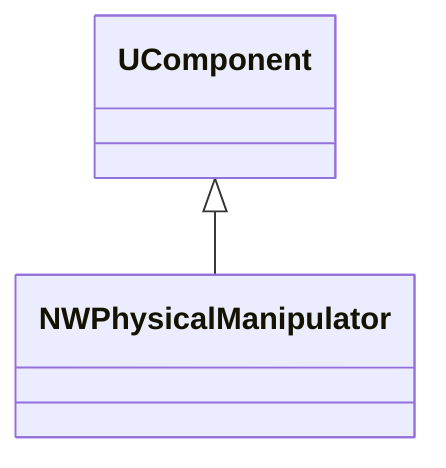
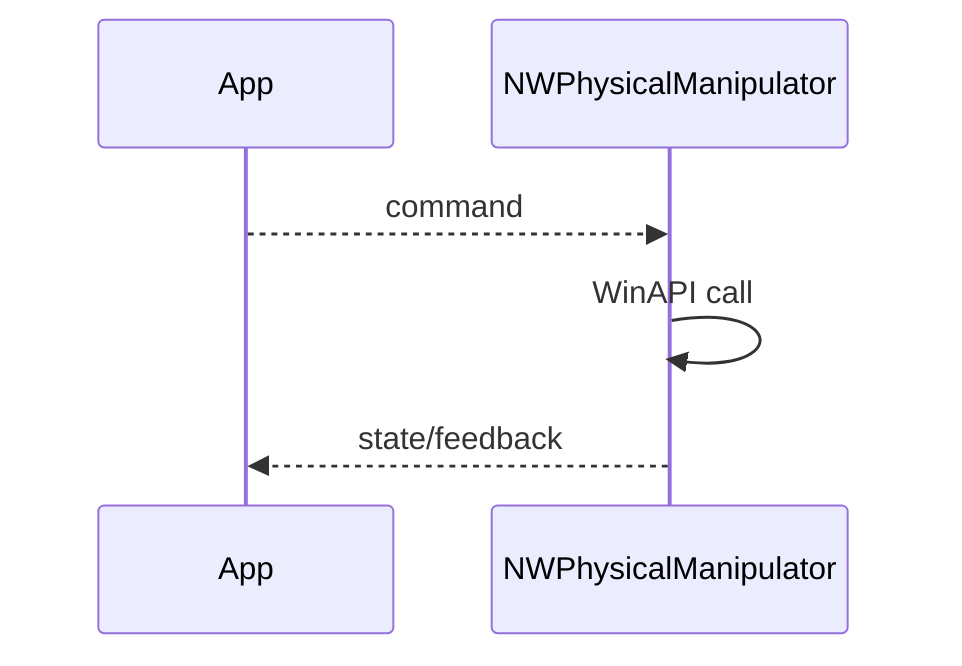
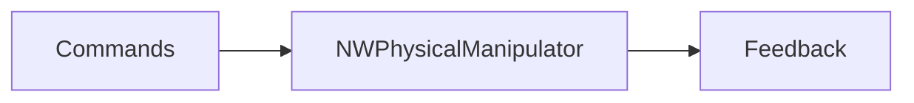
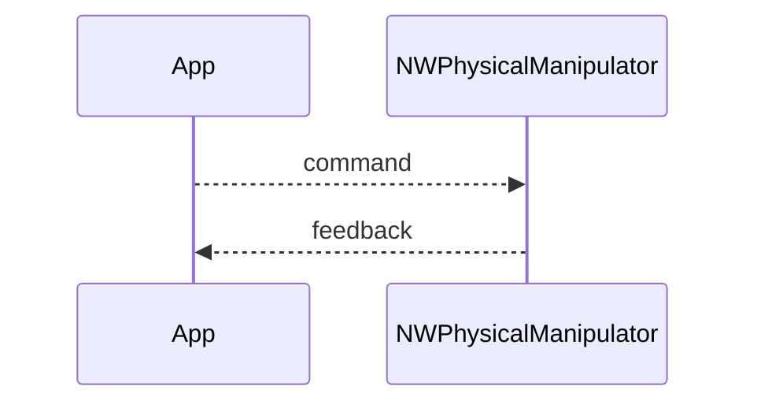

## NWPhysicalManipulator — WinAPI физический манипулятор

**Класс**: `NWPhysicalManipulator` — WinAPI-расширение для управления/доступа к физическому манипулятору.  
**Регистрация**: `Libraries/Nmsdk-MotionControlLib/Core/WinAPI/NWinAPIActLibrary.cpp` → `UploadClass("NWPhysicalManipulator", ...)`.

### Lifecycle
- **ADefault**: параметры подключения/драйвера.
- **ABuild**: инициализация WinAPI-ресурсов/дескрипторов.
- **AReset**: сброс/переинициализация.
- **ACalculate**: обмен командами/состоянием с устройством.

### I/O
- Вход: команды управления.
- Выход: состояние/обратная связь устройства.



Пояснение: диаграмма классов показывает место компонента в иерархии и ключевые связи.



Пояснение: диаграмма последовательности показывает типовой сценарий взаимодействия и порядок вызовов.



Пояснение: блок-схема показывает поток данных/сигналов (входы → компонент → выходы).

### Config snippet

```ini
[Component]
ClassName = NWPhysicalManipulator
Name = PhysMan1
```

---

## NWPhysicalManipulator — WinAPI physical manipulator (EN)

WinAPI-based component for controlling/reading a physical manipulator device.


Description: this class diagram shows the component position in the type hierarchy and key relations.



Description: this sequence diagram shows a typical runtime interaction and call order.


Description: this flowchart shows the data/signal flow (inputs → component → outputs).
